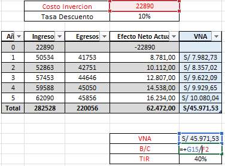
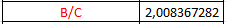
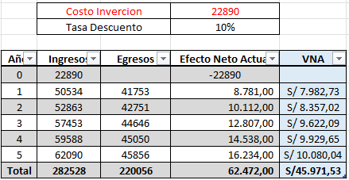
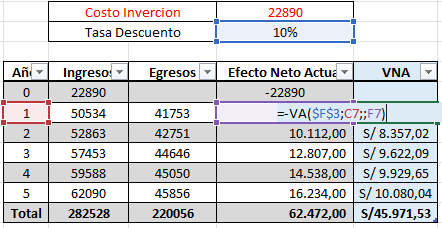
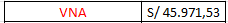
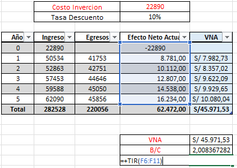
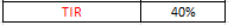

||||
| :- | :-: | -: |

**UNIVERSIDAD PRIVADA DE TACNA**

**FACULTAD DE INGENIERÍA**

**Escuela Profesional de Ingeniería de Sistemas**

**Plataforma Avanzada para la Generación Automática de Diagramas UML empresa Tech Solutions**

Curso: Patrones de Software

Docente: Mag. Patrick Jose Cuadros Quiroga

Integrantes:

\- Alexis Jeanpierre Martínez Vargas			(2019063638)

\- Juan José David Pérez Vizcarra				(2019063636)

\- Jhon Thomas Ticona Chambi				(2018062232)

**Tacna-Perú**

**2025**

**Plataforma Avanzada para la Generación Automática de Diagramas UML empresa Tech Solutions**

**Documento de Factibilidad**

**Versión 1.1**

***Presentado Por:***

*Martínez Vargas, Alexis Jeanpierre*

*Documentador*

*2025*

|**Control de Versiones**||||||
| :-: | :- | :- | :- | :- | :- |
|**Versión**|**Hecha por**|**Revisada por**|**Aprobada por**|**Fecha**|**Motivo**|
|1\.0|AMV, JTC|AMV, JTC,JJPV|JTC|18/03/2025|Versión Inicial|
|1\.1|AMV, JTC,JJPV|AMV, JTC,JJPV|JTC|31/03/2025|Versión Modificada|
# **Índex**
[I. Descripción del Proyecto	4](#_toc194418385)

[1.1. Nombre del Proyecto	4](#_toc194418386)

[1.2. Descripción del Proyecto	4](#_toc194418387)

[1.4. Objetivos	4](#_toc194418388)

[a) Objetivo general	4](#_toc194418389)

[b) Objetivos Específicos	5](#_toc194418390)

[II. Riesgos	5](#_toc194418391)

[III. Análisis de Situación Actual	7](#_toc194418392)

[3.1. Planteamiento del problema	7](#_toc194418393)

[3.2. Consideraciones del hardware y software	7](#_toc194418394)

[IV. Estudio de Factibilidad	8](#_toc194418395)

[4.1. Factibilidad Técnica	8](#_toc194418396)

[4.2. Factibilidad Económica	9](#_toc194418397)

[4.2.1. Costos Generales	9](#_toc194418398)

[4.2.2. Costos del ambiente	9](#_toc194418399)

[4.2.3. Costos de personal	10](#_toc194418400)

[4.2.4. Costos operativos durante el desarrollo	10](#_toc194418401)

[4.2.5. Costos totales del desarrollo del sistema	10](#_toc194418402)

[4.3. Factibilidad Operativa	11](#_toc194418403)

[4.4. Factibilidad Legal	12](#_toc194418404)

[4.5. Factibilidad Social	12](#_toc194418405)

[4.6. Factibilidad Ambiental	13](#_toc194418406)

[V. Análisis Financiero	13](#_toc194418407)

[5.1. Justificación de la Inversión	14](#_toc194418408)

[5.1.1. Beneficios del Proyecto	14](#_toc194418409)

[5.1.2. Criterios de Inversión	14](#_toc194418410)

[VI. Conclusiones	18](#_toc194418411)

# **I. Descripción del Proyecto**	
## **1.1. Nombre del Proyecto**
Proyecto Sistema "Plataforma Avanzada para la Generación Automática de Diagramas UML para la empresa Tech Soluciones"
## **1.2. Descripción del Proyecto**	
El proyecto "Plataforma Avanzada para la Generación Automática de Diagramas UML para la empresa Tech Soluciones" es una iniciativa orientada a facilitar la creación y validación de diagramas UML de manera automatizada. Su principal objetivo es proporcionar a los estudiantes y equipos de desarrollo una herramienta eficiente que permita generar, visualizar y corregir diagramas UML con base en distintas fuentes de entrada, mejorando la comprensión y documentación del diseño de software.

Este sistema, desarrollado en Python y C#, ofrecerá funcionalidades clave como:

- **Conversión de Código a UML**: Permite generar diagramas de clases, secuencia y componentes a partir de código fuente en lenguajes como C#, Python y Java, empleando reglas predefinidas en lugar de algoritmos de IA.
- **Integración con Modelos JSON/YAML**: Facilita la generación de diagramas a partir de descripciones estructuradas, permitiendo una mejor interoperabilidad con otras herramientas.
- **Editor Gráfico Asistido**: Brinda una interfaz intuitiva donde los usuarios pueden construir diagramas manualmente con validación en tiempo real.
- **Modo de Colaboración**: Permite que varios usuarios editen simultáneamente un diagrama UML, facilitando el trabajo en equipo.
- **Historial de Código en Git**: Extrae cambios recientes de un repositorio para generar diagramas UML que reflejen la evolución del software.
- **Extensibilidad mediante Plugins**: Los usuarios podrán agregar soporte para nuevos lenguajes de programación sin modificar el núcleo de la aplicación.

A diferencia de otras herramientas UML tradicionales, esta plataforma se destaca por su capacidad de integración con código fuente y su sistema de validación en tiempo real, lo que permite detectar errores de sintaxis y relaciones inválidas en los diagramas. Su enfoque flexible y colaborativo la convierte en una solución ideal para estudiantes y equipos de desarrollo que buscan mejorar la documentación de sus proyectos de software.
## **1.4. Objetivos**	
### **a) Objetivo general**
El objetivo general de este proyecto es desarrollar e implementar una plataforma avanzada que facilite la generación automática y validación de diagramas UML, mejorando la comprensión y documentación del diseño de software en entornos académicos y profesionales. Esta herramienta optimizará la creación de diagramas a partir de código fuente, modelos estructurados y ediciones manuales con validación en tiempo real.
### **b) Objetivos Específicos**	
- Desarrollar un sistema capaz de analizar código fuente y convertirlo en diagramas UML basándose en reglas predefinidas.
- Implementar un editor gráfico asistido que permita a los usuarios construir diagramas UML con validación en tiempo real.
- Crear un módulo de colaboración en tiempo real para la edición compartida de diagramas UML entre múltiples usuarios.
- Integrar la generación de diagramas UML a partir del historial de cambios en repositorios Git.
- Diseñar un sistema extensible mediante plugins, permitiendo la incorporación de nuevos lenguajes y reglas de análisis.
- Garantizar una interfaz intuitiva y adaptable para su uso en distintos dispositivos y navegadores.
# **II. Riesgos**

En cualquier proyecto de desarrollo de software, es fundamental identificar y gestionar los riesgos potenciales que podrían afectar su éxito. Estos riesgos pueden surgir de factores técnicos, operativos, ambientales o externos, y su adecuada gestión es clave para garantizar que el proyecto se complete dentro de los plazos y presupuestos establecidos.

|**N°**|**Riesgo**|**Descripción Detallada**|
| :-: | :-: | :-: |
|1|Implementación deficiente del sistema|El sistema podría presentar errores críticos, baja usabilidad o no cumplir con los requisitos funcionales y no funcionales del cliente, lo que resultaría en un producto final que no satisface las necesidades del usuario.|
|2|Problemas de integración con herramientas externas|La integración con herramientas como APIs de terceros o servicios en la nube podría fallar debido a incompatibilidades, cambios en las APIs o falta de soporte por parte del proveedor.|
|3|Complejidad técnica del proyecto|La alta complejidad técnica, especialmente en la generación automática de documentos y diagramas, podría llevar a retrasos en el desarrollo, sobrecostos o errores difíciles de resolver.|
|4|Desalineamiento de objetivos del proyecto|Podría existir una falta de alineación entre los objetivos del proyecto y las expectativas del cliente, lo que resultaría en un producto que no cumple con sus necesidades o requisitos.|
|5|Seguridad de la información|El manejo de información sensible, como datos de usuarios o documentos confidenciales, podría verse comprometido si no se implementan medidas de seguridad robustas, como cifrado, autenticación y protección contra amenazas cibernéticas.|
|6|Aceptación del usuario|Los usuarios finales podrían resistirse a adoptar el sistema debido a su complejidad, falta de capacitación o preferencia por métodos tradicionales de generación de documentos.|
|7|Dependencia de proveedores externos|La dependencia de proveedores externos para servicios clave, como alojamiento en la nube, APIs o herramientas de generación de documentos, podría presentar riesgos si estos proveedores no cumplen con los plazos, estándares o acuerdos establecidos.|
|8|Rendimiento y escalabilidad|El sistema podría tener problemas de rendimiento al manejar grandes volúmenes de documentos o usuarios simultáneos, lo que afectaría la experiencia del usuario y la eficiencia del sistema.|
|9|Mantenimiento y actualizaciones|El sistema podría volverse obsoleto o difícil de mantener si no se planifican adecuadamente las actualizaciones periódicas y el soporte técnico continuo.|
|10|Cumplimiento de plazos y presupuesto|El proyecto podría exceder los plazos y el presupuesto si no se gestiona adecuadamente, lo que resultaría en sobrecostos y retrasos en la entrega del producto final.|

# **III. Análisis de Situación Actual**	
## **3.1. Planteamiento del problema**
En Tech Soluciones, una empresa especializada en desarrollo de software, la creación y gestión de diagramas UML es un proceso manual y poco eficiente, lo que genera dificultades en la documentación y comunicación de arquitecturas y diseños de software. Actualmente, los desarrolladores deben utilizar múltiples herramientas para la generación de diagramas UML, lo que no solo incrementa la carga de trabajo, sino que también ocasiona inconsistencias en los modelos y errores en la representación de estructuras de software. La falta de una plataforma integrada que facilite la generación automática de diagramas UML afecta la eficiencia del equipo y la calidad de la documentación técnica.

**Problemas específicos identificados:** 

- La generación manual de diagramas UML es un proceso tedioso y propenso a errores, lo que provoca demoras en la documentación y dificulta la comprensión del diseño de software.
- La inexistencia de un estándar automatizado para la creación de diagramas genera inconsistencias en la representación de las arquitecturas y estructuras de software.
- La falta de integración con código fuente obliga a los desarrolladores a interpretar manualmente las estructuras y relaciones, aumentando el riesgo de errores en la documentación UML.
- La edición y revisión de diagramas UML se realiza de manera individual o a través del intercambio de archivos, lo que dificulta la colaboración en tiempo real y la actualización de modelos de software.
- La ausencia de una herramienta centralizada que permita la validación en tiempo real de los diagramas UML ocasiona problemas en la detección temprana de errores estructurales en el diseño del software.
## **3.2. Consideraciones del hardware y software**

|**HARDWARE Y SOFTWARE**|**ESPECIFICACIONES**|**DESCRIPCION**|
| :-: | :-: | :-: |
|Sistema operativo|Windows 10 Professional|Sistema operativo estable y ampliamente utilizado, con soporte para aplicaciones empresariales.|
|Conexión de red|Claro - Movistar|Velocidad de conexión a Internet de 80 Mbps, adecuada para la operación del sistema web.|
|Controlador versiones |GitHub|Herramienta de control de versiones y colaboración en equipo, permitiendo un historial de cambios seguro.|
|Lenguaje programación|Python|Lenguaje de programación de alto nivel, interpretado y de código abierto|
||||

|Base de datos|
| - |
||

||||
| :-: | :-: | :-: |

|MongoBd|
| - |
||

|||Sistema de gestión de bases de datos no relacional para almacenar la información del sistema.|
| :-: | :-: | :-: |
|Hosting|Render y Versel|Plataformas en la nube que permiten implementar y escalar aplicaciones web|
|Biblioteca|

React
|biblioteca de JavaScript que permite crear interfaces de usuario para aplicaciones web y móviles.|
|Entorno de desarrollo|Visual Studio|Entorno integrado de desarrollo (IDE) que facilita la programación en C# y la depuración del proyecto.|

*Fuente : Elaboración propia de la tabla*

*Tabla 1 – Elaboración propia de tabla de el hardware y software propuestos para el proyecto incluyen un sistema operativo Windows 10 Professional, una conexión de red a través de Claro y Movistar con una velocidad de 80 Mbps, el uso del controlador de versiones GitHub, la herramienta Rational Rose para diagramas UML, y el lenguaje de programación C#.*
# **IV. Estudio de Factibilidad**	
## **4.1. Factibilidad Técnica**	
Los siguientes programas nos permitirán la creación y desarrollo del proyecto:

<table><tr><th colspan="3"><b>RECURSOS TECNICOS PARA EL DESARROLLO DEL PROYECTO</b></th></tr>
<tr><td colspan="1"><b>Tipo de Recurso</b></td><td colspan="1"><b>Nombre del recurso</b></td><td colspan="1"><b>Descripción</b></td></tr>
<tr><td colspan="1" rowspan="5">
Hardware

</td><td colspan="1" rowspan="4">
PC

(Personal Computer)

</td><td colspan="1">Escritorio o Portátil</td></tr>
<tr><td colspan="1">Intel Core i5 - 1.8GHz</td></tr>
<tr><td colspan="1">8 GB de RAM recomendados (2 GB mínimo).</td></tr>
<tr><td colspan="1">4 GB de espacio en disco duro (2 GB mínimo).</td></tr>
<tr><td colspan="1">Impresora</td><td colspan="1">Multifuncional</td></tr>
<tr><td colspan="1" rowspan="4">Software</td><td colspan="1">Windows 10 (64 bits)</td><td colspan="1">Sistema operativo</td></tr>
<tr><td colspan="1">` `Visual Studio 2022</td><td colspan="1">Herramienta para el desarrollo del sistema web</td></tr>
<tr><td colspan="1">Teams (Microsoft Office 365)</td><td colspan="1">Herramienta para el desarrollo de documentos</td></tr>
<tr><td colspan="1">SQL Azure</td><td colspan="1">Herramienta para el desarrollo de la BD en la nube</td></tr>
</table>

*Fuente : Elaboración propia de la tabla*

*Tabla 2 –Elaboración propia de Los recursos técnicos para el desarrollo del proyecto incluyen hardware como computadoras de escritorio o portátiles con procesador Intel Core i5, 8 GB de RAM recomendados, 4 GB de espacio en disco duro y una impresora multifuncional. En cuanto al software, se utilizará Windows 10 (64 bits) como sistema operativo, Visual Studio 2022 como herramienta de desarrollo del sistema web, Microsoft Teams para el desarrollo de documentos y SQL Azure para el desarrollo de la base de datos en la nube.*
## **4.2. Factibilidad Económica**	
### **4.2.1. Costos Generales**	
*Tabla de Materiales de Escritorio* 

<table><tr><th colspan="1" rowspan="2"><b>Materiales de escritorio</b> </th><th colspan="3"><b>Tiempo/Coste</b> </th></tr>
<tr><td colspan="1"><b>Mes 1</b> </td><td colspan="1"><b>Mes 2</b> </td><td colspan="1"><b>Mes 3</b> </td></tr>
<tr><td colspan="1">Papel bond </td><td colspan="1">S/ 14.00 </td><td colspan="1">S/ 14.00 </td><td colspan="1">S/ 14.00 </td></tr>
<tr><td colspan="1">Tinta de impresora </td><td colspan="1">S/ 60.00 </td><td colspan="1">S/ 0.00 </td><td colspan="1">S/ 0.00 </td></tr>
<tr><td colspan="1"><b>Sub Total</b> </td><td colspan="1">S/ 74.00 </td><td colspan="1">S/ 16.00 </td><td colspan="1">S/ 14.00 </td></tr>
<tr><td colspan="3"><b>TOTAL</b></td><td colspan="1">S/ 105.00</td></tr>
</table>

*Fuente : Elaboración propia de la tabla*

*Tabla 3 – Costos de material de escritorio para equipo de trabajo para el proyecto , “Costo general será una total de **S/105.00**”*

### **4.2.2. Costos del ambiente**	

*Tabla de ambiente laboral* 

<table><tr><th colspan="1" rowspan="2"><b>Costos Ambiente</b></th><th colspan="4"><b>Tiempo/Costo</b> </th></tr>
<tr><td colspan="1"><b>Mes 1</b> </td><td colspan="2"><b>Mes 2</b> </td><td colspan="1" valign="top"><b>Mes 3</b> </td></tr>
<tr><td colspan="1">Servicio de Internet </td><td colspan="1">S/ 80.00</td><td colspan="2">S/ 80.00</td><td colspan="1">S/ 80.00</td></tr>
<tr><td colspan="1">Oficina</td><td colspan="1">S/ 800.00</td><td colspan="2">S/ 800.00</td><td colspan="1">S/ 800.00</td></tr>
<tr><td colspan="1">Hosting  (Somee)</td><td colspan="1">S/ 50.00</td><td colspan="2">S/ 50.00</td><td colspan="1">S/ 50.00</td></tr>
<tr><td colspan="1"><b>Sub Total</b> </td><td colspan="2">S/ 930.00</td><td colspan="1">S/ 930.00 </td><td colspan="1">S/ 930.00</td></tr>
<tr><td colspan="4"><b>TOTAL</b></td><td colspan="1">S/2.790.00</td></tr>
</table>

*Fuente : Elaboración propia de la tabla*

*Tabla 4 – Costos de ambiente laboral durante el desarrollo para equipo de trabajo para el proyecto , “Costo total del ambiente es de **s/ 2,790.00** ”*

### **4.2.3. Costos de personal**

*Tabla de costos del personal laboral* 

|**Rol**|**Horario (L a V)**|**Mes 1**|**Mes 2**|**Mes 3**|
| :-: | :-: | :-: | :-: | :-: |
|Jefe de proyecto|8:00 -16:00|S/ 2,500.00|S/ 2,500.00|S/ 2,500.00|
|Programador|8:00 -16:00|S/ 1,550.00|S/ 1,550.00|S/ 1,550.00|
|DBA|8:00 -16:00|S/ 1,300.00|S/ 1,300.00|S/ 1,300.00|
|Tester|8:00 -16:00|S/ 1,200.00|S/ 1,200.00|S/ 1,200.00|
|**Sub Total**|S/ 6,570.00|S/ 6,570.00|S/ 6,570.00||
|**TOTAL**|S/19.650.00||||

*Fuente : Elaboración propia de la tabla*

*Tabla 5 –Costos de costos del personal laboral durante el desarrollo para equipo de trabajo para el proyecto "Costo total del ambiente es de **s/ 19,650.00”***
### **4.2.4. Costos operativos durante el desarrollo**

*Tabla de servicios operativos*

<table><tr><th colspan="1" rowspan="2"><b>Servicio</b> </th><th colspan="3"><b>Tiempo/Coste</b> </th></tr>
<tr><td colspan="1"><b>Mes 1</b> </td><td colspan="1"><b>Mes 2</b> </td><td colspan="1"><b>Mes 3</b> </td></tr>
<tr><td colspan="1">Servicio Eléctrico </td><td colspan="1">S/ 85.00</td><td colspan="1" valign="top">` `S/ 85.00 </td><td colspan="1" valign="top">` `S/ 85.00 </td></tr>
<tr><td colspan="1">Servicio de Agua </td><td colspan="1" valign="top">` `S/ 30.00 </td><td colspan="1" valign="top">` `S/ 30.00 </td><td colspan="1" valign="top">` `S/ 30.00 </td></tr>
<tr><td colspan="1"><b>Sub Total</b> </td><td colspan="1" valign="top">` `S/ 115.00 </td><td colspan="1" valign="top">` `S/ 115.00 </td><td colspan="1" valign="top">` `S/ 115.00 </td></tr>
<tr><td colspan="3"><b>TOTAL</b></td><td colspan="1" valign="top">S/ 345.00</td></tr>
</table>

*Fuente : Elaboración propia de la tabla*

*Tabla 6 – Costos de operativos durante el desarrollo para equipo de trabajo para el proyecto , “Costo operativos total es de **S/345.00** ”*

### **4.2.5. Costos totales del desarrollo del sistema**	
A continuación, un resumen de todos los costos totales del proyecto final. 

*Tabla resumen de total de costos*

|Costo Total de Costo General|S/ 105.00|
| :- | - |
|Costo Total del Ambiente|S/ 2,790.00|
|Costo Total del Personal|S/ 19,650.00|
|Costo Total de los Operativos|S/ 345.00|
|Costo Final|S/ 22,890.00|

*Fuente : Elaboración propia de la tabla*

*Tabla 7 – Tabla resumen de todos los costos vistos en la tablas ,Costo total de costo general , Costo total de Ambiente , Costo total de personal ,Costo total de los servicios operativos, anteriormente “**Costo final s/22.890.00**” por los 3 meses de desarrollo del proyecto*
## **4.3. Factibilidad Operativa**
La factibilidad operativa de este proyecto se refiere a su capacidad para funcionar de manera eficiente y sostenible una vez que esté en funcionamiento. Esto implica:

**Recursos Humanos y Capacitación:**

Es fundamental contar con personal calificado en áreas como desarrollo web, inteligencia artificial, administración de sistemas y tecnología de la información. Además, se proporcionará capacitación continua para garantizar que el equipo esté actualizado en las últimas tendencias y técnicas en desarrollo de software y gestión de inventarios. Esto asegurará que el personal pueda manejar eficazmente el sistema y aprovechar al máximo sus capacidades.

**Instalaciones y Equipamiento:**

Aunque este proyecto no requiere instalaciones físicas específicas, es esencial disponer de una infraestructura tecnológica robusta que soporte el sistema web y las funcionalidades de inteligencia artificial. Esto incluye servidores confiables, software actualizado y los recursos tecnológicos necesarios para el desarrollo, la implementación y el mantenimiento del sistema. También se debe asegurar una conectividad a Internet estable y de alta velocidad para garantizar el acceso ininterrumpido a la plataforma.

**Cumplimiento de Normativas y Licencias:**

Es crucial cumplir con las normativas legales y regulatorias aplicables, especialmente en términos de protección de datos y seguridad cibernética. Además, se debe garantizar que el sistema cumpla con cualquier requerimiento específico establecido por las autoridades locales y regionales en cuanto a la gestión de inventarios y la elaboración de informes técnicos. Esto incluye la obtención de licencias necesarias y la adhesión a las mejores prácticas de la industria para asegurar la confiabilidad y credibilidad del sistema.
## **4.4. Factibilidad Legal**
Listamos algunas leyes y regulaciones relevantes que podrían afectar la factibilidad legal del proyecto:

- **Ley N° 29733, Ley de Protección de Datos Personales:** Esta ley es crucial, dado que el proyecto manejará datos sensibles de los equipos tecnológicos y posiblemente de los usuarios. Es necesario garantizar el cumplimiento de esta ley para proteger la privacidad de los datos y evitar posibles sanciones por el manejo inadecuado de la información.
- **Ley N° 30096, Ley Anti-Phishing:** Aunque esta ley no está directamente relacionada con la gestión de inventarios, es importante considerarla porque el sistema web podría ser vulnerable a intentos de suplantación de identidad con fines fraudulentos. Implementar medidas de seguridad adecuadas ayudará a prevenir tales ataques y proteger la información crítica del sistema.	
## **4.5. Factibilidad Social**	
El proyecto "Sistema de Generación Automática de Documentos Técnicos para la empresa Tech Solutions" tiene el potencial de generar un impacto social significativo dentro de la organización donde se implemente. Al optimizar los procesos de generación de documentos, el sistema no solo mejorará la eficiencia operativa, sino que también beneficiará a los empleados y, en última instancia, a la comunidad. 

- **Optimización de Procesos y Ahorro de Tiempo:**\
  El sistema permitirá una generación más rápida y eficiente de documentos técnicos, lo que reducirá el tiempo que los empleados dedican a tareas manuales y repetitivas. Esto no solo mejorará la productividad, sino que también permitirá a los equipos enfocarse en actividades de mayor valor, como la innovación y la mejora continua.
- **Mejora en la Calidad de los Documentos:**\
  Al automatizar la creación de documentos técnicos, se reducirán los errores humanos y se garantizará la consistencia en el formato y contenido. Esto mejorará la calidad de los entregables, lo que beneficiará tanto a la organización como a sus clientes o usuarios finales.
- **Capacitación y Desarrollo de Competencias:**\
  La implementación del sistema implicará la capacitación del personal en el uso de herramientas tecnológicas avanzadas, lo que no solo mejorará sus habilidades técnicas, sino que también aumentará su satisfacción laboral y su sentido de pertenencia al ver cómo su trabajo contribuye al éxito del proyecto.
- **Fomento de la Colaboración y el Trabajo en Equipo:**\
  El sistema facilitará la colaboración en tiempo real entre los miembros del equipo, permitiendo una edición y revisión más eficiente de los documentos técnicos. Esto fortalecerá el trabajo en equipo y mejorará la comunicación interna.
## **4.6. Factibilidad Ambiental**	
El proyecto "Plataforma Avanzada para la Generación Automática de Diagramas UML para la empresa Tech Soluciones" tiene un impacto ambiental mínimo, ya que su implementación y operación no implican procesos que generen emisiones contaminantes o consuman recursos naturales de manera significativa:

- **Ecoeficiencia en el Consumo de Energía:** Se prevé que el proyecto sea ecoeficiente, utilizando tecnologías y prácticas que minimicen el consumo de energía y reduzcan al mínimo la generación de residuos electrónicos. Esto incluye el uso de servidores energéticamente eficientes y la minimización del uso de papel a través de la digitalización de procesos.
- **Cumplimiento de Políticas Ambientales:** El desarrollo del proyecto se llevará a cabo en cumplimiento con las políticas y regulaciones ambientales locales y nacionales, asegurando que todas las actividades relacionadas con su implementación y operación se realicen de manera responsable y sostenible.
- **Promoción de la Conciencia Ambiental:** Aunque el impacto directo del proyecto en el medio ambiente es bajo, este puede servir como un ejemplo de cómo las tecnologías de la información pueden contribuir a la sostenibilidad. Al automatizar procesos y reducir el uso de recursos físicos, el sistema puede ayudar a promover una cultura organizacional más consciente del medio ambiente.
# **V. Análisis Financiero**	
El plan financiero se ocupa del análisis de ingresos y gastos asociados a cada proyecto, desde el punto de vista del instante temporal en que se producen. Su misión fundamental es detectar situaciones financieramente inadecuadas.

Para demostrar que este proyecto es rentable, utilizamos una TEA (Tasa de interés) = 15% y el VAN, B/C y TIR.
## **5.1. Justificación de la Inversión**
La justificación de la inversión en el proyecto "Plataforma Avanzada para la Generación Automática de Diagramas UML para la empresa Tech Soluciones" se fundamenta en los múltiples beneficios que proporcionará a la empresa, mejorando la eficiencia en la documentación de software y optimizando la colaboración en tiempo real.
### **5.1.1. Beneficios del Proyecto**	
**Beneficios Tangibles:**

- **Reducción de Costos Operativos:** La automatización de la generación de diagramas UML disminuirá el tiempo y los recursos necesarios para documentar software, reduciendo significativamente los costos operativos.
- **Optimización del Tiempo de Desarrollo:** Al generar diagramas UML de forma automática a partir del código fuente y modelos JSON, los desarrolladores podrán enfocarse en la implementación de software en lugar de crear documentación manualmente.
- **Mejor Integración y Compatibilidad:** La plataforma permitirá la exportación de diagramas en diversos formatos estándar, facilitando la integración con otras herramientas de desarrollo y documentación.

**Beneficios Intangibles:**

- **Mejora en la Precisión de la Documentación:** La generación automática basada en reglas predefinidas asegurará la coherencia y exactitud de los diagramas UML, reduciendo errores y omisiones.
- **Eficiencia y Productividad:** La plataforma agilizará la creación de modelos UML, permitiendo que los equipos de desarrollo trabajen de manera más eficiente y colaborativa.
- **Facilitación del Aprendizaje y Adopción de UML:** La validación en tiempo real y las reglas de modelado ayudarán a los usuarios a mejorar su comprensión de UML y aplicar buenas prácticas en la documentación de software.
- **Fomento de la Colaboración en Tiempo Real:** La posibilidad de que varios usuarios editen diagramas simultáneamente permitirá una mejor comunicación y coordinación en equipos de desarrollo distribuidos.
- **Mejora en la Toma de Decisiones:** La visualización estructurada de arquitecturas y flujos de software permitirá una mejor planificación y optimización de proyectos de desarrollo.
### **5.1.2. Criterios de Inversión**
Nuestros criterios de inversión se basan en los tres criterios presentados en base a que se necesitara el B/C para saber si hay beneficios, El VAN para saber si es aceptable el valor del proyecto y el TIR si es que se puede obtener retornar los gastos, ya que necesitamos recuperar de los costos invertidos al desarrollarse en el trayecto del tiempo. En ello, podemos utilizar a esos criterios debido a que queremos que el proyecto cumpla con todos los requisitos y con los valores económicos para ser aceptado	

|**FLUJO DE CAJA**||||
| :-: | :- | :- | :- |
|**PERIODO ANUAL**|**INGRESOS**|**EGRESOS**|**EFECTIVO NETO ACTUAL**|
|0|-S/  22,890.00| |-S/  22,890.00|
|1|` `S/   50,534.00 |` `S/    41,753.00 |` `S/     8,781.00 |
|2|` `S/   52,863.00 |` `S/    42,751.00 |` `S/   10,112.00 |
|3|` `S/   57,453.00 |` `S/    44,646.00 |` `S/   12,807.00 |
|4|` `S/   59,588.00 |` `S/    45,050.00 |` `S/   14,538.00 |
|5|` `S/   62,090.00 |` `S/    45,856.00 |` `S/   16,234.00 |
|**Total**|**S/ 282,528.00**|**S/220,056.00**|**S/62.472.00**|

*Fuente : Elaboración propia de la tabla*

*Tabla 8 – La tabla presenta un **flujo de caja anual proyectado a cinco años**, en el que se detallan los ingresos, egresos y el efectivo neto resultante para cada periodo. En el primer año (periodo 0) se observa un ingreso inicial de S/ 22,890, sin egresos, resultando en un flujo de caja neto negativo de S/ 22,890. A partir del primer año, los ingresos aumentan progresivamente desde S/ 50,534 hasta S/ 62,090 en el quinto año, mientras que los egresos también crecen cada año, comenzando en S/ 41,753 y alcanzando S/ 45,856 al final del periodo. El efectivo neto actual, que representa la diferencia entre ingresos y egresos en cada año, evoluciona de manera positiva, pasando de un saldo inicial negativo en el periodo 0 a un saldo final positivo de S/ 16,234 en el quinto año. La proyección total acumulada indica que los ingresos suman S/ 282,528, los egresos S/ 220,056, y el efectivo neto actual final asciende a S/ 62,472. Esta tabla es una **elaboración propia** que proporciona una visión general de la rentabilidad y el desempeño financiero proyectado del flujo de caja a lo largo del periodo.* 

#### ***5.1.2.1. Relación Beneficio/Costo (B/C)***	

*Fuente : Elaboración propia de la tabla*

*Tabla 9 –  Tabla realizada en el Excel con los datos correspondiste del proyecto a realizar donde realizamos la formula de B/C y el Total de nuestro **B/C  = 2,008367282***

#### ***5.1.2.2. Valor Actual Neto (VAN)***	

*Fuente : Elaboración propia de la tabla*

*Tabla 10 –  Tabla realizada en el Excel con los datos correspondiste del proyecto a realizar donde realizamos la formula de VNA y el Total de nuestro **VNA = S/45.,971.53***

#### ***5.1.2.3. Tasa Interna de Retorno (TIR)***	

*Fuente : Elaboración propia de la tabla*

*Tabla 11- Tabla realizada en el Excel con los datos correspondiste del proyecto a realizar donde realizamos la formula de TIR y el Total de nuestro **TIR = 40% , Lo que nos indica que el proyecto si es factible.***

# **VI. Conclusiones**	

- El proyecto cuenta con los recursos técnicos necesarios para su desarrollo y operación, garantizando que se puedan cumplir los requisitos establecidos para la gestión eficiente de inventarios y la elaboración de informes técnicos.
- La evaluación económica del proyecto indica una factibilidad adecuada, con un beneficio/costo (B/C) superior a 1, lo que demuestra que los ingresos proyectados superan los costos involucrados, haciendo el proyecto viable.
- Desde el punto de vista legal, el proyecto cumple con las normativas y leyes pertinentes, lo que asegura su viabilidad en términos de cumplimiento regulatorio.
- El análisis del Valor Actual Neto (VAN) arrojó un resultado positivo, lo que significa que el proyecto es rentable y generará retornos favorables después de considerar el costo de capital.
- La Tasa Interna de Retorno (TIR) es significativamente alta en comparación con la tasa de descuento aplicada, lo que refuerza la viabilidad y atractivo del proyecto para los inversionistas.
- En resumen, los resultados de los estudios de B/C, VAN, y TIR indican que el proyecto no solo es viable, sino también altamente rentable, lo que justifica plenamente la inversión y los esfuerzos para su implementación.

||||
| :- | :-: | -: |

