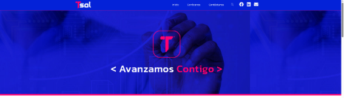
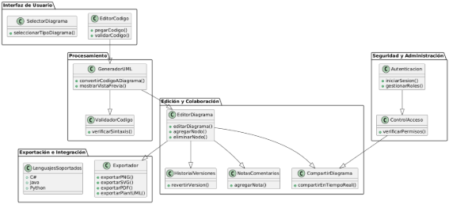
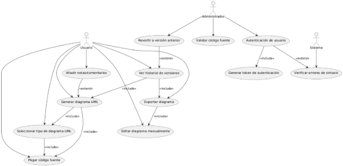
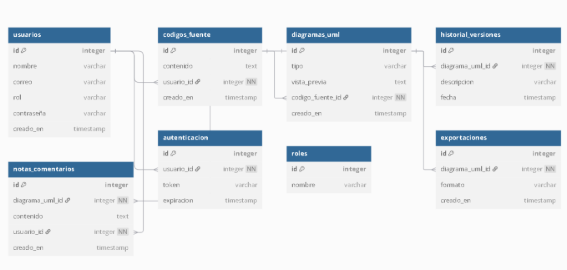
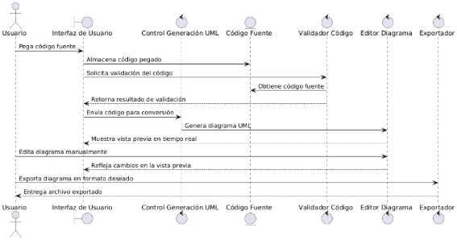
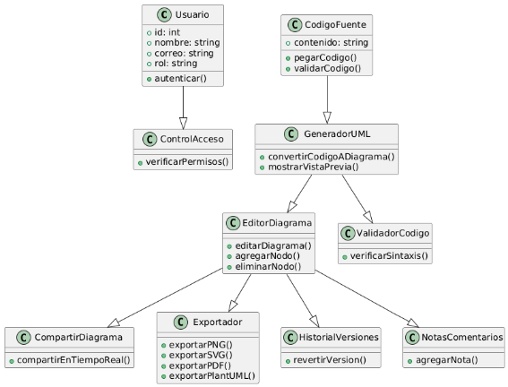



**UNIVERSIDAD PRIVADA DE TACNA**

**FACULTAD DE INGENIERÍA**

**Escuela Profesional de Ingeniería de Sistemas**

**Plataforma Avanzada para la Generación Automática de Diagramas UML para la empresa Tech Solutions**

Curso: Patrones de Software

Docente: Mag. Patrick Jose Cuadros Quiroga

Integrantes:

\- Alexis Jeanpierre Martínez Vargas			(2019063638)

\- Juan José David Pérez Vizcarra				(2019063636)

\- Jhon Thomas Ticona Chambi				(2018062232)

**Tacna-Perú**

**2025**

**Plataforma Avanzada para la Generación Automática de Diagramas UML para la empresa Tech Solutions**

**Documento SRS**

**Versión 1.0**

***Presentado Por:***

*Martínez Vargas, Alexis Jeanpierre*

*Documentador*

*2025*

|**Control de Versiones**||||||
| :-: | :- | :- | :- | :- | :- |
|**Versión**|**Hecha por**|**Revisada por**|**Aprobada por**|**Fecha**|**Motivo**|
|1\.0|AMV,JJPV|AMV, JTC,JJPV|JTC|31/03/2025|Versión Inicial|

# **INDICE GENERAL**
[INTRODUCCION	5](#_toc181265371)

[I. Generalidades de la Empresa	5](#_toc181265372)

[1. Nombre de la Empresa	5](#_toc181265373)

[2. Visión	5](#_toc181265374)

[3. Misión	5](#_toc181265375)

[4. Organigrama	6](#_toc181265376)

[II. Visionamiento de la Empresa	6](#_toc181265377)

[1. Descripción del Problema	6](#_toc181265378)

[2. Objetivos de Negocios	6](#_toc181265379)

[3. Objetivos de Diseño	7](#_toc181265380)

[4. Alcance del proyecto	7](#_toc181265381)

[5. Viabilidad del Sistema	8](#_toc181265382)

[6. Información obtenida del Levantamiento de información	8](#_toc181265383)

[6.1. Lectura de Antecedentes	8](#_toc181265384)

[III.  Análisis de Procesos	10](#_toc181265385)

[a) Diagrama del Proceso Actual – Diagrama de actividades	10](#_toc181265386)

[b) Diagrama del Proceso Propuesto – Diagrama de actividades Inicial	11](#_toc181265387)

[IV Especificación de Requerimientos de Software	11](#_toc181265388)

[a) Cuadro de Requerimientos funcionales Inicial	11](#_toc181265389)

[b) Cuadro de Requerimientos No funcionales	12](#_toc181265390)

[c) Cuadro de Requerimientos funcionales Final	13](#_toc181265391)

[d) Reglas de Negocio	15](#_toc181265392)

[V Fase de Desarrollo	17](#_toc181265393)

[1. Perfiles de Usuario	17](#_toc181265394)

[2. Modelo Conceptual	18](#_toc181265395)

[a) Diagrama de Paquetes	19](#_toc181265396)

[b) Diagrama de Casos de Uso	20](#_toc181265397)

[c) Escenarios de Caso de Uso (narrativa)	26](#_toc181265398)

[3. Modelo Lógico	116](#_toc181265399)

[a) Análisis de Objetos	116](#_toc181265400)

[b) Diagrama de Entidad-Relación	121](#_toc181265401)

[c) Diagrama de Secuencia	123](#_toc181265402)

[d) Diagrama de Clases	138](#_toc181265403)

[CONCLUSIONES	140](#_toc181265404)

[RECOMENDACIONES	140](#_toc181265405)

[BIBLIOGRAFIA	141](#_toc181265406)

[WEBGRAFIA	141](#_toc181265407)

# **INTRODUCCION**
Tech Solutions, empresa especializada en el desarrollo de soluciones tecnológicas innovadoras, busca optimizar la creación y gestión de documentos técnicos mediante la implementación de una plataforma basada en inteligencia artificial (IA). Este proyecto tiene como objetivo desarrollar un sistema web avanzado que automatice la generación de informes técnicos, reduciendo el esfuerzo manual y garantizando precisión, coherencia y estandarización en los documentos.

La plataforma permitirá a los usuarios generar documentos de manera estructurada a partir de plantillas predefinidas y configurables, facilitando la personalización y optimización del contenido. Además, integrará herramientas de IA para mejorar la redacción, detectar errores y sugerir ajustes en función del contexto del documento.

Con este desarrollo, Tech Solutions podrá ampliar su oferta de productos y servicios, proporcionando a sus clientes una solución innovadora que mejore la productividad y eficiencia en la gestión documental.
# **I. Generalidades de la Empresa**
## **1. Nombre de la Empresa**
Tech Solutions
## **2. Visión**
Ser la empresa líder en ciberseguridad en la región, brindando soluciones innovadoras y de confianza. 
## **3. Misión**
Posicionarnos como la empresa líder en la región, ofreciendo servicios y soluciones de ciberseguridad altamente especializadas, diseñadas para proteger de manera integral los recursos tecnológicos de nuestros clientes y asegurar la continuidad de su operación.
## **4. Organigrama**
*Figura 1: Organigrama de Tech Solutions*

*Fuente: Sacado de la página de Tech Solutions*
# **II. Visionamiento de la Empresa**
## **1. Descripción del Problema**
Tech Solutions busca abordar las dificultades que enfrentan estudiantes y profesionales en la creación de diagramas UML, tales como:

🔹 La generación manual de diagramas UML a partir de código, lo que consume tiempo y es propenso a errores.

🔹 La falta de validaciones en tiempo real, lo que puede llevar a diagramas incorrectos o incoherentes.

🔹 La limitada integración con herramientas de desarrollo y control de versiones como Git.

🔹 La ausencia de opciones de colaboración en tiempo real para la creación conjunta de diagramas.

Para resolver estos problemas, Tech Solutions desarrollará una Plataforma Avanzada para la Generación Automática de Diagramas UML, la cual permitirá a los usuarios generar, validar y modificar diagramas UML de manera eficiente sin necesidad de herramientas externas.
## **2. Objetivos de Negocios**
- Automatizar la generación de diagramas UML a partir de código fuente en diversos lenguajes como C#, Java y Python.
- Optimizar el proceso de aprendizaje mediante un motor de validación en tiempo real que ayude a los usuarios a crear diagramas correctos.
- Facilitar la colaboración en tiempo real, permitiendo que varios usuarios editen un mismo diagrama simultáneamente.
- Integrar la plataforma con repositorios Git, permitiendo la generación de diagramas UML basados en el historial de cambios del código.
- Permitir la extensibilidad mediante soporte para plugins, lo que facilitará la incorporación de nuevos lenguajes y reglas de análisis.
## **3. Objetivos de Diseño**
- Desarrollar una interfaz gráfica intuitiva con herramientas asistidas para la construcción de diagramas UML.
- Implementar validaciones en tiempo real, asegurando que los diagramas generados cumplan con las reglas de UML.
- Integrar reglas configurables para la conversión automática de código a UML sin necesidad de IA.
- Optimizar el rendimiento del sistema, permitiendo la carga y edición de diagramas grandes sin afectar la fluidez de la plataforma.
- Garantizar la escalabilidad y compatibilidad, facilitando la integración con herramientas de terceros mediante modelos en JSON y YAML.
## **4. Alcance del proyecto**
- Desarrollo de una Plataforma Web o de Escritorio accesible desde cualquier dispositivo con conexión a Internet.
- Soporte para Diversos Diagramas UML, incluyendo diagramas de clases, casos de uso, secuencia y componentes.
- Motor de Validación en Tiempo Real que detecte errores estructurales y relacionales en los diagramas.
- Conversión Automática de Código a UML, utilizando reglas configurables en lugar de IA.
- Modo de Colaboración en Tiempo Real, permitiendo que varios usuarios editen simultáneamente.
- Integración con Repositorios Git, generando diagramas basados en el historial de cambios del código.
- Soporte para Plugins, permitiendo a los usuarios personalizar la plataforma agregando compatibilidad con nuevos lenguajes o modelos.
## **5. Viabilidad del Sistema**
Tras un exhaustivo análisis de viabilidad, se ha determinado que el desarrollo e implementación del proyecto es completamente viable, sustentado por los siguientes aspectos:

📌 **Viabilidad Técnica**: La plataforma será desarrollada con tecnologías modernas que permitan la integración con repositorios de código y herramientas UML.\
📌 **Viabilidad Económica**: Se espera que la plataforma genere valor al reducir el tiempo y esfuerzo en la creación de diagramas, lo que la hace viable a largo plazo.\
📌 **Viabilidad Operativa**: Su diseño intuitivo permitirá que estudiantes y profesionales adopten la herramienta sin necesidad de capacitación avanzada.\
📌 **Viabilidad Legal**: Cumplirá con normativas de protección de datos y licencias de software para asegurar un uso ético y legal de la información.
## **6. Información obtenida del Levantamiento de información**
### **6.1. Lectura de Antecedentes**
Es una técnica de muy buena utilidad porque permite prepararse e informarse acerca de la organización de la empresa y sus reglas dentro de la organización. La técnica fue utilizada para entender cómo funciona la empresa y en específico, sobre el área de ventas y almacén.

**Página Web de la Empresa Tech Solutions**

 

**Página de Ubicación de la Empresa Tech Solutions**

# **III.  Análisis de Procesos**
## **a) Diagrama del Proceso Actual – Diagrama de actividades**
*Figura 2: Diagrama de Actividad del Proceso Actual de Generar Diagramas de Proyectos Informáticos de la Empresa Tech Solutions*

Fuente: Elaboración Propia
## **b) Diagrama del Proceso Propuesto – Diagrama de actividades Inicial**
*Figura 3: Diagrama de Actividad del Proceso Propuesto de Generar Diagramas de Proyectos Informáticos de la Empresa Tech Solutions*

Fuente: Elaboración Propia
# **IV Especificación de Requerimientos de Software**
## **a) Cuadro de Requerimientos funcionales Inicial**
*Tabla 1: Cuadro de Requisitos Funcionales Inicial del Proyecto Plataforma Avanzada para la Generación Automática de Diagramas UML para la empresa Tech Solutions*

<table><tr><th><b>Módulo</b></th><th><b>Nro. RF</b></th><th><b>Requerimiento Funcional</b></th><th><b>CUS</b></th><th><b>Prioridad</b></th></tr>
<tr><td rowspan="2"><b>Módulo Seguridad</b></td><td>RF01</td><td>Permitir la autenticación de los usuarios mediante credenciales.</td><td>Validar Usuario</td><td>Alta</td></tr>
<tr><td>RF02</td><td>Gestionar el registro de nuevos usuarios en la plataforma.</td><td>Gestionar Usuario</td><td>Media</td></tr>
<tr><td rowspan="4"><b>Módulo Generación UML</b></td><td>RF03</td><td>Generar diagramas de clases automáticamente a partir de código fuente.</td><td>Generar UML</td><td>Alta</td></tr>
<tr><td>RF04</td><td>Permitir la importación de modelos en JSON/YAML para la generación de diagramas.</td><td>Importar Modelos</td><td>Alta</td></tr>
<tr><td>RF05</td><td>Generar diagramas de casos de uso a partir de estructuras predefinidas.</td><td>Generar UML</td><td>Media</td></tr>
<tr><td>RF06</td><td>Generar diagramas de secuencia analizando interacciones en código fuente.</td><td>Generar UML</td><td>Alta</td></tr>
<tr><td rowspan="2"><b>Módulo Edición y Validación</b></td><td>RF07</td><td>Permitir la edición manual de los diagramas generados.</td><td>Editar Diagramas</td><td>Media</td></tr>
<tr><td>RF08</td><td>Implementar validaciones en tiempo real para evitar errores de sintaxis y relaciones inválidas.</td><td>Validar Diagramas</td><td>Alta</td></tr>
<tr><td rowspan="2"><b>Módulo Colaboración</b></td><td>RF09</td><td>Permitir que múltiples usuarios editen un mismo diagrama en tiempo real.</td><td>Colaborar en Diagramas</td><td>Alta</td></tr>
<tr><td>RF10</td><td>Asignar colores distintos a cada usuario para identificar sus cambios.</td><td>Visualizar Cambios</td><td>Media</td></tr>
<tr><td><b>Módulo Integración con Repositorios</b></td><td>RF11</td><td>Conectarse con repositorios Git y generar diagramas UML basados en cambios recientes del código.</td><td>Integrar con Git</td><td>Alta</td></tr>
<tr><td><b>Módulo Extensibilidad</b></td><td>RF12</td><td>Permitir la creación de plugins para soportar nuevos lenguajes de programación.</td><td>Extender Plataforma</td><td>Media</td></tr>
</table>

*Fuente: Elaboración Propia*
## **b) Cuadro de Requerimientos No funcionales**
*Tabla 2: Cuadro de Requisitos No Funcionales del Proyecto Plataforma Avanzada para la Generación Automática de Diagramas UML para la empresa Tech Solutions*

<table><tr><th><b>Nro. Rnf</b></th><th><b>Requerimientos no Funcional</b></th><th><b>Descripción del Requerimiento No Funcional</b></th></tr>
<tr><td rowspan="2">Rnf01</td><td rowspan="2">Rendimiento</td><td>El sitio web debe tener un tiempo de carga máximo de 2 segundos para garantizar una experiencia de usuario fluida.</td></tr>
<tr><td>El sistema debe ser capaz de manejar hasta 1000 usuarios concurrentes sin degradación significativa del rendimiento.</td></tr>
<tr><td rowspan="2">Rnf02</td><td rowspan="2">Seguridad</td><td>El sitio web debe implementar medidas de seguridad, como cifrado SSL, para proteger los datos de los usuarios.</td></tr>
<tr><td>Debe haber una política de contraseñas seguras que requiera contraseñas fuertes para los usuarios registrados.</td></tr>
<tr><td>Rnf03</td><td>Disponibilidad</td><td>El sitio web debe estar disponible las 24 horas del día, los 7 días de la semana, con un tiempo de inactividad planificado mínimo.</td></tr>
<tr><td rowspan="2">Rnf04</td><td rowspan="2">Usabilidad</td><td>El diseño y la interfaz de usuario del sitio web deben ser intuitivos y fáciles de usar para niños, con elementos visuales atractivos.</td></tr>
<tr><td>El sitio debe ser accesible desde dispositivos móviles y tabletas, además de computadoras de escritorio.</td></tr>
<tr><td>Rnf05</td><td>Compatibilidad</td><td>El sitio web debe ser compatible con los principales navegadores web, como Chrome, Firefox, Edge y Safari.</td></tr>
</table>

*Fuente: Elaboración Propia*	
## **c) Cuadro de Requerimientos funcionales Final**
*Tabla 3: Cuadro de Requisitos Funcionales Final del Proyecto Plataforma Avanzada para la Generación Automática de Diagramas UML para la empresa Tech Solutions*

<table><tr><th><b>Nombre</b></th><th><b>Código</b></th><th><b>Descripción</b></th><th><b>Sistema</b></th><th><b>Prioridad</b></th></tr>
<tr><td>RF-01</td><td rowspan="2"><b>Selección de Opciones</b></td><td>Elegir el tipo de diagrama UML a generar: Clases, Secuencia, Casos de Uso, Componentes.</td><td>Plataforma Web</td><td>Alta</td></tr>
<tr><td>RF-02</td><td>Soporte para múltiples lenguajes de programación (C#, Java, Python, etc.).</td><td>Plataforma Web</td><td>Alta</td></tr>
<tr><td>RF-03</td><td><b>Generación de UML</b></td><td>Convertir automáticamente el código pegado en un diagrama UML con vista previa en tiempo real.</td><td>Plataforma Web</td><td>Alta</td></tr>
<tr><td>RF-04</td><td><b>Edición y Personalización</b></td><td>Permitir la edición manual del diagrama generado, añadiendo o eliminando nodos, relaciones o notas.</td><td>Plataforma Web</td><td>Alta</td></tr>
<tr><td>RF-05</td><td><b>Colaboración</b></td><td>Permitir compartir diagramas UML en tiempo real con otros usuarios para edición conjunta.</td><td>Plataforma Web</td><td>Media</td></tr>
<tr><td>RF-06</td><td><b>Exportación</b></td><td>Guardar diagramas en diferentes formatos: PNG, SVG, PDF o en código PlantUML/Mermaid.</td><td>Plataforma Web</td><td>Alta</td></tr>
<tr><td>RF-07</td><td><b>Historial y Versionado</b></td><td>Permitir la reversión a versiones anteriores del diagrama para recuperar cambios previos.</td><td>Plataforma Web</td><td>Media</td></tr>
<tr><td>RF-08</td><td><b>Comentarios y Notas</b></td><td>Posibilidad de añadir anotaciones o notas técnicas a los elementos del diagrama UML.</td><td>Plataforma Web</td><td>Baja</td></tr>
<tr><td>RF-09</td><td><b>Validaciones</b></td><td>Alertar si el código pegado tiene errores de sintaxis que impiden la generación del diagrama.</td><td>Plataforma Web</td><td>Alta</td></tr>
<tr><td>RF-10</td><td><b>Seguridad y Acceso</b></td><td>Implementar autenticación de usuarios con roles de acceso (Invitado, Usuario, Administrador).</td><td>Plataforma Web</td><td>Alta</td></tr>
</table>

*Fuente: Elaboración Propia*

## **d) Reglas de Negocio**
*Tabla 4: Cuadro de Reglas de Negocio de la Empresa Tech Solutions*

|**BR ID**|**Tipo de Regla del Negocio**|**Nombre de la Regla de Negocio**|**Descripción**|**Casos de Uso / Reglas Aplicadas**|
| :-: | :-: | :-: | :-: | :-: |
|**RN01**|Regla de Estructura|Registro de Usuarios|Todo usuario debe ser registrado en el sistema con sus datos completos, incluyendo nombre, correo y tipo de usuario (Invitado, Usuario, Administrador).|Iniciar Sesión, Gestionar Usuarios|
|**RN02**|Regla de Estructura|Permiso de Edición|Solo los usuarios con rol de Administrador pueden modificar o eliminar diagramas creados por otros usuarios.|Gestionar Usuarios, Gestionar Diagramas|
|**RN03**|Regla de Estructura|Soporte Multilenguaje|El sistema debe soportar la entrada de código en múltiples lenguajes de programación, incluyendo C#, Java, Python y JavaScript.|Gestionar Diagramas|
|**RN04**|Regla de Proceso|Generación Automática de Diagramas|Los diagramas UML deben generarse automáticamente a partir del código fuente pegado, con vista previa en tiempo real.|Generar Diagrama UML|
|**RN05**|Regla de Proceso|Edición Manual de Diagramas|Los usuarios deben poder modificar manualmente los diagramas generados, añadiendo o eliminando nodos, relaciones o notas.|Editar Diagrama UML|
|**RN06**|Regla de Estructura|Modo Colaborativo|Los diagramas pueden ser compartidos con otros usuarios en tiempo real para edición conjunta.|Compartir Diagramas|
|**RN07**|Regla de Proceso|Exportación de Diagramas|Los diagramas generados deben poder exportarse en formato PNG, SVG, PDF o código PlantUML/Mermaid.|Exportar Diagrama UML|
|**RN08**|Regla de Proceso|Historial de Cambios|El sistema debe permitir a los usuarios revertir a versiones anteriores de un diagrama.|Gestionar Historial de Diagramas|
|**RN09**|Regla de Estructura|Comentarios y Anotaciones|Los usuarios deben poder añadir notas o comentarios en elementos específicos del diagrama UML.|Gestionar Notas en Diagramas|
|**RN10**|Regla de Proceso|Validación de Código|Antes de generar un diagrama, el sistema debe validar la sintaxis del código fuente y alertar sobre posibles errores.|Generar Diagrama UML|

*Fuente: Elaboración Propia*

# **V Fase de Desarrollo**
## **1. Perfiles de Usuario**
*Tabla 5. Descripción del Usuario*

|**Representante**|Profesional de Ingeniería de Sistemas encargado del área Desarrollo|
| - | - |
|**Descripción**|Personales responsables de los equipos tecnológicos|
|**Tipo**|Usuario|
|**Responsabilidades**|Participar en los servicios brindados por la consultoría.|
|**Criterio de Éxito**|A definir por el cliente|
|**Grado de participación**|A definir por el cliente|
|**Comentarios**|Ninguno|

*Fuente: Elaboración Propia*

*Tabla 6. Descripción del Usuario*

|**Representante**|Alumnos o estudiantes que hacen uso del Programa|
| - | - |
|**Descripción**|Persona que busca el servicio de Sistema|
|**Tipo**|Usuario|
|**Responsabilidades**|Participar en los servicios brindados por la consultoría.|
|**Criterio de Éxito**|A definir por el cliente|
|**Grado de participación**|A definir por el cliente|
|**Comentarios**|Ninguno|

`				`*Fuente: Elaboración Propia*
## **2. Modelo Conceptual**
*Figura 4: Imagen de Generalización de Redes acerca de Usuario que demuestra que el usuario que ingresa al Sistema es tanto el ingeniero del Área de Desarrollo como un Estudiante o Gerente*

*Fuente: Elaboración Propia*
## **a) Diagrama de Paquetes**
*Figura 5: Diagrama de Paquetes con los Módulos del Sistema Web Inventario*

*Fuente: Elaboración Propia*

Este diagrama de paquetes organiza de manera clara los módulos del sistema, dividiendo las funcionalidades en áreas clave como Interfaz de Usuario, Procesamiento, Edición y Colaboración, Exportación e Integración, y Seguridad y Administración. Cada paquete encapsula clases específicas que representan sus responsabilidades dentro del sistema, estableciendo relaciones lógicas entre ellas. La estructura facilita la comprensión del flujo del sistema, desde la entrada de código hasta la generación, edición, colaboración y exportación de diagramas UML, garantizando además seguridad y control de acceso.

## **b) Diagrama de Casos de Uso**
*Figura 6: Diagrama de Caso de Uso de Iniciar Sesión incluyendo la acción de validar Usuario*

*Fuente: Elaboración Propia*

## **c) Escenarios de Caso de Uso (narrativa)**
Modulo Iniciar Sesión:

|**Caso de Uso**|**Iniciar Sesión**|
| :- | :-: |
|**Tipo**|Básico|
|**Descripción**|El usuario debe ingresar su DNI y contraseña para acceder al sistema. No se permite el registro de nuevos usuarios desde esta interfaz, ya que el acceso está destinado exclusivamente al personal autorizado de la municipalidad. Si el usuario ya está logueado y no ha cerrado su sesión anterior, no podrá acceder nuevamente a la pantalla de inicio de sesión hasta que cierre sesión. En caso de no ingresar correctamente los datos, se mostrarán mensajes de error..|
|**Actores**|Usuario|
|**Precondiciones**|
El usuario debe estar registrado previamente en el sistema.

Debe mostrarse la pantalla de inicio de sesión al intentar ingresar al sistema, siempre que el usuario no esté ya logueado.
|
|**Post condiciones**|
El usuario es redirigido a la página principal (Home) si la autenticación es correcta.

Si los datos no son válidos, se muestra un mensaje de error.
|
|***Flujo normal de eventos Validar Usuario***||
|**Acción del actor**|**Respuesta del sistema**|
|1\. El usuario ingresa a la interfaz de inicio de sesión (pantalla de login).||

|2\. Muestra una interfaz gráfica con una imagen de la Municipalidad Distrital de Pocollay y a un costado están los campos para ingresar “DOCUMENTO” y “CONTRASEÑA” en ambos campos se muestra un texto escondido que dice lo siguiente: “Ingrese número de documento o RUC” en DOCUMENTO y “Ingrese Contraseña” en CONTRASEÑA también en este Campo se habilita un botón que muestra el texto encriptado a la hora de colocar la contraseña y por ultimo abajo se encuentra con el botón “INICIAR SESIÓN”.|
| :-: |

|||
| :-: | :-: |

||
| :-: |

|||
| :-: | :-: |
|||

|3\. El usuario ingresa su “DOCUMENTO” y “CONTRASEÑA”.|
| :-: |

|||
| :-: | :-: |

||
| :-: |

|||
| :-: | :-: |

||
| :-: |

|||
| :-: | :-: |

||
| :-: |

|||
| :-: | :-: |
|||

|4\. El usuario hace clic en el botón "INICIAR SESIÓN".|
| :-: |

|||
| :-: | :-: |

||
| :-: |

|||
| :-: | :-: |

|5\. El Sistema valida que ambos campos estén llenos.|
| :-: |

|||
| :-: | :-: |

||
| - |

|||
| :-: | :-: |
|||

|6\. Verifica si los datos ingresados en los campos (“DOCUMENTO” y “CONTRASEÑA”) son correctos. Si los datos son válidos, el usuario es redirigido a la página principal (Home).|
| :-: |

|||
| :-: | :-: |
|||

|7\. Registra la entrada del usuario en el sistema.|
| :- |

|||
| :-: | :-: |
|***Flujo Alternativo A-1***||
|**Acción del actor**|**Respuesta del sistema**|
|1\. El usuario deja vacío uno o ambos campos (DNI o contraseña).|2\. El sistema muestra el mensaje: "El Numero Documento o contraseña que ingresaste no está correcto a verifique bien sus datos.".|
|***Flujo de Excepción E-1***||
|**Acción del actor**|**Respuesta del sistema**|
|||

|1\. El usuario ingresa un DNI o contraseña incorrectos.|
| - |

|||
| - | - |

||
| - |

||2\. El sistema muestra el mensaje: "El Numero Documento o contraseña que ingresaste no está correcto a verifique bien sus datos.".|
| - | - |
|***PROTOTIPO INICIO DE SESION***||
|||

|**Caso de Uso**|Generación de UML|
| :- | :-: |
|**Tipo**|Primario|
|**Descripción**|Convierte automáticamente el código pegado en un diagrama UML con una vista previa en tiempo real.|
|**Actores**|Usuario|
|**Precondiciones**|El usuario debe haber ingresado código fuente válido en la plataforma.|
|**Post condiciones**|Se muestra un diagrama UML generado en tiempo real en la interfaz.|
|***Flujo normal de eventos Validar Usuario***||
|**Acción del actor**|**Respuesta del sistema**|
|El usuario pega código en la interfaz.|El sistema analiza el código e identifica las estructuras UML correspondientes.|
|El usuario selecciona el tipo de diagrama UML deseado.|El sistema genera el diagrama UML y lo muestra en tiempo real.|
|El usuario visualiza el diagrama y puede realizar ediciones adicionales.|El sistema permite la edición y personalización del diagrama generado.|

|**Caso de Uso**|Generación de UML|
| :- | :-: |
|**Tipo**|Primario|
|**Descripción**|Convierte automáticamente el código pegado en un diagrama UML con una vista previa en tiempo real.|
|**Actores**|Usuario|
|**Precondiciones**|El usuario debe haber ingresado código fuente válido en la plataforma.|
|**Post condiciones**|Se muestra un diagrama UML generado en tiempo real en la interfaz.|
|***Flujo normal de eventos Validar Usuario***||
|**Acción del actor**|**Respuesta del sistema**|
|El usuario pega código en la interfaz.|El sistema analiza el código e identifica las estructuras UML correspondientes.|
|El usuario selecciona el tipo de diagrama UML deseado.|El sistema genera el diagrama UML y lo muestra en tiempo real.|
|El usuario visualiza el diagrama y puede realizar ediciones adicionales.|El sistema permite la edición y personalización del diagrama generado.|

# **3. Modelo Lógico**
## **a) Análisis de Objetos**
*Figura 19: Análisis de Objeto de Iniciar Sesión*

*Fuente: Elaboración Propia*
## **b) Diagrama de Entidad-Relación**
*Figura 32: Diagrama de Entidad-Relación acerca de la Base de Datos BD\_Sistema del Proyecto*

Fuente: Elaboración Propia

Este diagrama ER representa las entidades y relaciones clave del "Sistema Web de Gestión de Inventario y Elaboración de Informes Técnicos". A continuación, se describen las principales entidades y su propósito dentro del sistema
## **c) Diagrama de Secuencia**
*Figura 33: Diagrama de Secuencia de Generación UML *

*Fuente: Elaboración Propia*
## **d) Diagrama de Clases**
*Figura 46: Diagrama de Clases del Sistema Web Inventario*

*Fuente: Elaboración Propia*

# **CONCLUSIONES**
- A través de la aplicación de la metodología RUP (Proceso Unificado de Rational), el equipo de desarrollo ha llevado a cabo un análisis exhaustivo para el proyecto del Sistema Web de Gestión de Inventario para la Municipalidad Distrital de Pocollay. Esta metodología ha permitido una comprensión clara de los requerimientos del área de EFTIC, proporcionando una estructura sólida para el desarrollo del sistema.
- Como resultado de este análisis, el equipo ha diseñado un sistema web interactivo, que no solo gestiona el inventario de equipos tecnológicos de manera eficiente, sino que también automatiza la elaboración de informes técnicos utilizando inteligencia artificial. Este enfoque optimiza la toma de decisiones y la gestión operativa de los recursos tecnológicos de la municipalidad.
- A través de la utilización de la metodología RUP y la implementación del sistema web con IA, se han cumplido eficazmente los requerimientos de la Municipalidad de Pocollay. Esto asegura que el proyecto avance según lo planificado y que el sistema proporcione una solución eficiente para la gestión de inventario y generación de informes técnicos.
# **RECOMENDACIONES**
- Además de las entrevistas y reuniones iniciales con los responsables del proyecto, se recomienda mantener una comunicación constante con los usuarios finales para asegurar que cualquier cambio en las necesidades o requisitos sea detectado y abordado a tiempo, evitando desviaciones en el desarrollo del sistema.
- Es importante documentar y establecer claramente los estándares de seguridad, rendimiento y calidad de código que se deben cumplir durante el desarrollo del sistema web. Esto garantizará que el producto final cumpla con las normativas de la municipalidad y sea eficiente en su funcionamiento.
- Realizar pruebas de usuario en etapas tempranas del desarrollo ayudará a validar las funcionalidades clave del sistema, como la generación automática de informes y la gestión del inventario. Esto reducirá el riesgo de errores importantes en fases avanzadas y asegurará una mayor alineación con las expectativas de los usuarios.
- Establecer un proceso formal para la gestión de cambios, con evaluaciones, aprobaciones y documentación detallada de cualquier modificación en los requisitos del proyecto. Esto garantizará un control adecuado sobre las alteraciones en el alcance y cronograma del sistema.
- Se recomienda organizar sesiones de capacitación para los empleados de la municipalidad que utilizarán el sistema, asegurando que estén preparados para aprovechar todas las funcionalidades y maximizar los beneficios del sistema web.
- Evaluar regularmente los riesgos potenciales a lo largo del ciclo de desarrollo, identificando cualquier posible inconveniente antes de que se convierta en un problema. Esto permitirá tomar acciones preventivas y asegurar que el proyecto siga en la dirección correcta.
- Asegurarse de que toda la documentación técnica y de usuario esté completa, clara y actualizada. Esto facilitará el mantenimiento del sistema, la resolución de problemas y la transferencia de conocimientos en el futuro.
# **BIBLIOGRAFIA**
Karl. E.Wiegers. Software Requirements. Microsoft Press, 1999
# **WEBGRAFIA**
Municipalidad Distrital de Pocollay. (s.f.). Recuperado el 5 de septiembre de 2024, de <https://www.munidepocollay.gob.pe/>

Municipalidad Distrital de Pocollay. (s.f.). Ubicación. Recuperado el 5 de septiembre de 2024, de <https://www.munidepocollay.gob.pe/distrito/ubicacion>

Municipalidad Distrital de Pocollay. (s.f.). Organigrama institucional. Recuperado el 5 de septiembre de 2024, de https://www.munidepocollay.gob.pe/municipalidad/organigrama-institucional

