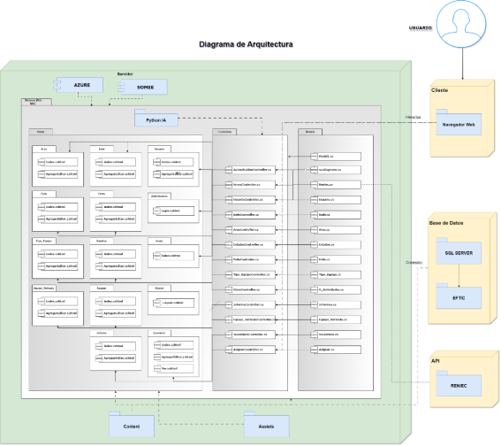
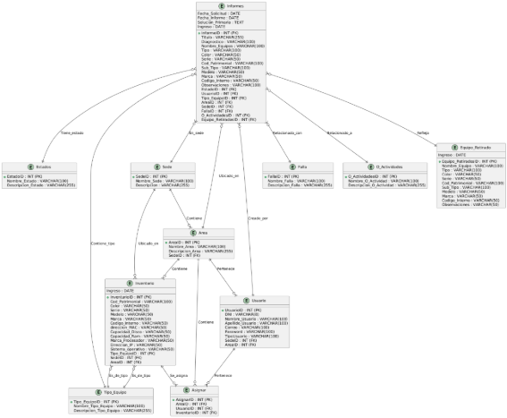



**UNIVERSIDAD PRIVADA DE TACNA**

**FACULTAD DE INGENIERÍA**

**Escuela Profesional de Ingeniería de Sistemas**

**Plataforma Avanzada para la Generación Automática de Diagramas UML para la empresa Tech Solutions**

Curso: Patrones de Software

Docente: Mag. Patrick Jose Cuadros Quiroga

Integrantes:

\- Alexis Jeanpierre Martínez Vargas			(2019063638)

\- Juan José David Pérez Vizcarra				(2019063636)

\- Jhon Thomas Ticona Chambi				(2018062232)

**Tacna-Perú**

**2025**

**Sistema Web de gestión de Inventario y Elaboración de Informes Técnicos implementado con IA para la municipalidad Distrital de Pocollay (EFTIC)**

**Documento SAD**

**Versión 1.0**

***Presentado Por:***

*Martínez Vargas, Alexis Jeanpierre*

*Documentador*

*2025*

|**Control de Versiones**||||||
| :-: | :- | :- | :- | :- | :- |
|**Versión**|**Hecha por**|**Revisada por**|**Aprobada por**|**Fecha**|**Motivo**|
|1\.0|AMV,JJPV|AMV, JTC,JJPV|JTC|31/03/2025|Versión Inicial|
# **INDICE GENERAL**
[1. Introducción	5](#_toc181286178)

[1.1. Propósito	5](#_toc181286179)

[1.2. Alcance	5](#_toc181286180)

[1.3. Definición, siglas y abreviaturas	5](#_toc181286181)

[1.4. Referencias	6](#_toc181286182)

[1.5. Visión General	6](#_toc181286183)

[2. Representación Arquitectónica	6](#_toc181286184)

[2.1. Escenarios	6](#_toc181286185)

[2.2. Vista Lógica	101](#_toc181286186)

[2.3. Vista del Proceso	103](#_toc181286187)

[2.4. Vista del desarrollo	117](#_toc181286188)

[2.5. Vista Física	118](#_toc181286189)

[3. Objetivos y limitaciones arquitectónicas	118](#_toc181286190)

[3.1. Disponibilidad	118](#_toc181286191)

[3.2. Seguridad	119](#_toc181286192)

[3.3. Adaptabilidad	119](#_toc181286193)

[3.4. Rendimiento	119](#_toc181286194)

[4. Análisis de Requerimientos	119](#_toc181286195)

[4.1. Requerimientos funcionales	119](#_toc181286196)

[4.2. Requerimientos no funcionales	122](#_toc181286197)

[5. Vistas de Caso de Uso	122](#_toc181286198)

[6. Vista Lógica	129](#_toc181286199)

[6.1. Diagrama de Clases	129](#_toc181286200)

[7. Vista de Procesos	133](#_toc181286201)

[7.1. Diagrama de Proceso Actual	133](#_toc181286202)

[7.2. Diagrama de Proceso Propuesto	134](#_toc181286203)

[8. Vista de Despliegue	134](#_toc181286204)

[8.1. Diagrama de Contenedor	134](#_toc181286205)

[9. Vista de Implementación	136](#_toc181286206)

[9.1. Diagrama de Componentes	136](#_toc181286207)

[10. Vista de Datos	137](#_toc181286208)

[10.1 Diagrama Entidad Relación	137](#_toc181286209)

[11. Calidad	138](#_toc181286210)

[11.1. Escenario de Seguridad	138](#_toc181286211)

[11.2. Escenario de Usabilidad	138](#_toc181286212)

[11.3. Escenario de Adaptabilidad	138](#_toc181286213)

[11.4. Escenario de Disponibilidad	138](#_toc181286214)

[11.5. Otro Escenario	139](#_toc181286215)

# **1. Introducción**
## **1.1. Propósito**
El presente documento tiene como objetivo describir la arquitectura general del sistema Plataforma Avanzada para la Generación Automática de Diagramas UML desarrollado para la empresa Tech Solutions. Este sistema tiene como propósito principal facilitar la visualización, edición y generación colaborativa de diagramas UML a partir de código fuente en diferentes lenguajes de programación.

El documento abordará los requerimientos funcionales de la plataforma, los casos de uso relevantes, así como los diagramas de secuencia y de clases que describen su funcionamiento. También se incluirá una descripción detallada de la implementación del sistema, los módulos principales y la forma en la que se atenderán los requisitos específicos establecidos por la empresa. Los detalles técnicos y de diseño se ampliarán en la especificación de casos de uso y en documentos complementarios que respaldan la planificación y desarrollo del sistema.
## **1.2. Alcance**
El proyecto abarca el desarrollo de una plataforma web interactiva y avanzada, que permita a desarrolladores y equipos técnicos generar de manera automática diagramas UML a partir de fragmentos de código fuente. La plataforma estará dirigida a los profesionales de Tech Solutions, quienes podrán utilizarla para analizar, documentar y compartir visualmente la estructura y comportamiento de sus aplicaciones.

Entre las principales funcionalidades se encuentran: la selección del tipo de diagrama UML a generar (clases, secuencia, casos de uso, componentes), el soporte para múltiples lenguajes de programación (como C#, Java, Python), la generación automática con vista previa en tiempo real, la edición manual de los diagramas generados, la colaboración en tiempo real, el historial de versiones, y la exportación de diagramas en diversos formatos (PNG, SVG, PDF o código compatible como PlantUML y Mermaid).

Además, se incorporarán validaciones sintácticas del código fuente, anotaciones personalizables, y un sistema de autenticación con diferentes roles de usuario (Invitado, Usuario y Administrador), garantizando así seguridad y control de acceso en la plataforma.

El principal objetivo del sistema es optimizar el proceso de documentación y análisis visual de software, promoviendo la eficiencia y la colaboración dentro de los equipos técnicos de Tech Solutions.
## **1.3. Definición, siglas y abreviaturas**
UML:

Definición: UML es la abreviatura de "Unified Modeling Language", que se traduce al español como "Lenguaje de Modelado Unificado". Es un estándar de la industria para la notación y la representación de sistemas de software, que se utiliza para visualizar, diseñar y documentar sistemas y procesos de software.

Siglas: Unified Modeling Language.

RUP:

Definición: RUP son las siglas de "Rational Unified Process". Se trata de una metodología de desarrollo de software que proporciona un enfoque disciplinado para asignar tareas y responsabilidades dentro de una organización de desarrollo de software.

Siglas: Rational Unified Process.
## **1.4. Referencias**
- Diagramas de Casos de Usos
- Página web de documentación de IBM. 
- Páginas web en información acerca de la Municipalidad Distrital de Pocollay.
## **1.5. Visión General**
La Plataforma Avanzada para la Generación Automática de Diagramas UML es una solución web orientada a profesionales del desarrollo de software y análisis de sistemas dentro de Tech Solutions. Su propósito principal es facilitar la comprensión, documentación y colaboración en proyectos de software a través de la generación visual automatizada de diagramas UML a partir de fragmentos de código fuente.

La plataforma ofrecerá una interfaz de usuario moderna e intuitiva que permitirá a los usuarios seleccionar el tipo de diagrama que desean generar (como clases, secuencia, casos de uso o componentes), pegar su código en múltiples lenguajes (C#, Java, Python, entre otros), y visualizar en tiempo real un diagrama UML generado automáticamente. Además, los usuarios podrán editar manualmente los diagramas generados, ajustando relaciones, añadiendo notas o modificando elementos, todo desde la misma plataforma.

Un componente clave del sistema será su capacidad colaborativa: los diagramas podrán compartirse en tiempo real con otros usuarios para permitir ediciones conjuntas, facilitando así el trabajo en equipo. También se integrarán funciones como el historial de versiones para recuperar cambios previos, validación de sintaxis en el código fuente, anotaciones técnicas, y la exportación en formatos como PNG, SVG, PDF o código compatible con PlantUML y Mermaid.

En resumen, esta plataforma representa una herramienta estratégica para Tech Solutions, ya que mejora significativamente el análisis estructural de software, promueve una comunicación más clara dentro de los equipos, y agiliza el proceso de documentación técnica mediante automatización e interfaces visuales altamente personalizables.
# **2. Representación Arquitectónica**
## **2.1. Escenarios**
**Modulo Iniciar Sesión:**

<table><tr><th><b>Caso de Uso</b></th><th><b>Iniciar Sesión</b></th></tr>
<tr><td><b>Tipo</b></td><td>Básico</td></tr>
<tr><td><b>Descripción</b></td><td>El usuario ingresa su DNI y contraseña para acceder al sistema. El acceso está limitado a personal autorizado. Si las credenciales son incorrectas, se muestra un mensaje de error.</td></tr>
<tr><td><b>Actores</b></td><td>Usuario</td></tr>
<tr><td rowspan="2"><b>Precondiciones</b></td><td>El usuario debe estar registrado previamente en el sistema.</td></tr>
<tr><td>La pantalla de inicio de sesión debe mostrarse si el usuario no está autenticado.</td></tr>
<tr><td rowspan="2"><b>Post condiciones</b></td><td>El usuario es redirigido a la página principal si la autenticación es correcta.</td></tr>
<tr><td>Se muestra un mensaje de error si los datos son incorrectos.</td></tr>
<tr><td><b>Modelo</b></td><td>Usuario.cs: Realiza la verificación de las credenciales contra la base de datos SQL y maneja las operaciones CRUD relacionadas con el usuario.</td></tr>
<tr><td><b>Vista</b></td><td>Login.cshtml: Muestra el formulario para ingresar el DNI y la contraseña, y maneja los mensajes de error y los botones de interacción.</td></tr>
<tr><td><b>Controlador</b></td><td>AutenticationController.cs: Controla el flujo de la autenticación, llamando al modelo para verificar credenciales y redirigiendo a la vista correspondiente.</td></tr>
<tr><td colspan="2"><b>Flujo normal de eventos: Validar Usuario</b></td></tr>
<tr><td><b>Acción del actor</b></td><td><b>Respuesta del sistema</b></td></tr>
<tr><td>1\. El usuario ingresa a la interfaz de inicio de sesión.</td><td>2\. Muestra una interfaz gráfica Login.cshtml con una imagen de la Municipalidad Distrital de Pocollay y a un costado están los campos para ingresar “DOCUMENTO” y “CONTRASEÑA” en ambos campos se muestra un texto escondido que dice lo siguiente: “Ingrese número de documento o RUC” en DOCUMENTO y “Ingrese Contraseña” en CONTRASEÑA también en este Campo se habilita un botón que muestra el texto encriptado a la hora de colocar la contraseña y por ultimo abajo se encuentra con el botón “INICIAR SESIÓN”.</td></tr>
<tr><td>3\. El usuario ingresa su “DOCUMENTO” y “CONTRASEÑA”.</td><td>4\. La vista captura los datos ingresados y los envía al método Index del controlador AutenticationController.cs al hacer clic en "Iniciar Sesión".</td></tr>
<tr><td> </td><td>5\. El controlador valida que ambos campos estén llenos.</td></tr>
<tr><td> </td><td>6\. El controlador verifica si los datos ingresados son correctos utilizando el método Autenticar() en el modelo Usuario.cs.</td></tr>
<tr><td> </td><td>7\. Si los datos son válidos, el controlador establece la sesión del usuario y lo redirige a la página principal (Home).</td></tr>
<tr><td> </td><td>8\. El controlador registra la entrada del usuario en el sistema.</td></tr>
<tr><td>9\. El usuario ve la Página Principal (Home).</td><td> </td></tr>
<tr><td colspan="2"><b>Flujo Alternativo A-1</b></td></tr>
<tr><td><b>Acción del actor</b></td><td><b>Respuesta del sistema</b></td></tr>
<tr><td>1\. El usuario deja vacío uno o ambos campos.</td><td>2\. El sistema muestra un mensaje en la vista Login.cshtml indicando que ambos campos deben ser completados.</td></tr>
<tr><td colspan="2"><b>Flujo de Excepción E-1</b></td></tr>
<tr><td><b>Acción del actor</b></td><td><b>Respuesta del sistema</b></td></tr>
<tr><td>1\. El usuario ingresa un DNI o contraseña incorrectos.</td><td>2\. El controlador redirige nuevamente a la vista Login.cshtml mostrando el mensaje: "DNI o Contraseña incorrectos. Por favor, revise sus credenciales e intente nuevamente".</td></tr>
</table>

|***PROTOTIPO INICIO DE SESION***|
| :-: |
||

## **2.2. Vista Lógica**
**Diagrama de Subsistemas (paquetes):**

*Figura 1: Diagrama de Paquetes de Diseño con los Carpetas del Sistema Web Inventario*

*Fuente: Elaboración Propia*

**Descripción del Diagrama de Paquetes**

Este diagrama de paquetes representa la arquitectura del sistema web "EFTIC", que incluye tres componentes externos principales: **API RENIEC**, **Python IA** y la base de datos **SQL Server "EFTIC"**.

- **API RENIEC**: Utilizada para la validación de los DNI de los usuarios. Se conecta directamente con la vista de **Usuario** y el controlador **UsuarioController.cs** para verificar datos personales en el momento de registro o autenticación, y está representada en el modelo por el archivo **Reniec.cs**.
- **Python IA**: Una inteligencia artificial desarrollada en Python que da soporte a todo el sistema web, proveyendo análisis de datos y funcionalidades avanzadas. Este módulo tiene acceso a todas las carpetas de vistas, controladores y modelos, permitiendo que el sistema integre respuestas inteligentes y predicciones en diferentes áreas funcionales.
- **SQL Server "EFTIC"**: La base de datos principal del sistema, que almacena todos los datos estructurados relacionados con usuarios, áreas, sedes, equipos, inventarios, asignaciones, informes y más. Todos los modelos, controladores y vistas interactúan con esta base de datos para realizar operaciones CRUD y recuperar información en tiempo real.

**Estructura del Sistema**

El sistema se organiza en tres capas:

1. **Vistas (Views)**: Contiene las interfaces de usuario, con carpetas para cada funcionalidad, como **Área**, **Sede**, **Usuario**, **Falla**, **Estados**, **Inventario**, entre otras. Cada carpeta tiene dos archivos principales: uno para visualizar los registros (Index.cshtml) y otro para agregar o editar (AgregarEditar.cshtml). También se incluye una vista compartida (\_Layout.cshtml) para la estructura de navegación y una vista de autenticación (Login.cshtml).
1. **Controladores (Controllers)**: Define la lógica de negocio y las operaciones CRUD para cada funcionalidad, tales como **UsuarioController.cs**, **AreaController.cs**, **FallaController.cs**, y **InformesController.cs**. Estos controladores gestionan las interacciones entre la base de datos y las vistas.
1. **Modelos (Models)**: Contiene la definición de las entidades de la base de datos, incluyendo **Sede.cs**, **Area.cs**, **Estados.cs**, **Inventario.cs**, y **Informes.cs**. Estos modelos representan las tablas de la base de datos y mantienen la estructura y las relaciones entre los datos.

## **2.3. Vista del Proceso**
**Diagrama de Secuencia:**

*Figura 2: Diagrama de Secuencia de Inicio de Sesión del Sistema Web Inventario*

*Fuente: Elaboración Propia*

\
Este diagrama muestra el proceso de iniciar sesión de un usuario en el sistema. El usuario ingresa su DNI y contraseña en la interfaz de login, la cual envía las credenciales al AuthenticationController. El controlador valida la información con el modelo de usuario. Si las credenciales son correctas, el usuario es redirigido a la página principal; si son incorrectas, se muestra un mensaje de error.

## **2.4. Vista del desarrollo**
El **Sistema Web de Inventario con IA** utiliza una arquitectura basada en **capas MVC (Modelo-Vista-Controlador)**, que separa las funcionalidades del sistema en tres componentes principales, cada uno con un rol específico:

**• Capa de Control:**

La **capa de control** actúa como intermediario entre las vistas y los modelos. Su función principal es gestionar las interacciones del usuario, controlar el flujo de datos entre la interfaz y la base de datos, y ejecutar las acciones solicitadas. Esta capa responde a las acciones del usuario y ejecuta la lógica necesaria para satisfacer los requisitos de la aplicación. En el caso del **Sistema Web de Inventario**, el controlador maneja tareas como agregar, editar, eliminar, y consultar inventarios y usuarios.

**• Capa de Modelo:**

La **capa de modelo** se encarga de la gestión de los datos del sistema. Aquí se encuentran los mecanismos para acceder, manipular y actualizar la información almacenada en la base de datos. Las entidades de la aplicación están representadas en esta capa, y las operaciones como **select**, **insert**, **update**, y **delete** son ejecutadas a través de consultas SQL en la base de datos. Por ejemplo, en el caso de la gestión de inventarios, los datos de los equipos, usuarios y transacciones están contenidos en esta capa.

**• Capa de Vista:**

La **capa de vista** es responsable de la presentación y renderización de las interfaces de usuario. En esta capa se produce el código **HTML**, **CSS**, y **JavaScript** necesarios para mostrar los datos y formularios de la aplicación. Las vistas son dinámicas, adaptándose a las acciones que el usuario ejecuta en el sistema, como agregar un equipo o consultar reportes. En el **Sistema Web de Inventario**, las vistas contienen formularios para agregar o editar equipos y muestran listados de inventarios y usuarios, facilitando la interacción con el sistema.

**• Cliente:**

El **cliente** es el usuario que interactúa con la capa de control, que responde a las acciones realizadas. Dependiendo del rol asignado al cliente, este tendrá diferentes niveles de acceso al sistema. En el **Sistema Web de Inventario**, los usuarios con rol de soporte pueden gestionar equipos, usuarios, etc.

## **2.5. Vista Física**
**Primera Capa: Control**

Los **usuarios** ya registrados con nombre de usuario y contraseña pueden ingresar al sistema según los roles asignados por el **Soporte**.

- El **Usuario-Soporte** tiene acceso completo a la gestión de usuarios, equipos de inventario, etc.

La conexión entre la capa de control y la capa de modelo se realiza mediante consultas a la base de datos. Los controladores gestionan las solicitudes y envían los datos necesarios para la capa de vista.

**Segunda Capa: Vista**

En la **capa de vista**, se encuentran todas las páginas web del sistema, accesibles a través de un navegador. Los usuarios pueden interactuar con formularios, listas y reportes generados desde esta capa.

- El sistema muestra una página inicial donde se listan los equipos, los usuarios y otras opciones de gestión, dependiendo del nivel de acceso del usuario.
- Las vistas están diseñadas para ser accesibles y funcionales en diferentes navegadores web.

**Tercera Capa: Modelo**

La **capa de modelo** contiene todos los mecanismos de lógica de negocio, como los modelos de datos y las consultas necesarias para el funcionamiento del sistema.

- Aquí es donde se almacenan las entidades del sistema, como **usuarios**, **equipos**, y **transacciones**. Esta capa es implementada utilizando **C#** y realiza las operaciones en la base de datos SQL que respalda el sistema.

# **3. Objetivos y limitaciones arquitectónicas**
## **3.1. Disponibilidad**
El sistema está diseñado para soportar un número ilimitado de usuarios, equipos y operaciones, siempre que los recursos de almacenamiento y procesamiento de la base de datos y los servidores sean suficientes. El tiempo de respuesta es rápido, permitiendo el uso del sistema durante largas jornadas sin afectar su rendimiento.

## **3.2. Seguridad**
La seguridad es una prioridad dentro del **Sistema Web de Inventario con IA**. Se implementa un sistema de autenticación y autorización en el que solo los usuarios registrados pueden acceder al sistema. El acceso está restringido por roles, garantizando que cada usuario solo pueda acceder a las funcionalidades que le corresponden. Además, la base de datos está protegida para garantizar la integridad y confidencialidad de los datos.

## **3.3. Adaptabilidad**
El sistema está diseñado para ser compatible con diversos navegadores web en plataformas de 64 bits y dispositivos Android. Aunque el sistema no ha sido probado en versiones más recientes de sistemas operativos como **Windows 11**, se espera que sea funcional en una amplia gama de entornos.

## **3.4. Rendimiento**
El sistema está optimizado para manejar un gran volumen de datos y usuarios. El **Sistema Web de Inventario con IA** está diseñado para funcionar eficientemente durante largos periodos de uso, garantizando una experiencia de usuario fluida y sin interrupciones.

# **4. Análisis de Requerimientos**
## **4.1. Requerimientos funcionales**
*Tabla 1: Cuadro de Requisitos Funcionales Final del Proyecto Plataforma Avanzada para la Generación Automática de Diagramas UML para la empresa Tech Solutions*

<table><tr><th><b>Nombre</b></th><th><b>Código</b></th><th><b>Descripción</b></th><th><b>Sistema</b></th><th><b>Prioridad</b></th></tr>
<tr><td>RF-01</td><td rowspan="2"><b>Selección de Opciones</b></td><td>Elegir el tipo de diagrama UML a generar: Clases, Secuencia, Casos de Uso, Componentes.</td><td>Plataforma Web</td><td>Alta</td></tr>
<tr><td>RF-02</td><td>Soporte para múltiples lenguajes de programación (C#, Java, Python, etc.).</td><td>Plataforma Web</td><td>Alta</td></tr>
<tr><td>RF-03</td><td><b>Generación de UML</b></td><td>Convertir automáticamente el código pegado en un diagrama UML con vista previa en tiempo real.</td><td>Plataforma Web</td><td>Alta</td></tr>
<tr><td>RF-04</td><td><b>Edición y Personalización</b></td><td>Permitir la edición manual del diagrama generado, añadiendo o eliminando nodos, relaciones o notas.</td><td>Plataforma Web</td><td>Alta</td></tr>
<tr><td>RF-05</td><td><b>Colaboración</b></td><td>Permitir compartir diagramas UML en tiempo real con otros usuarios para edición conjunta.</td><td>Plataforma Web</td><td>Media</td></tr>
<tr><td>RF-06</td><td><b>Exportación</b></td><td>Guardar diagramas en diferentes formatos: PNG, SVG, PDF o en código PlantUML/Mermaid.</td><td>Plataforma Web</td><td>Alta</td></tr>
<tr><td>RF-07</td><td><b>Historial y Versionado</b></td><td>Permitir la reversión a versiones anteriores del diagrama para recuperar cambios previos.</td><td>Plataforma Web</td><td>Media</td></tr>
<tr><td>RF-08</td><td><b>Comentarios y Notas</b></td><td>Posibilidad de añadir anotaciones o notas técnicas a los elementos del diagrama UML.</td><td>Plataforma Web</td><td>Baja</td></tr>
<tr><td>RF-09</td><td><b>Validaciones</b></td><td>Alertar si el código pegado tiene errores de sintaxis que impiden la generación del diagrama.</td><td>Plataforma Web</td><td>Alta</td></tr>
<tr><td>RF-10</td><td><b>Seguridad y Acceso</b></td><td>Implementar autenticación de usuarios con roles de acceso </td><td>Plataforma Web</td><td>Alta</td></tr>
</table>

*Fuente: Elaboración Propia*	
## **4.2. Requerimientos no funcionales**
*Tabla 1: Cuadro de Requisitos No Funcionales del Proyecto Plataforma Avanzada para la Generación Automática de Diagramas UML para la empresa Tech Solutions*

<table><tr><th><b>Nro. Rnf</b></th><th><b>Requerimientos no Funcional</b></th><th><b>Descripción del Requerimiento No Funcional</b></th></tr>
<tr><td rowspan="2">Rnf01</td><td rowspan="2">Rendimiento</td><td>El sitio web debe tener un tiempo de carga máximo de 2 segundos para garantizar una experiencia de usuario fluida.</td></tr>
<tr><td>El sistema debe ser capaz de manejar hasta 1000 usuarios concurrentes sin degradación significativa del rendimiento.</td></tr>
<tr><td rowspan="2">Rnf02</td><td rowspan="2">Seguridad</td><td>El sitio web debe implementar medidas de seguridad, como cifrado SSL, para proteger los datos de los usuarios.</td></tr>
<tr><td>Debe haber una política de contraseñas seguras que requiera contraseñas fuertes para los usuarios registrados.</td></tr>
<tr><td>Rnf03</td><td>Disponibilidad</td><td>El sitio web debe estar disponible las 24 horas del día, los 7 días de la semana, con un tiempo de inactividad planificado mínimo.</td></tr>
<tr><td rowspan="2">Rnf04</td><td rowspan="2">Usabilidad</td><td>El diseño y la interfaz de usuario del sitio web deben ser intuitivos y fáciles de usar para niños, con elementos visuales atractivos.</td></tr>
<tr><td>El sitio debe ser accesible desde dispositivos móviles y tabletas, además de computadoras de escritorio.</td></tr>
<tr><td>Rnf05</td><td>Compatibilidad</td><td>El sitio web debe ser compatible con los principales navegadores web, como Chrome, Firefox, Edge y Safari.</td></tr>
</table>

*Fuente: Elaboración Propia*
# **5. Vistas de Caso de Uso**
*Figura 15: Diagrama de Caso de Uso de Iniciar Sesión incluyendo la acción de validar Usuario*

*Fuente: Elaboración Propia*

# **6. Vista Lógica**
## **6.1. Diagrama de Clases**
*Figura 28: Diagrama de Clases del Sistema Web Inventario*

*Fuente: Elaboración Propia*

**Clases Principales:**

1. **InformeTecnico**: Sigue siendo el núcleo del sistema, pero ahora en modo diseño incluye claramente los métodos que permiten gestionar los informes técnicos, como:
   1. Agregar\_InformeTecnico()
   1. Modificar\_InformeTecnico()
   1. Eliminar\_InformeTecnico()
   1. Listar\_InformeTecnico()
   1. GenerarPDF\_InformeTecnico()

Además, se destacan los atributos más detallados para el informe, como la fecha de solicitud, situación, nombre de los equipos y las IDs asociadas a FallaID, ActividadesID, EquipoRetiradoID, etc.

1. **Equipo\_Retirado**: En esta clase se gestionan equipos que han sido retirados del inventario. Ahora, en el diseño, se incluyen métodos para realizar acciones CRUD (Crear, Leer, Actualizar, Eliminar):
   1. Agregar\_Equipo\_Retirado()
   1. Modificar\_Equipo\_Retirado()
   1. Eliminar\_Equipo\_Retirado()
   1. Listar\_Equipo\_Retirado()

Los atributos son más detallados y específicos, como el modelo, marca, serie, código patrimonial, entre otros.

1. **Falla**: Se encarga de la gestión de las fallas registradas en los equipos. Los métodos CRUD están claramente definidos:
   1. Agregar\_Falla()
   1. Modificar\_Falla()
   1. Eliminar\_Falla()
   1. Listar\_Falla()
1. **O\_Actividades**: Aquí se gestionan las actividades asociadas con los equipos o informes técnicos. Tiene los métodos CRUD correspondientes:
   1. Agregar\_Actividad()
   1. Modificar\_Actividad()
   1. Eliminar\_Actividad()
   1. Listar\_O\_Actividad()

Los atributos incluyen información sobre las actividades como el nombre y descripción de la actividad.

1. **Estado**: En esta clase se definen los distintos estados de los equipos, y en modo diseño se incluyen los métodos CRUD:
   1. Agregar\_Estado()
   1. Modificar\_Estado()
   1. Eliminar\_Estado()
   1. Listar\_Estado()
1. **Inventario**: Gestiona los equipos que están activos en el inventario. Los métodos CRUD están definidos como:
   1. Agregar\_Inventario()
   1. Modificar\_Inventario()
   1. Eliminar\_Inventario()
   1. Listar\_Inventario()

Se incluyen atributos que especifican detalles del equipo, como el código patrimonial, número de serie, modelo, y su sede asociada.

1. **Asignar**: Esta clase gestiona la asignación de equipos a usuarios, permitiendo vincular equipos del inventario con los usuarios que los utilizan. Se incluyen los métodos CRUD:
   1. Agregar\_Asignacion()
   1. Modificar\_Asignacion()
   1. Eliminar\_Asignacion()
   1. Listar\_Asignacion()
1. **Usuario**: Maneja los usuarios que interactúan con el sistema, permitiendo registrar, modificar y listar usuarios. Incluye métodos CRUD para gestionar los usuarios:
   1. Agregar\_Usuario()
   1. Modificar\_Usuario()
   1. Eliminar\_Usuario()
   1. Listar\_Usuario()

Los atributos son detallados y claros, incluyendo el DNI, nombre, apellido, correo, y sede del usuario.

1. **Area**: Esta clase contiene las áreas de trabajo de la organización. Los métodos CRUD están incluidos:
   1. Agregar\_Area()
   1. Modificar\_Area()
   1. Eliminar\_Area()
   1. Listar\_Area()

El área está vinculada tanto a las sedes como a los usuarios.

1. **Sede**: Aquí se gestionan las sedes de la organización, con métodos CRUD definidos:
   1. Agregar\_Sede()
   1. Modificar\_Sede()
   1. Eliminar\_Sede()
   1. Listar\_Sede()
1. **Tipo\_Equipo**: Esta clase gestiona los tipos específicos de equipos disponibles en el inventario, permitiendo agregar, modificar, eliminar y listar los tipos de equipos:
   1. Agregar\_Tipo\_Equipo()
   1. Modificar\_Tipo\_Equipo()
   1. Eliminar\_Tipo\_Equipo()
   1. Listar\_Tipo\_Equipo()

**Relaciones Clave:**

- **Relación "usa"**: Varias clases, como InformeTecnico, Inventario, Falla, y Actividades, están conectadas mediante relaciones de uso, indicando que dependen de la información de otras clases para sus operaciones.
- **Relación "pertenece\_a"**: Se mantiene la relación entre Area y Sede, donde cada área pertenece a una sede específica.
- **Relación "asigna\_a"**: La clase Asignar vincula a los usuarios con el inventario, permitiendo asignar equipos a usuarios específicos.
- **Relación "trabaja\_en"**: Los usuarios están relacionados con las áreas, indicando en qué área trabaja cada usuario.

**Diferencias con el Diagrama de Análisis:**

En este diagrama de diseño, la estructura del sistema es más detallada, y se han definido de manera clara los métodos que implementarán la lógica del sistema. Las relaciones entre las clases son las mismas, pero en esta fase de diseño se han concretado los métodos para que cada clase realice las operaciones que necesita para interactuar con otras entidades del sistema.

# **7. Vista de Procesos**
## **7.1. Diagrama de Proceso Actual**
*Figura 29: Diagrama de Actividad del Proceso Actual de Generar Informe de Daños de Equipo de la Municipalidad Distrital de Pocollay*

*Fuente: Elaboración Propia*

## **7.2. Diagrama de Proceso Propuesto**
*Figura 30: Diagrama de Actividad del Proceso Propuesto de Generar Informe de Daños de Equipo de la Municipalidad Distrital de Pocollay*
##

*Fuente: Elaboración Propia*
# **8. Vista de Despliegue**	
## **8.1. Diagrama de Contenedor**
*Figura 31: Diagrama de Contenedor del Sistema Web Inventario donde se explica el Proceso por el cual el Usuario realiza una petición al Sistema Web*

*Fuente: Elaboración Propia*
# **9. Vista de Implementación**
## **9.1. Diagrama de Componentes**
*Figura 32: Diagrama de Componentes del Sistema Web Inventario donde se explica el Proceso por el cual el Usuario realiza una petición al Sistema Web*

*Fuente: Elaboración Propia*

*Este diagrama representa la arquitectura **MVC (Modelo-Vista-Controlador)** en una aplicación web, donde el **Controlador** actúa como intermediario entre el **Modelo**, que gestiona la lógica de negocio y el acceso a datos, y la **Vista**, que muestra la interfaz de usuario. Los controladores procesan las solicitudes de los usuarios, interactúan con el modelo para obtener o modificar datos y devuelven la vista correspondiente para mostrar la información al usuario. Esta separación permite un desarrollo modular, facilitando el mantenimiento y la escalabilidad de la aplicación.*
# **10. Vista de Datos**
## **10.1 Diagrama Entidad Relación**
*Figura 33: Diagrama de Entidad Relación en Diseño del Sistema Web Inventario*

*Fuente: Elaboración Propia*

**Descripción del Diagrama de Entidad-Relación**

Este diagrama representa la estructura de la base de datos para un sistema de gestión de inventarios y elaboración de informes técnicos. Las principales entidades (tablas) incluyen **Estados**, **Sede**, **Área**, **Tipo\_Equipo**, **Usuario**, **Inventario**, **Informes**, y **Asignar**. Cada entidad contiene atributos específicos, destacando los identificadores primarios (PK) y las claves foráneas (FK) que establecen las relaciones.

- **Sede** se relaciona con **Área**, **Usuario**, y **Inventario**, reflejando la ubicación y gestión de recursos.
- **Informes** centraliza datos clave, vinculándose con **Estados**, **Usuario**, **Área**, **Sede**, y otras entidades para documentar información detallada sobre fallas, equipos retirados, y actividades de mantenimiento.
- **Asignar** gestiona la asignación de **Usuarios** y **Áreas** a **Inventarios**, proporcionando control sobre los activos de la organización.

Este modelo facilita la gestión de inventario y permite la generación de informes detallados sobre el estado, ubicación y características de los equipos en el sistema.
# **11. Calidad**
## **11.1. Escenario de Seguridad**
- **Fuente de estímulo**: Administrador
- **Estímulo**: Ingreso de datos de inventario o usuario
- **Artefacto**: Almacenamiento de datos en la base de datos SQL
- **Ambiente**: Durante la operación de registro de equipos o usuarios
- **Respuesta**: Validación de los datos ingresados (por ejemplo, validación de campos obligatorios, formato correcto, y duplicados)
- **Medición de respuesta**: Validación completada en un máximo de 3 segundos
## **11.2. Escenario de Usabilidad**
- **Fuente de estímulo**: Usuario
- **Estímulo**: Acceso al sistema
- **Artefacto**: Página de inicio de sesión y verificación de credenciales
- **Ambiente**: Operación de inicio de sesión desde la página de autenticación
- **Respuesta**: Autenticación exitosa y acceso a las funcionalidades según los roles del usuario
- **Medición de respuesta**: El sistema debe responder en un máximo de 5 segundos
## **11.3. Escenario de Adaptabilidad**
- **Fuente de estímulo**: Usuario
- **Estímulo**: Consulta de lista de equipos o usuarios
- **Artefacto**: Almacenamiento de datos en la base de datos SQL
- **Ambiente**: Durante la operación de listado de usuarios o inventario
- **Respuesta**: Los datos solicitados se muestran en la interfaz de usuario
- **Medición de respuesta**: El listado debe cargarse inmediatamente, en un tiempo inferior a 2 segundos
## **11.4. Escenario de Disponibilidad**
- **Fuente de estímulo**: Administrador
- **Estímulo**: Cambio de roles de usuario
- **Artefacto**: Sistema Web de Inventario
- **Ambiente**: En cualquier momento desde el panel de administración
- **Respuesta**: Los cambios de rol deben reflejarse en el acceso y las acciones disponibles para el usuario la próxima vez que inicie sesión
- **Medición de respuesta**: Los cambios deben reflejarse inmediatamente en la siguiente sesión del usuario
## **11.5. Otro Escenario**
- **Fuente de estímulo**: Administrador
- **Estímulo**: Modificación de datos de equipos o usuarios
- **Artefacto**: Base de datos del sistema
- **Ambiente**: Durante las operaciones de actualización en cualquier momento
- **Respuesta**: Los cambios se reflejan inmediatamente en los listados y formularios correspondientes
- **Medición de respuesta**: Los cambios deben reflejarse de inmediato, en menos de 2 segundos	
