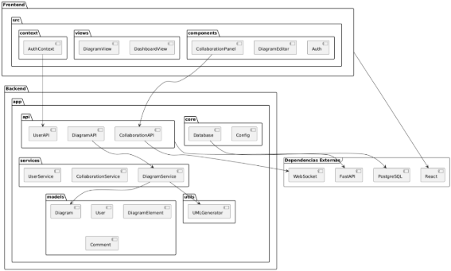

**UNIVERSIDAD PRIVADA DE TACNA**

**FACULTAD DE INGENIERÍA**

**Escuela Profesional de Ingeniería de Sistemas**

**Plataforma Avanzada para la Generación Automática de Diagramas UML para la empresa Tech Solutions**

Curso: Patrones de Software

Docente: Mag. Patrick Jose Cuadros Quiroga

Integrantes:

\- Alexis Jeanpierre Martínez Vargas			(2019063638)

\- Juan José David Pérez Vizcarra				(2019063636)

\- Jhon Thomas Ticona Chambi				(2018062232)

**Tacna-Perú**

**2025**

**Sistema Web de gestión de Inventario y Elaboración de Informes Técnicos implementado con IA para la municipalidad Distrital de Pocollay (EFTIC)**

**Documento SAD**

**Versión 1.0**

***Presentado Por:***

*Martínez Vargas, Alexis Jeanpierre*

*Documentador*

*2025*

|**Control de Versiones**||||||
| :-: | :- | :- | :- | :- | :- |
|**Versión**|**Hecha por**|**Revisada por**|**Aprobada por**|**Fecha**|**Motivo**|
|1\.0|AMV,JJPV|AMV, JTC,JJPV|JTC|31/03/2025|Versión Inicial|
# **INDICE GENERAL**
[1. Introducción	5](#_toc202029983)

[1.1. Propósito	5](#_toc202029984)

[1.2. Alcance	5](#_toc202029985)

[1.3. Definición, siglas y abreviaturas	6](#_toc202029986)

[1.4. Referencias	6](#_toc202029987)

[1.5. Visión General	6](#_toc202029988)

[2. Representación Arquitectónica	7](#_toc202029989)

[2.1. Escenarios	7](#_toc202029990)

[2.2. Vista Lógica	7](#_toc202029991)

[2.3. Vista del Proceso	8](#_toc202029992)

[2.4. Vista del desarrollo	12](#_toc202029993)

[2.5. Vista Física	13](#_toc202029994)

[3. Objetivos y limitaciones arquitectónicas	14](#_toc202029995)

[3.1. Disponibilidad	14](#_toc202029996)

[3.2. Seguridad	14](#_toc202029997)

[3.3. Adaptabilidad	15](#_toc202029998)

[3.4. Rendimiento	15](#_toc202029999)

[4. Análisis de Requerimientos	15](#_toc202030000)

[4.1. Requerimientos funcionales	15](#_toc202030001)

[4.2. Requerimientos no funcionales	16](#_toc202030002)

[5. Vistas de Caso de Uso	17](#_toc202030003)

[6. Vista Lógica	18](#_toc202030004)

[6.1. Diagrama de Clases	18](#_toc202030005)

[7. Vista de Procesos	19](#_toc202030006)

[7.1. Diagrama de Proceso Actual	19](#_toc202030007)

[7.8. Vista de Despliegue	22](#_toc202030008)

[8.1. Diagrama de Contenedor	22](#_toc202030009)

[9. Vista de Implementación	23](#_toc202030010)

[9.1. Diagrama de Componentes	23](#_toc202030011)

[10. Vista de Datos	23](#_toc202030012)

[10.1 Diagrama Entidad Relación	23](#_toc202030013)

[11. Calidad	24](#_toc202030014)

[11.1. Escenario de Seguridad	24](#_toc202030015)

[11.2. Escenario de Usabilidad	24](#_toc202030016)

[11.3. Escenario de Adaptabilidad	25](#_toc202030017)

[11.4. Escenario de Disponibilidad	25](#_toc202030018)

[11.5. Otro Escenario	25](#_toc202030019)

# **1. Introducción**
## **1.1. Propósito**
El presente documento tiene como objetivo describir la arquitectura general del sistema Plataforma Avanzada para la Generación Automática de Diagramas UML desarrollado para la empresa Tech Solutions. Este sistema tiene como propósito principal facilitar la visualización, edición y generación colaborativa de diagramas UML a partir de código fuente en diferentes lenguajes de programación.

El documento abordará los requerimientos funcionales de la plataforma, los casos de uso relevantes, así como los diagramas de secuencia y de clases que describen su funcionamiento. También se incluirá una descripción detallada de la implementación del sistema, los módulos principales y la forma en la que se atenderán los requisitos específicos establecidos por la empresa. Los detalles técnicos y de diseño se ampliarán en la especificación de casos de uso y en documentos complementarios que respaldan la planificación y desarrollo del sistema.
## **1.2. Alcance**
El proyecto abarca el desarrollo de una plataforma web interactiva y avanzada, que permita a desarrolladores y equipos técnicos generar de manera automática diagramas UML a partir de fragmentos de código fuente. La plataforma estará dirigida a los profesionales de Tech Solutions, quienes podrán utilizarla para analizar, documentar y compartir visualmente la estructura y comportamiento de sus aplicaciones.

Entre las principales funcionalidades se encuentran: la selección del tipo de diagrama UML a generar (clases, secuencia, casos de uso, componentes), el soporte para múltiples lenguajes de programación (como C#, Java, Python), la generación automática con vista previa en tiempo real, la edición manual de los diagramas generados, la colaboración en tiempo real, el historial de versiones, y la exportación de diagramas en diversos formatos (PNG, SVG, PDF o código compatible como PlantUML y Mermaid).

Además, se incorporarán validaciones sintácticas del código fuente, anotaciones personalizables, y un sistema de autenticación con diferentes roles de usuario (Invitado, Usuario y Administrador), garantizando así seguridad y control de acceso en la plataforma.

El principal objetivo del sistema es optimizar el proceso de documentación y análisis visual de software, promoviendo la eficiencia y la colaboración dentro de los equipos técnicos de Tech Solutions.

## **1.3. Definición, siglas y abreviaturas**
UML:

Definición: UML es la abreviatura de "Unified Modeling Language", que se traduce al español como "Lenguaje de Modelado Unificado". Es un estándar de la industria para la notación y la representación de sistemas de software, que se utiliza para visualizar, diseñar y documentar sistemas y procesos de software.

Siglas: Unified Modeling Language.

RUP:

Definición: RUP son las siglas de "Rational Unified Process". Se trata de una metodología de desarrollo de software que proporciona un enfoque disciplinado para asignar tareas y responsabilidades dentro de una organización de desarrollo de software.

Siglas: Rational Unified Process.
## **1.4. Referencias**
- Diagramas de Casos de Usos
- Página web de documentación de IBM. 
- Páginas web en información acerca de la Municipalidad Distrital de Pocollay.
## **1.5. Visión General**
La Plataforma Avanzada para la Generación Automática de Diagramas UML es una solución web orientada a profesionales del desarrollo de software y análisis de sistemas dentro de Tech Solutions. Su propósito principal es facilitar la comprensión, documentación y colaboración en proyectos de software a través de la generación visual automatizada de diagramas UML a partir de fragmentos de código fuente.

La plataforma ofrecerá una interfaz de usuario moderna e intuitiva que permitirá a los usuarios seleccionar el tipo de diagrama que desean generar (como clases, secuencia, casos de uso o componentes), pegar su código en múltiples lenguajes (C#, Java, Python, entre otros), y visualizar en tiempo real un diagrama UML generado automáticamente. Además, los usuarios podrán editar manualmente los diagramas generados, ajustando relaciones, añadiendo notas o modificando elementos, todo desde la misma plataforma.

Un componente clave del sistema será su capacidad colaborativa: los diagramas podrán compartirse en tiempo real con otros usuarios para permitir ediciones conjuntas, facilitando así el trabajo en equipo. También se integrarán funciones como el historial de versiones para recuperar cambios previos, validación de sintaxis en el código fuente, anotaciones técnicas, y la exportación en formatos como PNG, SVG, PDF o código compatible con PlantUML y Mermaid.

En resumen, esta plataforma representa una herramienta estratégica para Tech Solutions, ya que mejora significativamente el análisis estructural de software, promueve una comunicación más clara dentro de los equipos, y agiliza el proceso de documentación técnica mediante automatización e interfaces visuales altamente personalizables.
# **2. Representación Arquitectónica**
## **2.1. Escenarios**
**Modulo Iniciar Sesión:**

## **2.2. Vista Lógica**
**Diagrama de Subsistemas (paquetes):**

*Figura 1: Diagrama de Paquetes de Diseño con los Carpetas del Sistema Web Inventario*

*Fuente: Elaboración Propia*

**Estructura del Sistema**

El sistema se organiza en tres capas:

1. **Vistas (Views)**: Contiene las interfaces de usuario, con carpetas para cada funcionalidad, como **Área**, **Sede**, **Usuario**, **Falla**, **Estados**, **Inventario**, entre otras. Cada carpeta tiene dos archivos principales: uno para visualizar los registros (Index.cshtml) y otro para agregar o editar (AgregarEditar.cshtml). También se incluye una vista compartida (\_Layout.cshtml) para la estructura de navegación y una vista de autenticación (Login.cshtml).
1. **Controladores (Controllers)**: Define la lógica de negocio y las operaciones CRUD para cada funcionalidad, tales como **UsuarioController.cs**, **AreaController.cs**, **FallaController.cs**, y **InformesController.cs**. Estos controladores gestionan las interacciones entre la base de datos y las vistas.
1. **Modelos (Models)**: Contiene la definición de las entidades de la base de datos, incluyendo **Sede.cs**, **Area.cs**, **Estados.cs**, **Inventario.cs**, y **Informes.cs**. Estos modelos representan las tablas de la base de datos y mantienen la estructura y las relaciones entre los datos.

## **2.3. Vista del Proceso**
**Diagrama de Secuencia:**

*Figura 2: Diagrama de Secuencia – Autenticación de usuario*  

*Fuente: Elaboración Propia*

Figura 2: Diagrama de Secuencia de - Colaboración

Figura 2: Diagrama de Secuencia - Generación de diagramas UML

Figura 2: Diagrama de Secuencia versiona miento

\
Este diagrama muestra el proceso de iniciar sesión de un usuario en el sistema. El usuario ingresa su DNI y contraseña en la interfaz de login, la cual envía las credenciales al AuthenticationController. El controlador valida la información con el modelo de usuario. Si las credenciales son correctas, el usuario es redirigido a la página principal; si son incorrectas, se muestra un mensaje de error.

## **2.4. Vista del desarrollo**
El **Sistema Web de Inventario con IA** utiliza una arquitectura basada en **capas MVC (Modelo-Vista-Controlador)**, que separa las funcionalidades del sistema en tres componentes principales, cada uno con un rol específico:

**• Capa de Control:**

La **capa de control** actúa como intermediario entre las vistas y los modelos. Su función principal es gestionar las interacciones del usuario, controlar el flujo de datos entre la interfaz y la base de datos, y ejecutar las acciones solicitadas. Esta capa responde a las acciones del usuario y ejecuta la lógica necesaria para satisfacer los requisitos de la aplicación. En el caso del **Sistema Web de Inventario**, el controlador maneja tareas como agregar, editar, eliminar, y consultar inventarios y usuarios.

**• Capa de Modelo:**

La **capa de modelo** se encarga de la gestión de los datos del sistema. Aquí se encuentran los mecanismos para acceder, manipular y actualizar la información almacenada en la base de datos. Las entidades de la aplicación están representadas en esta capa, y las operaciones como **select**, **insert**, **update**, y **delete** son ejecutadas a través de consultas SQL en la base de datos. Por ejemplo, en el caso de la gestión de inventarios, los datos de los equipos, usuarios y transacciones están contenidos en esta capa.

**• Capa de Vista:**

La **capa de vista** es responsable de la presentación y renderización de las interfaces de usuario. En esta capa se produce el código **HTML**, **CSS**, y **JavaScript** necesarios para mostrar los datos y formularios de la aplicación. Las vistas son dinámicas, adaptándose a las acciones que el usuario ejecuta en el sistema, como agregar un equipo o consultar reportes. En el **Sistema Web de Inventario**, las vistas contienen formularios para agregar o editar equipos y muestran listados de inventarios y usuarios, facilitando la interacción con el sistema.

**• Cliente:**

El **cliente** es el usuario que interactúa con la capa de control, que responde a las acciones realizadas. Dependiendo del rol asignado al cliente, este tendrá diferentes niveles de acceso al sistema. En el **Sistema Web de Inventario**, los usuarios con rol de soporte pueden gestionar equipos, usuarios, etc.
## **2.5. Vista Física**
**Primera Capa: Control**

Los **usuarios** ya registrados con nombre de usuario y contraseña pueden ingresar al sistema según los roles asignados por el **Soporte**.

- El **Usuario-Soporte** tiene acceso completo a la gestión de usuarios, equipos de inventario, etc.

La conexión entre la capa de control y la capa de modelo se realiza mediante consultas a la base de datos. Los controladores gestionan las solicitudes y envían los datos necesarios para la capa de vista.

**Segunda Capa: Vista**

En la **capa de vista**, se encuentran todas las páginas web del sistema, accesibles a través de un navegador. Los usuarios pueden interactuar con formularios, listas y reportes generados desde esta capa.

- El sistema muestra una página inicial donde se listan los equipos, los usuarios y otras opciones de gestión, dependiendo del nivel de acceso del usuario.
- Las vistas están diseñadas para ser accesibles y funcionales en diferentes navegadores web.

**Tercera Capa: Modelo**

La **capa de modelo** contiene todos los mecanismos de lógica de negocio, como los modelos de datos y las consultas necesarias para el funcionamiento del sistema.

- Aquí es donde se almacenan las entidades del sistema, como **usuarios**, **equipos**, y **transacciones**. Esta capa es implementada utilizando **C#** y realiza las operaciones en la base de datos SQL que respalda el sistema.

# **3. Objetivos y limitaciones arquitectónicas**
## **3.1. Disponibilidad**
El sistema está diseñado para soportar un número ilimitado de usuarios, equipos y operaciones, siempre que los recursos de almacenamiento y procesamiento de la base de datos y los servidores sean suficientes. El tiempo de respuesta es rápido, permitiendo el uso del sistema durante largas jornadas sin afectar su rendimiento.

## **3.2. Seguridad**
La seguridad es una prioridad dentro del **sistema**. Se implementa un sistema de autenticación y autorización en el que solo los usuarios registrados pueden acceder al sistema. El acceso está restringido por roles, garantizando que cada usuario solo pueda acceder a las funcionalidades que le corresponden. Además, la base de datos está protegida para garantizar la integridad y confidencialidad de los datos.

## **3.3. Adaptabilidad**
El sistema está diseñado para ser compatible con diversos navegadores web en plataformas de 64 bits y dispositivos Android. Aunque el sistema no ha sido probado en versiones más recientes de sistemas operativos como **Windows 11**, se espera que sea funcional en una amplia gama de entornos.

## **3.4. Rendimiento**
El sistema está optimizado para manejar un gran volumen de datos y usuarios. El sistema está diseñado para funcionar eficientemente durante largos periodos de uso, garantizando una experiencia de usuario fluida y sin interrupciones.

# **4. Análisis de Requerimientos**
## **4.1. Requerimientos funcionales**
*Tabla 1: Cuadro de Requisitos Funcionales Final del Proyecto Plataforma Avanzada para la Generación Automática de Diagramas UML para la empresa Tech Solutions*

<table><tr><th><b>Nombre</b></th><th><b>Código</b></th><th><b>Descripción</b></th><th><b>Sistema</b></th><th><b>Prioridad</b></th></tr>
<tr><td>RF-01</td><td rowspan="2"><b>Selección de Opciones</b></td><td>Elegir el tipo de diagrama UML a generar: Clases, Secuencia, Casos de Uso, Componentes.</td><td>Plataforma Web</td><td>Alta</td></tr>
<tr><td>RF-02</td><td>Soporte para múltiples lenguajes de programación (C#, Java, Python, etc.).</td><td>Plataforma Web</td><td>Alta</td></tr>
<tr><td>RF-03</td><td><b>Generación de UML</b></td><td>Convertir automáticamente el código pegado en un diagrama UML con vista previa en tiempo real.</td><td>Plataforma Web</td><td>Alta</td></tr>
<tr><td>RF-04</td><td><b>Edición y Personalización</b></td><td>Permitir la edición manual del diagrama generado, añadiendo o eliminando nodos, relaciones o notas.</td><td>Plataforma Web</td><td>Alta</td></tr>
<tr><td>RF-05</td><td><b>Colaboración</b></td><td>Permitir compartir diagramas UML en tiempo real con otros usuarios para edición conjunta.</td><td>Plataforma Web</td><td>Media</td></tr>
<tr><td>RF-06</td><td><b>Exportación</b></td><td>Guardar diagramas en diferentes formatos: PNG, SVG, PDF o en código PlantUML/Mermaid.</td><td>Plataforma Web</td><td>Alta</td></tr>
<tr><td>RF-07</td><td><b>Historial y Versionado</b></td><td>Permitir la reversión a versiones anteriores del diagrama para recuperar cambios previos.</td><td>Plataforma Web</td><td>Media</td></tr>
<tr><td>RF-08</td><td><b>Comentarios y Notas</b></td><td>Posibilidad de añadir anotaciones o notas técnicas a los elementos del diagrama UML.</td><td>Plataforma Web</td><td>Baja</td></tr>
<tr><td>RF-09</td><td><b>Validaciones</b></td><td>Alertar si el código pegado tiene errores de sintaxis que impiden la generación del diagrama.</td><td>Plataforma Web</td><td>Alta</td></tr>
<tr><td>RF-10</td><td><b>Seguridad y Acceso</b></td><td>Implementar autenticación de usuarios con roles de acceso </td><td>Plataforma Web</td><td>Alta</td></tr>
</table>

*Fuente: Elaboración Propia*	
## **4.2. Requerimientos no funcionales**
*Tabla 1: Cuadro de Requisitos No Funcionales del Proyecto Plataforma Avanzada para la Generación Automática de Diagramas UML para la empresa Tech Solutions*

<table><tr><th><b>Nro. Rnf</b></th><th><b>Requerimientos no Funcional</b></th><th><b>Descripción del Requerimiento No Funcional</b></th></tr>
<tr><td rowspan="2">Rnf01</td><td rowspan="2">Rendimiento</td><td>El sitio web debe tener un tiempo de carga máximo de 2 segundos para garantizar una experiencia de usuario fluida.</td></tr>
<tr><td>El sistema debe ser capaz de manejar hasta 1000 usuarios concurrentes sin degradación significativa del rendimiento.</td></tr>
<tr><td rowspan="2">Rnf02</td><td rowspan="2">Seguridad</td><td>El sitio web debe implementar medidas de seguridad, como cifrado SSL, para proteger los datos de los usuarios.</td></tr>
<tr><td>Debe haber una política de contraseñas seguras que requiera contraseñas fuertes para los usuarios registrados.</td></tr>
<tr><td>Rnf03</td><td>Disponibilidad</td><td>El sitio web debe estar disponible las 24 horas del día, los 7 días de la semana, con un tiempo de inactividad planificado mínimo.</td></tr>
<tr><td rowspan="2">Rnf04</td><td rowspan="2">Usabilidad</td><td>El diseño y la interfaz de usuario del sitio web deben ser intuitivos y fáciles de usar para niños, con elementos visuales atractivos.</td></tr>
<tr><td>El sitio debe ser accesible desde dispositivos móviles y tabletas, además de computadoras de escritorio.</td></tr>
<tr><td>Rnf05</td><td>Compatibilidad</td><td>El sitio web debe ser compatible con los principales navegadores web, como Chrome, Firefox, Edge y Safari.</td></tr>
</table>

*Fuente: Elaboración Propia*
# **5. Vistas de Caso de Uso**
- *Figura 15: Diagrama de Caso de Uso Generación de UML desde código*

*Fuente: Elaboración Propia*

Diagrama de Caso de Uso del Módulo Iniciar Sesión incluyendo la acción de validar Usuario

Diagrama de Caso de Uso del Módulo Gestionar Colaboración

Modulo Iniciar Sesión:

|**Caso de Uso**|**Iniciar Sesión**|
| :- | :-: |
|**Tipo**|Básico|
|**Descripción**|El usuario debe ingresar su correo y contraseña para acceder al sistema. No se permite el registro de nuevos usuarios desde esta interfaz, ya que el acceso está destinado exclusivamente al personal autorizado de la municipalidad. Si el usuario ya está logueado y no ha cerrado su sesión anterior, no podrá acceder nuevamente a la pantalla de inicio de sesión hasta que cierre sesión. En caso de no ingresar correctamente los datos, se mostrarán mensajes de error..|
|**Actores**|Usuario|
|**Precondiciones**|
El usuario debe estar registrado previamente en el sistema.

Debe mostrarse la pantalla de inicio de sesión al intentar ingresar al sistema, siempre que el usuario no esté ya logueado.
|
|**Post condiciones**|
El usuario es redirigido a la página principal (Home) si la autenticación es correcta.

Si los datos no son válidos, se muestra un mensaje de error.
|
|***Flujo normal de eventos Validar Usuario***||
|**Acción del actor**|**Respuesta del sistema**|
|1\. El usuario ingresa a la interfaz de inicio de sesión (pantalla de login).|
2\. Muestra una interfaz gráfica con una imagen de la Municipalidad Distrital de Pocollay y a un costado están los campos para ingresar “DOCUMENTO” y “CONTRASEÑA” en ambos campos se muestra un texto escondido que dice lo siguiente: “Ingrese número de documento o RUC” en DOCUMENTO y “Ingrese Contraseña” en CONTRASEÑA también en este Campo se habilita un botón que muestra el texto encriptado a la hora de colocar la contraseña y por ultimo abajo se encuentra con el botón “INICIAR SESIÓN”.

|
|
3\. El usuario ingresa su “DOCUMENTO” y “CONTRASEÑA”.

|

|
|
4\. El usuario hace clic en el botón "INICIAR SESIÓN".

|
5\. El Sistema valida que ambos campos estén llenos.

|
||
6\. Verifica si los datos ingresados en los campos (“DOCUMENTO” y “CONTRASEÑA”) son correctos. Si los datos son válidos, el usuario es redirigido a la página principal (Home).

|
||

7\. Registra la entrada del usuario en el sistema.

|
|***Flujo Alternativo A-1***||
|**Acción del actor**|**Respuesta del sistema**|
|1\. El usuario deja vacío uno o ambos campos (DNI o contraseña).|2\. El sistema muestra el mensaje: "El Numero Documento o contraseña que ingresaste no está correcto a verifique bien sus datos.".|
|***Flujo de Excepción E-1***||
|**Acción del actor**|**Respuesta del sistema**|
|
1\. El usuario ingresa un DNI o contraseña incorrectos.

|2\. El sistema muestra el mensaje: "El Numero Documento o contraseña que ingresaste no está correcto a verifique bien sus datos.".|
|***PROTOTIPO INICIO DE SESION***||
|||

**Generación de UML:**

|**Caso de Uso**|Generación de UML|
| :- | :-: |
|**Tipo**|Basico|
|**Descripción**|El usuario puede generar diferentes tipos de diagramas UML (clases, casos de uso y secuencia) a partir del código fuente o desde archivos estructurados en formatos JSON o YAML. Esta funcionalidad está dirigida a facilitar la visualización y documentación de los sistemas desarrollados por el personal técnico de la empresa. La generación se hace automáticamente al cargar el archivo o seleccionar la opción correspondiente, y se muestran en una interfaz gráfica interactiva.|
|**Actores**|Usuario|
|**Precondiciones**|El usuario debe haber ingresado código fuente válido en la plataforma.|
|**Post condiciones**|Se muestra un diagrama UML generado en tiempo real en la interfaz.|
|***Flujo Normal de Eventos – Generar Diagrama UML***||
|**Acción del actor**|**Respuesta del sistema**|
|1\. El usuario accede al módulo "Generación UML" desde el menú principal.|2\. El sistema muestra una interfaz gráfica con opciones para: "Cargar ZIP", "Importar link github" y "Seleccionar tipo de diagrama a generar".|
|3\. El usuario carga un archivo de código fuente o importa un archivo zip.|4\. El sistema verifica la validez del archivo cargado.|
|5\. El usuario selecciona el tipo de diagrama a generar (Clases, Casos de Uso o Secuencia).|6\. El sistema procesa el archivo y analiza el contenido según el tipo seleccionado.|
|7\. El sistema genera el diagrama UML correspondiente.|8\. Se muestra en pantalla el diagrama con opciones para hacer zoom, guardar o descargar.|
|***Flujo Alternativo A-1 – Archivo No Válido***||
|**Acción del actor**|**Respuesta del sistema**|
|1\. El usuario carga un archivo que no cumple con el formato válido.|2\. El sistema muestra el mensaje: "El archivo seleccionado no es válido o no es compatible. Por favor verifique el formato".|
|***Flujo de Excepción E-1 – Error interno durante el procesamiento***||
|**Acción del actor**|**Respuesta del sistema**|
|1\. El usuario carga el archivo y selecciona el tipo de diagrama, pero ocurre un error interno en el procesamiento.|2\. El sistema muestra el mensaje: "Ocurrió un error durante la generación del diagrama. Intente nuevamente o contacte con soporte técnico".|

**Colaboración en Diagramas UML:**

|**Caso de Uso**|Colaboración en Diagramas UML|
| :- | :-: |
|**Tipo**|Primario|
|**Descripción**|El sistema permite que múltiples usuarios trabajen simultáneamente sobre un mismo diagrama UML en tiempo real. Cada usuario podrá realizar modificaciones mientras visualiza los cambios efectuados por los demás colaboradores. Para facilitar la identificación de las ediciones, cada usuario es representado por un color distinto asignado automáticamente por el sistema.|
|**Actores**|Usuario|
|**Precondiciones**|Todos los usuarios deben haber iniciado sesión.  Deben tener acceso al mismo diagrama compartido.  El sistema debe tener habilitado el módulo de colaboración en tiempo real.|
|**Post condiciones**|El diagrama es actualizado en tiempo real para todos los participantes.|
|***Flujo Normal de Eventos – Colaborar en Diagrama UML***||
|**Acción del actor**|**Respuesta del sistema**|
|1\. El primer usuario abre un diagrama UML desde el módulo correspondiente.|2\. El sistema carga el diagrama en modo de edición e inicia una sesión colaborativa.|
|3\. Otro usuario accede al mismo diagrama.|4\. El sistema une al nuevo usuario a la sesión de colaboración activa y asigna un color distintivo.|
|5\. Cada usuario comienza a realizar ediciones (renombrar elementos del diagrama).|6\. El sistema actualiza en tiempo real los cambios y los sincroniza para todos los participantes.|
| |7\. El diagrama se guarda periódicamente y puede ser descargado por cualquiera de los participantes.|
|***Flujo Alternativo A-1 – Usuario se desconecta durante la edición***||
|**Acción del actor**|**Respuesta del sistema**|
|1\. Uno de los usuarios pierde conexión o cierra el navegador.|2\. El sistema guarda automáticamente los cambios realizados por dicho usuario y notifica a los demás que se ha desconectado.|
|***Flujo de Excepción E-1 – Fallo en sincronización en tiempo real***||
|**Acción del actor**|**Respuesta del sistema**|
|1\. El sistema detecta una pérdida de sincronización entre los usuarios.|2\. Muestra un mensaje: "Problemas de conexión detectados. Se intentará reestablecer la sincronización automática".|

**Integración con Repositorios Git:**

|**Caso de Uso**|Integración con Repositorios Git|
| :- | :-: |
|**Tipo**|Basico|
|**Descripción**|El sistema permite al usuario integrar proyectos alojados en repositorios Git a través de un enlace de descarga directa (ZIP). Al proporcionar el enlace del repositorio (por ejemplo, un archivo comprimido de GitHub), el sistema analiza automáticamente los archivos del código fuente contenidos en el ZIP y genera los diagramas UML correspondientes (clases, casos de uso o secuencia). Esta funcionalidad está orientada a facilitar la documentación de proyectos externos o en desarrollo alojados en plataformas de control de versiones.|
|**Actores**|Usuario|
|**Precondiciones**|El enlace ZIP del repositorio debe estar disponible y contener código fuente compatible.|
|**Post condiciones**|El sistema descarga y analiza el contenido del repositorio.  Se generan y muestran los diagramas UML correspondientes.|
|***Flujo Normal de Eventos – Integrar con Repositorio Git***||
|**Acción del actor**|**Respuesta del sistema**|
|1\. El usuario accede al módulo "Integración con Git". |2\. El sistema muestra una interfaz con un campo para ingresar el enlace del archivo ZIP del repositorio.|
|3\. El usuario pega el enlace del archivo ZIP (por ejemplo, desde GitHub). |4\. El sistema valida que el enlace sea accesible y que apunte a un archivo ZIP.|
|5\. El usuario confirma la acción con el botón "Importar Repositorio".|6\. El sistema descarga el archivo ZIP, lo descomprime y analiza los archivos de código fuente.|
|7\. El sistema detecta los cambios recientes en el código fuente y genera automáticamente los diagramas UML correspondientes.|8\. Se muestran los diagramas generados en pantalla con opciones para visualizarlos, editarlos o guardarlos.|
|***Flujo Alternativo A-1 – Enlace no válido***||
|**Acción del actor**|**Respuesta del sistema**|
|1\. El usuario ingresa un enlace que no corresponde a un archivo ZIP o no es accesible.|2\. El sistema muestra el mensaje: "El enlace proporcionado no es válido o no se puede acceder al archivo ZIP. Verifique el formato o los permisos del repositorio."|
|***Flujo de Excepción E-1 – Fallo en la descarga del ZIP***||
|**Acción del actor**|**Respuesta del sistema**|
|1\. El sistema no puede descargar el archivo ZIP por problemas de red o servidor. |2\. Muestra el mensaje: "No se pudo completar la descarga del repositorio. Intente nuevamente más tarde."|

**Extender Plataforma para Nuevos Lenguajes:**

|**Caso de Uso**|Extender Plataforma para Nuevos Lenguajes|
| :- | :-: |
|**Tipo**|Basico|
|**Descripción**|El sistema permite seleccionar el lenguaje de programación en el que está escrito el código fuente a analizar para generar los diagramas UML. Actualmente, se encuentran disponibles lenguajes como C#, Java, Python y Visual Basic. Esta capacidad de extensibilidad está diseñada para que, mediante la creación o integración de plugins, se puedan añadir nuevos lenguajes de programación en el futuro. El sistema detecta el lenguaje seleccionado y aplica las reglas de análisis sintáctico correspondientes para interpretar el código correctamente.|
|**Actores**|Usuario|
|**Precondiciones**|Debe estar en el proceso de generación de un diagrama UML a partir de código fuente.  El sistema debe tener disponibles los plugins para los lenguajes soportados.|
|**Post condiciones**|El código fuente es procesado de acuerdo al lenguaje seleccionado.  Se genera el diagrama UML correspondiente al análisis realizado.  El sistema queda preparado para admitir nuevos plugins que amplíen la compatibilidad con más lenguajes en el futuro.|
|***Flujo Normal de Eventos – Seleccionar Lenguaje para Análisis***||
|**Acción del actor**|**Respuesta del sistema**|
|1\. El usuario accede al módulo de generación de diagramas UML. |2\. El sistema muestra una opción desplegable para seleccionar el lenguaje de programación (C#, Java y Python).|
|3\. El usuario selecciona el lenguaje correspondiente al código fuente cargado. |4\. El sistema activa el analizador correspondiente al lenguaje seleccionado mediante su plugin.|
|5\. El usuario carga el archivo de código fuente. |6\. El sistema analiza el código usando el plugin del lenguaje seleccionado y genera el diagrama UML.|
|7\. Se muestra en pantalla el diagrama generado. |8\. El usuario puede visualizar, editar o guardar el diagrama.|
|***Flujo Alternativo A-1 – El lenguaje seleccionado no es compatible con el archivo cargado***||
|**Acción del actor**|**Respuesta del sistema**|
|1\. El usuario selecciona un lenguaje incorrecto para el archivo cargado (por ejemplo, selecciona C# pero sube código Python). |2\. El sistema muestra el mensaje: "El contenido del archivo no corresponde al lenguaje seleccionado. Verifique e intente nuevamente."|
|***Flujo de Excepción E-1 – Plugin no disponible o con error***||
|**Acción del actor**|**Respuesta del sistema**|
|1\. El usuario selecciona un lenguaje, pero el plugin necesario no está disponible o presenta un error. |2\. El sistema muestra el mensaje: "El lenguaje seleccionado no está soportado actualmente. Contacte al administrador o verifique la disponibilidad del plugin."|

# **6. Vista Lógica**
## **6.1. Diagrama de Clases**
*Figura 28: Diagrama de Clases del Sistema Web Inventario*

*Fuente: Elaboración Propia*
**\

**Relaciones Clave:**

- **Relación "usa"**: Varias clases, como InformeTecnico, Inventario, Falla, y Actividades, están conectadas mediante relaciones de uso, indicando que dependen de la información de otras clases para sus operaciones.
- **Relación "pertenece\_a"**: Se mantiene la relación entre Area y Sede, donde cada área pertenece a una sede específica.
- **Relación "asigna\_a"**: La clase Asignar vincula a los usuarios con el inventario, permitiendo asignar equipos a usuarios específicos.
- **Relación "trabaja\_en"**: Los usuarios están relacionados con las áreas, indicando en qué área trabaja cada usuario.

**Diferencias con el Diagrama de Análisis:**

En este diagrama de diseño, la estructura del sistema es más detallada, y se han definido de manera clara los métodos que implementarán la lógica del sistema. Las relaciones entre las clases son las mismas, pero en esta fase de diseño se han concretado los métodos para que cada clase realice las operaciones que necesita para interactuar con otras entidades del sistema.

# **7. Vista de Procesos**
## **7.1. Diagrama de Proceso Actual**
*Diagrama de actividades - Autenticación de usuario*

\*\

*Diagrama de actividades - Colaboración*

*Diagrama de actividades – Generar Diagramas UML*

\*\

*Diagrama de actividades – Gestionar Versiones de diagramas*

## **7.8. Vista de Despliegue**	
## **8.1. Diagrama de Despliegue**
*Figura 31: Diagrama de Despliegue físico*

*Fuente: Elaboración Propia*
# **9. Vista de Implementación**
## **9.1. Diagrama de Componentes**
*Figura 32: Diagrama de Componentes del Sistema Web Inventario donde se explica el Proceso por el cual el Usuario realiza una petición al Sistema Web*

*Fuente: Elaboración Propia*
# **10. Vista de Datos**
## **10.1 Diagrama Entidad Relación**
*Figura 33: Diagrama de Entidad Relación en Diseño del Sistema Web Inventario*

*Fuente: Elaboración Propia*
**\

**Descripción del Diagrama de Entidad-Relación**

Este diagrama representa la estructura de la base de datos para un sistema de gestión de inventarios y elaboración de informes técnicos. Las principales entidades (tablas) incluyen **Estados**, **Sede**, **Área**, **Tipo\_Equipo**, **Usuario**, **Inventario**, **Informes**, y **Asignar**. Cada entidad contiene atributos específicos, destacando los identificadores primarios (PK) y las claves foráneas (FK) que establecen las relaciones.

- **Sede** se relaciona con **Área**, **Usuario**, y **Inventario**, reflejando la ubicación y gestión de recursos.
- **Informes** centraliza datos clave, vinculándose con **Estados**, **Usuario**, **Área**, **Sede**, y otras entidades para documentar información detallada sobre fallas, equipos retirados, y actividades de mantenimiento.
- **Asignar** gestiona la asignación de **Usuarios** y **Áreas** a **Inventarios**, proporcionando control sobre los activos de la organización.

Este modelo facilita la gestión de inventario y permite la generación de informes detallados sobre el estado, ubicación y características de los equipos en el sistema.
# **11. Calidad**
## **11.1. Escenario de Seguridad**
- **Fuente de estímulo**: Administrador
- **Estímulo**: Ingreso de datos de inventario o usuario
- **Artefacto**: Almacenamiento de datos en la base de datos SQL
- **Ambiente**: Durante la operación de registro de equipos o usuarios
- **Respuesta**: Validación de los datos ingresados (por ejemplo, validación de campos obligatorios, formato correcto, y duplicados)
- **Medición de respuesta**: Validación completada en un máximo de 3 segundos
## **11.2. Escenario de Usabilidad**
- **Fuente de estímulo**: Usuario
- **Estímulo**: Acceso al sistema
- **Artefacto**: Página de inicio de sesión y verificación de credenciales
- **Ambiente**: Operación de inicio de sesión desde la página de autenticación
- **Respuesta**: Autenticación exitosa y acceso a las funcionalidades según los roles del usuario
- **Medición de respuesta**: El sistema debe responder en un máximo de 5 segundos
## **11.3. Escenario de Adaptabilidad**
- **Fuente de estímulo**: Usuario
- **Estímulo**: Consulta de lista de equipos o usuarios
- **Artefacto**: Almacenamiento de datos en la base de datos SQL
- **Ambiente**: Durante la operación de listado de usuarios o inventario
- **Respuesta**: Los datos solicitados se muestran en la interfaz de usuario
- **Medición de respuesta**: El listado debe cargarse inmediatamente, en un tiempo inferior a 2 segundos
## **11.4. Escenario de Disponibilidad**
- **Fuente de estímulo**: Administrador
- **Estímulo**: Cambio de roles de usuario
- **Artefacto**: Sistema Web de Inventario
- **Ambiente**: En cualquier momento desde el panel de administración
- **Respuesta**: Los cambios de rol deben reflejarse en el acceso y las acciones disponibles para el usuario la próxima vez que inicie sesión
- **Medición de respuesta**: Los cambios deben reflejarse inmediatamente en la siguiente sesión del usuario
## **11.5. Otro Escenario**
- **Fuente de estímulo**: Administrador
- **Estímulo**: Modificación de datos de equipos o usuarios
- **Artefacto**: Base de datos del sistema
- **Ambiente**: Durante las operaciones de actualización en cualquier momento
- **Respuesta**: Los cambios se reflejan inmediatamente en los listados y formularios correspondientes
- **Medición de respuesta**: Los cambios deben reflejarse de inmediato, en menos de 2 segundos	
