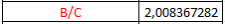



**UNIVERSIDAD PRIVADA DE TACNA**

**FACULTAD DE INGENIERÍA**

**Escuela Profesional de Ingeniería de Sistemas**

**Documento Informe de Proyecto Final**

**Plataforma Avanzada para la Generación Automática de Diagramas UML empresa Tech Solutions**

**Curso:** Patrones de Software

**Docente:** Mg. Patrick Jose Cuadros Quiroga

**Integrantes:**

\- Alexis Jeanpierre Martínez Vargas			(2019063638)

\- Juan José David Pérez Vizcarra				(2019063636)

\- Jhon Thomas Ticona Chambi				(2018062232)

**TACNA – PERÚ**

**2025**

**Plataforma Avanzada para la Generación Automática de Diagramas UML empresa Tech Solutions**

**Documento Informe de Proyecto Final**

*Documentador*

*Alexis Jeanpierre Martínez Vargas*

Versión *1.5*

# **Índex**
[1. Antecedentes	4](#_toc181973815)

[2. Planteamiento del Problema	4](#_toc181973816)

[2.1 Problema	4](#_toc181973817)

[2.2 Justificación	5](#_toc181973818)

[2.3 Alcance	5](#_toc181973819)

[3. Objetivos	6](#_toc181973820)

[3.1 Objetivo General	6](#_toc181973821)

[3.2 Objetivos Específicos	6](#_toc181973822)

[4. Marco Teórico	6](#_toc181973823)

[4.1 Aplicación Web	6](#_toc181973824)

[5. Desarrollo de Solución	7](#_toc181973825)

[5.1 Análisis de Factibilidad	7](#_toc181973826)

[5.1.1 Factibilidad Económica	7](#_toc181973827)

[5.1.2 Factibilidad Operativa	10](#_toc181973828)

[5.1.3 Factibilidad Legal	11](#_toc181973829)

[5.1.4 Factibilidad Ambiental	11](#_toc181973830)

[5.2 Metodología de Desarrollo	12](#_toc181973831)

[5.3 Metodología de Implementación	13](#_toc181973832)

[6. Cronograma	13](#_toc181973833)

[7. Presupuesto	14](#_toc181973834)

[8. Conclusiones	14](#_toc181973835)

[9. Recomendaciones	14](#_toc181973836)

[10. Bibliografía	15](#_toc181973837)

[11. Anexos	15](#_toc181973838)

# **Resumen** 
La generación de diagramas UML sigue siendo un componente esencial en la documentación y diseño de sistemas de software. Sin embargo, la creación manual de estos diagramas suele implicar altos niveles de esfuerzo, errores y desactualización frente a los cambios en el código fuente. En este contexto, se desarrolló e implementó exitosamente una plataforma web avanzada para la generación automática, validación y edición colaborativa de diagramas UML, orientada tanto a entornos académicos como profesionales. La solución permite generar diagramas a partir de código en Java, Python y C#, así como desde archivos estructurados (JSON/YAML), integrando funcionalidades como trabajo colaborativo en tiempo real, integración con Git, validación estructural y exportación en múltiples formatos. A pesar de dificultades como la integración de telemetría, problemas con la base de datos y los plazos ajustados, el sistema fue desplegado con éxito y es completamente funcional. Este proyecto representa un aporte significativo a la automatización del modelado y a la mejora de la documentación técnica de software.

# **Abstract**
The generation of UML diagrams remains a fundamental part of software system design and documentation. However, manually creating these diagrams often leads to time-consuming processes, errors, and difficulties keeping documentation aligned with evolving code. In response to these challenges, a web-based advanced platform was successfully developed and deployed to enable automated generation, validation, and collaborative editing of UML diagrams. The tool supports code-to-diagram conversion for Java, Python, and C#, as well as structured file inputs (JSON/YAML). Key features include real-time collaborative editing, Git integration, structural validation, and export options in multiple formats. Despite challenges such as telemetry integration issues, database delays, and tight project timelines, the platform achieved full functionality. This project contributes to the automation of software modeling and enhances technical documentation efficiency in both academic and professional settings.

# **1. Antecedentes**
La creación de diagramas UML constituye una actividad esencial en la ingeniería de software, ya que permite representar visualmente la estructura, comportamiento y relaciones de un sistema, favoreciendo su análisis, documentación y evolución. No obstante, esta tarea puede tornarse compleja, repetitiva y propensa a errores, especialmente en proyectos de gran tamaño, con cambios frecuentes o desarrollados por equipos distribuidos. Por ello, han surgido diversas propuestas que buscan automatizar la generación y validación de estos diagramas, reduciendo la carga manual e incrementando la precisión del modelado.

Dentro del enfoque de desarrollo dirigido por modelos (MDE), el uso de UML permite no solo especificar el comportamiento del sistema, sino también transformar dichos modelos en artefactos útiles como código, datos de prueba o documentación (Sahoo et al., 2021). Esta automatización mejora significativamente el proceso de verificación de requisitos y pruebas, especialmente cuando se utilizan algoritmos avanzados, como los genéticos, para optimizar escenarios generados desde diagramas como los de actividades o estados.

Asimismo, se han propuesto marcos para transformar diagramas UML hacia notaciones formales como las redes de Petri, con el fin de permitir análisis más rigurosos mediante herramientas especializadas (Rahmoune et al., 2015). Estas transformaciones, realizadas mediante metamodelos y gramáticas gráficas, evidencian el potencial de la automatización en el modelado conceptual, mejorando la validación temprana del diseño.

Otro aporte relevante en esta línea es la generación automática de operaciones básicas (crear, actualizar, eliminar) a partir de diagramas de clases UML, asegurando consistencia con restricciones estructurales y facilitando la construcción de sistemas desde una base conceptual sólida (Albert et al., 2011). Este enfoque permite acelerar el diseño del comportamiento del sistema, complementando la representación estática con lógica operativa lista para ser utilizada o extendida.

Finalmente, el uso de técnicas de procesamiento de lenguaje natural (NLP) para transformar automáticamente historias de usuario en diagramas de casos de uso ha demostrado ser eficaz, alcanzando precisiones entre el 87% y el 98% en su validación (Elallaoui et al., 2018). Esta línea de trabajo refuerza la necesidad de integrar funcionalidades inteligentes en las herramientas de modelado, capaces de interpretar distintos formatos de entrada y adaptarse a los procesos ágiles de desarrollo.

En respuesta a estas tendencias y necesidades, el presente proyecto plantea el desarrollo de una plataforma avanzada para la generación automática de diagramas UML. Esta solución está orientada tanto a entornos académicos como profesionales, y permitirá la creación de diagramas a partir de código fuente, modelos estructurados (como JSON o YAML) y ediciones gráficas manuales, integrando validación en tiempo real, colaboración multiusuario, y compatibilidad con sistemas de control de versiones. Su implementación busca no solo mejorar la eficiencia en la documentación técnica, sino también fomentar buenas prácticas de diseño y comunicación en el desarrollo de software.
# **2. Titulo**
Plataforma Avanzada para la Generación Automática de Diagramas UML empresa Tech Solutions
# **3. Autores**
- Martínez Vargas, Alexis Jeanpierre**\

- Ticona Chambi, Jhon Thomas**\

- Pérez Vizcarra, Juan José
# **4. Planteamiento del Problema**
## **4.1 Problema**
En los procesos de diseño y documentación de software, la creación de diagramas UML sigue siendo una tarea fundamental para representar visualmente la arquitectura, relaciones y comportamientos de los sistemas. Sin embargo, muchas veces este proceso se realiza de forma manual, lo que implica un consumo significativo de tiempo, una alta probabilidad de errores y dificultades para mantener actualizada la documentación cuando el código fuente evoluciona.

A pesar de la existencia de herramientas para generar diagramas UML, muchas de ellas presentan limitaciones como falta de integración con el código fuente, escasa validación automática, interfaces poco intuitivas o ausencia de funciones colaborativas. Esto dificulta su adopción en entornos académicos y profesionales, donde la agilidad, precisión y colaboración son esenciales.

Por lo tanto, el problema central que aborda este proyecto es:\
¿Cómo desarrollar una plataforma automatizada, intuitiva y colaborativa que facilite la generación, validación y edición de diagramas UML a partir de múltiples fuentes como código, archivos estructurados y ediciones manuales, mejorando así la comprensión y documentación del diseño de software?
## **4.2 Justificación**
El desarrollo de una Plataforma Avanzada para la Generación Automática de Diagramas UML se justifica por los siguientes motivos clave:

- **Optimización de tiempos y reducción de errores:** Automatizar la generación de diagramas UML permitirá a los usuarios ahorrar tiempo valioso y reducir errores humanos al interpretar o trasladar el diseño desde el código hacia un modelo visual.
- **Facilidad de uso e interfaz intuitiva:** Al enfocarse en una experiencia de usuario sencilla y amigable, se ampliará el acceso a esta herramienta tanto para estudiantes como para profesionales, sin requerir un alto nivel técnico para su uso.
- **Soporte multiplataforma y extensibilidad:** Al diseñarse como una aplicación web extensible, la plataforma será accesible desde distintos dispositivos y podrá adaptarse fácilmente a nuevos lenguajes de programación o estándares de diagramación mediante plugins.
- **Fomento del trabajo colaborativo:** Las funciones de colaboración en tiempo real fortalecerán el trabajo en equipo, permitiendo la co-edición de diagramas entre múltiples usuarios, característica especialmente útil en ambientes de desarrollo ágil o académico.
- **Validación estructural y sintáctica:** La plataforma no solo permitirá crear diagramas, sino que también incluirá mecanismos de validación para asegurar la coherencia de los modelos generados, detectando relaciones inválidas o errores sintácticos en tiempo real.

En conjunto, este proyecto representa una solución moderna e integral que responde a las necesidades actuales de documentación técnica y colaboración en el desarrollo de software.
## **4.3 Alcance**
Este proyecto comprende el diseño, desarrollo e implementación de una plataforma web que permitirá a los usuarios generar, editar y validar diagramas UML de manera automática y colaborativa. La plataforma incluirá las siguientes funcionalidades:

- **Conversión de código fuente a UML:** Generación automática de diagramas de clases, secuencia, casos de uso y componentes a partir de código en C#, Python y Java, utilizando reglas predefinidas.
- **Soporte para modelos JSON/YAML:** Lectura de archivos estructurados para construir diagramas a partir de descripciones técnicas.
- **Editor gráfico asistido:** Herramienta de edición visual que permitirá modificar manualmente los diagramas con validación en tiempo real.
- **Colaboración en línea:** Edición simultánea de diagramas entre varios usuarios mediante sesiones colaborativas.
- **Historial de versiones:** Integración con Git para generar diagramas UML a partir del historial de cambios del proyecto.
- **Exportación en múltiples formatos:** Posibilidad de exportar los diagramas en formatos gráficos (PNG, SVG, PDF) o como código (PlantUML, Mermaid).
- **Extensibilidad:** Soporte para plugins que permitirán incorporar nuevos lenguajes de programación o estilos de modelado.

La plataforma estará dirigida a estudiantes, docentes y desarrolladores de software, y será diseñada para funcionar correctamente en navegadores modernos y múltiples dispositivos. El equipo de desarrollo será responsable del diseño, programación, pruebas y documentación técnica de la solución.
# **5. Objetivos**
## **5.1 Objetivo General**
El objetivo general de este proyecto es desarrollar e implementar una plataforma avanzada que facilite la generación automática y validación de diagramas UML, mejorando la comprensión y documentación del diseño de software en entornos académicos y profesionales. Esta herramienta optimizará la creación de diagramas a partir de código fuente, modelos estructurados y ediciones manuales con validación en tiempo real.
## **5.2 Objetivos Específicos**
- Desarrollar un sistema capaz de analizar código fuente y convertirlo en diagramas UML basándose en reglas predefinidas.
- Implementar un editor gráfico asistido que permita a los usuarios construir diagramas UML con validación en tiempo real.
- Crear un módulo de colaboración en tiempo real para la edición compartida de diagramas UML entre múltiples usuarios.
- Integrar la generación de diagramas UML a partir del historial de cambios en repositorios Git.
- Diseñar un sistema extensible mediante plugins, permitiendo la incorporación de nuevos lenguajes y reglas de análisis.
- Garantizar una interfaz intuitiva y adaptable para su uso en distintos dispositivos y navegadores.
# **6. Marco Teórico**
## **6.1. Aplicación Web**
Una aplicación web es un tipo de software que se ejecuta en un navegador web y que permite a los usuarios acceder a funcionalidades dinámicas e interactivas a través de Internet, sin necesidad de instalar programas en su dispositivo local. Estas aplicaciones se comunican con servidores remotos para procesar datos, almacenar información y ofrecer una experiencia personalizada, rápida y segura.

El diseño de una aplicación web se basa en una arquitectura cliente-servidor, donde el cliente representa la interfaz que el usuario ve e interactúa (navegador), y el servidor se encarga del procesamiento de la lógica del negocio, almacenamiento de datos y generación de respuestas. Esta estructura permite que múltiples usuarios puedan utilizar el mismo sistema desde distintos dispositivos y ubicaciones, facilitando el trabajo colaborativo, la escalabilidad y la disponibilidad constante.

Existen distintos tipos de aplicaciones web, como plataformas de comercio electrónico (Amazon), sistemas de mensajería y correo electrónico (Gmail), banca en línea, editores colaborativos (Google Docs) y gestores de contenidos. Su principal ventaja es que ofrecen accesibilidad multiplataforma, actualizaciones automáticas y una experiencia de usuario sencilla. Además, eliminan la necesidad de instalación y reducen la dependencia del hardware local.

Según Amazon Web Services (s.f.), *“las aplicaciones web son accesibles desde todos los navegadores web y desde diferentes dispositivos personales y empresariales […], reciben actualizaciones de software y seguridad de manera automática, lo que significa que siempre están actualizadas y presentan menor riesgo de sufrir brechas de seguridad”*. Esta capacidad de mantener sus servicios operativos y seguros en tiempo real las convierte en una solución eficaz para diversos entornos, incluyendo el educativo y empresarial.

En el contexto del presente proyecto, se ha desarrollado una aplicación web avanzada que automatiza la generación de diagramas UML. Gracias a su arquitectura moderna, permite a los usuarios trabajar en tiempo real, validar estructuras, colaborar desde distintos lugares y mantener sincronizados los modelos con los cambios en el código, demostrando el gran potencial de las aplicaciones web en el desarrollo de herramientas técnicas y de ingeniería.
## **6.2. Que es UML**
El Lenguaje Unificado de Modelado (UML, por sus siglas en inglés *Unified Modeling Language*) es un lenguaje gráfico estandarizado que permite especificar, visualizar, construir y documentar los artefactos de un sistema de software. Fue concebido con el objetivo de unificar las notaciones desarrolladas por Grady Booch, James Rumbaugh e Ivar Jacobson en los años noventa, y desde entonces ha evolucionado para convertirse en el estándar más utilizado en la industria del software para modelar sistemas orientados a objetos.

UML ofrece una amplia variedad de diagramas organizados en tres grandes categorías: diagramas de estructura (como el de clases, componentes o despliegue), diagramas de comportamiento (como el de actividades o casos de uso) y diagramas de interacción (como el de secuencia o comunicación). Esta variedad permite modelar desde la arquitectura estática del sistema hasta su comportamiento dinámico, lo que lo convierte en una herramienta útil durante todas las fases del ciclo de vida del desarrollo de software.

La versión vigente del estándar, UML 2.5.1, publicada por el Object Management Group (OMG), define 14 tipos de diagramas que permiten representar tanto la estructura como el flujo de información y la evolución del sistema en el tiempo. Su uso adecuado mejora la comprensión del diseño, facilita la colaboración entre equipos multidisciplinarios y contribuye a reducir errores durante la implementación.

Entre sus ventajas, destacan su flexibilidad, capacidad de reutilización de elementos, compatibilidad con herramientas de desarrollo basadas en modelos y su potencial para facilitar la documentación técnica. Sin embargo, también se señalan limitaciones, como la sobrecarga documental, la posible obsolescencia de los modelos por falta de mantenimiento y la dificultad para mantener la claridad en diagramas extensos.

En síntesis, UML no es un lenguaje de programación ni una metodología de desarrollo, sino una notación visual poderosa que, cuando se utiliza de forma coherente y apoyada por herramientas adecuadas, potencia la calidad del diseño de software y su documentación.

*“UML is a versatile and flexible modeling language suitable for specifying, visualizing, and documenting systems across all development phases and sectors”* (t2informatik GmbH, 2025).
## **6.3. Lenguaje de programación Python en el desarrollo web**
Python es un lenguaje de programación de alto nivel, interpretado, de propósito general y con una sintaxis clara y legible que facilita la escritura y el mantenimiento del código. En el contexto del desarrollo web, Python ha ganado gran popularidad gracias a su simplicidad, escalabilidad y a la extensa disponibilidad de bibliotecas y frameworks diseñados específicamente para crear aplicaciones modernas y robustas.

El desarrollo web con Python se refiere a la creación de aplicaciones y sitios web utilizando este lenguaje para manejar la lógica del lado del servidor. Esto incluye la gestión de solicitudes HTTP, la interacción con bases de datos, la implementación de reglas de negocio y la entrega de contenido dinámico a través de APIs o plantillas web. Python es especialmente conocido por su enfoque en la productividad, lo que lo hace ideal para equipos pequeños, startups o proyectos académicos, como el presente caso.

Una de las grandes fortalezas de Python en este ámbito es su ecosistema de frameworks como Django, Flask, Pyramid o FastAPI, que proporcionan herramientas estructuradas para optimizar el desarrollo. Por ejemplo, FastAPI es un framework moderno y altamente eficiente que aprovecha las funcionalidades de Python 3.7+ para construir APIs asincrónicas rápidas, seguras y fáciles de usar, lo cual ha sido una elección clave en este proyecto para el desarrollo del backend.

Entre las bibliotecas más utilizadas para complementar el desarrollo web en Python se encuentran SQLAlchemy (ORM para bases de datos), Pydantic (validación de datos), Jinja2 (plantillas HTML), y herramientas para pruebas como Pytest. Estas librerías permiten desde la construcción de interfaces web dinámicas hasta la conexión eficiente con bases de datos relacionales como PostgreSQL.

Además, Python es altamente compatible con distintos tipos de bases de datos y servicios, lo que permite una integración flexible con tecnologías modernas. Su compatibilidad con prácticas de desarrollo ágil, pruebas automatizadas, APIs REST y microservicios lo convierte en una opción estratégica tanto para entornos empresariales como educativos.

En palabras de Kumar (2025), *"Python proporciona un ecosistema sólido de marcos, bibliotecas y herramientas que simplifican el proceso de desarrollo y permiten a los desarrolladores crear soluciones web escalables"*. Esta afirmación reafirma la pertinencia del uso de Python para la implementación de una plataforma avanzada como la desarrollada en este proyecto.
## **6.4. FastAPI como framework para aplicaciones backend**
FastAPI es un framework web moderno y de alto rendimiento diseñado para el desarrollo de interfaces de programación de aplicaciones (API) utilizando Python 3.6 o superior. Desde su lanzamiento en 2018 por Sebastián Ramírez, ha revolucionado la forma en que los desarrolladores construyen servicios backend, gracias a su rapidez, simplicidad y facilidad de uso. A diferencia de frameworks más antiguos como Flask o Django, FastAPI fue creado con un enfoque centrado en el rendimiento, la validación automática de datos y la documentación interactiva basada en los estándares OpenAPI y JSON Schema.

Una de sus características más notables es la integración nativa con **Pydantic** para la validación de datos y con **Starlette** para la gestión asincrónica del ciclo de vida de las solicitudes, lo cual le otorga un rendimiento comparable al de frameworks como Node.js o Go. Esto lo convierte en una opción ideal para construir aplicaciones modernas, orientadas a microservicios y con alta demanda de procesamiento concurrente.

En el contexto del presente proyecto, FastAPI fue empleado como framework backend por su eficiencia al manejar múltiples peticiones simultáneas y su facilidad para construir endpoints robustos y bien documentados. Como lo señala Melanie (2023), *“FastAPI proporciona código listo para producción con documentación interactiva automática”*, lo que agiliza el desarrollo sin comprometer la calidad del producto final.

Además, una de las ventajas más apreciadas por los desarrolladores es su soporte para el tipado fuerte de Python, lo que permite detectar errores durante la etapa de desarrollo, reduciendo así el tiempo de depuración. Esto es especialmente útil en equipos pequeños o proyectos académicos que requieren mantener un código limpio y fácil de escalar. Tal como se menciona en el análisis de DataScientest, *“la cantidad de errores y las oportunidades de error humano se reducen enormemente”* al trabajar con FastAPI (Melanie, 2023).

Aunque su comunidad aún es menor en comparación con frameworks más establecidos como Django, FastAPI ha sido adoptado rápidamente por grandes compañías como Uber, Netflix y Microsoft, lo que valida su estabilidad en entornos productivos y de misión crítica. También es altamente compatible con proyectos de ciencia de datos y aprendizaje automático, ya que facilita la exposición de modelos entrenados a través de APIs REST, funcionando perfectamente como capa de integración entre modelos y usuarios finales.

## **6.5. PostgreSQL como sistema de gestión de bases de datos**
PostgreSQL es un sistema de gestión de bases de datos relacional orientado a objetos, de código abierto, reconocido por su estabilidad, robustez y cumplimiento estricto de los estándares ACID. Utilizado ampliamente en entornos web, móviles y de análisis de datos, PostgreSQL ha ganado popularidad como una solución confiable y potente para manejar grandes volúmenes de información con integridad y eficiencia.

En este proyecto, PostgreSQL fue elegido como el sistema de base de datos por su compatibilidad con Python, su capacidad para manejar consultas complejas y su amplia escalabilidad. Permite definir relaciones entre tablas, establecer restricciones de integridad referencial, crear vistas, funciones y procedimientos almacenados, lo que facilita una estructura sólida y extensible del modelo de datos. Como lo menciona Kinsta (2025), *“PostgreSQL ofrece una verdadera semántica ACID para las transacciones y tiene soporte completo para claves foráneas, uniones, vistas, disparadores y procedimientos almacenados”*, características esenciales para garantizar la integridad y seguridad de los datos en aplicaciones web.

Una de las ventajas distintivas de PostgreSQL es su arquitectura modular y extensible, que permite definir tipos de datos personalizados, implementar funciones escritas en diversos lenguajes como Python o Java, y hasta extender su funcionamiento mediante la carga dinámica de código. Su diseño permite la ejecución de consultas paralelas, indexación avanzada, control de concurrencia multiversión (MVCC) y recuperación ante fallos, lo que lo convierte en una base de datos idónea para sistemas críticos y de alto rendimiento. En efecto, *“PostgreSQL es altamente escalable, tanto en el número de usuarios concurrentes que puede acomodar como en la cantidad de datos que puede gestionar”* (Kinsta, 2025).

Desde el punto de vista operativo, PostgreSQL ofrece herramientas avanzadas como la replicación síncrona y asincrónica, el archivado continuo, puntos de control, procesos de escritura y buffers compartidos, lo que optimiza su comportamiento tanto en entornos de producción como de desarrollo. Estas funcionalidades, junto con su compatibilidad multiplataforma y soporte activo de la comunidad, hacen de PostgreSQL una elección estratégica y sostenible en proyectos tecnológicos modernos.
## **6.6. React como biblioteca de desarrollo frontend**
React es una biblioteca de JavaScript orientada al desarrollo de interfaces de usuario, especialmente enfocada en aplicaciones web de una sola página (SPA). Su modelo basado en componentes reutilizables, la actualización eficiente del DOM mediante el Virtual DOM y su ecosistema de herramientas modernas, han convertido a React en una de las tecnologías más empleadas en el desarrollo frontend a nivel mundial. Según Acharya (2025), *“React es una biblioteca de JavaScript que te ayuda a desarrollar interfaces de usuario para aplicaciones móviles y web sin ningún tipo de problema”*, destacando su sencillez y eficacia tanto para desarrolladores individuales como para grandes equipos de desarrollo.

React permite construir interfaces modulares mediante componentes independientes, que pueden ser reutilizados, probados y mantenidos de forma sencilla. En este proyecto, React se utilizó como base del frontend debido a su integración fluida con bibliotecas de componentes como Material-UI (MUI), facilitando la construcción de interfaces modernas, responsivas y accesibles.

Una de las principales ventajas de React es su compatibilidad con bibliotecas de componentes UI, que agilizan el desarrollo al ofrecer elementos visuales preconstruidos como botones, formularios, tablas, alertas, tarjetas, menús, entre otros. Estas bibliotecas, como Chakra UI, Ant Design o React Bootstrap, reducen significativamente el tiempo de codificación y elevan la calidad visual del producto final. Como señala Acharya (2025), *“En lugar de crear el código de cada componente, puedes utilizar una biblioteca de componentes de React UI como MUI, Chakra UI, React Bootstrap, etc.”*, lo cual permite a los desarrolladores enfocarse en la lógica de negocio y no en la construcción manual de cada interfaz.

Otra ventaja clave de React y sus bibliotecas UI es su compatibilidad entre navegadores, lo cual asegura una experiencia de usuario coherente en distintos dispositivos y plataformas. Asimismo, la comunidad activa, la abundancia de documentación y el soporte continuo aseguran su escalabilidad y sostenibilidad como tecnología principal para el desarrollo frontend.

React fue complementado en este proyecto con bibliotecas como MUI, seleccionada por su equilibrio entre personalización, accesibilidad y estética moderna. La integración de estas herramientas fortaleció el desarrollo ágil del sistema, facilitando la implementación de formularios dinámicos, alertas visuales, menús laterales y componentes responsivos, todo manteniendo un diseño uniforme y atractivo.
# **7. Desarrollo de la Propuesta**
## **7.1 Análisis de Factibilidad**
### **7.1.1 Factibilidad Económica**
**Costos Generales**	

Tabla de Materiales de Escritorio

<table><tr><th colspan="1" rowspan="2"><b>Materiales de escritorio</b> </th><th colspan="3"><b>Tiempo/Coste</b> </th></tr>
<tr><td colspan="1"><b>Mes 1</b> </td><td colspan="1"><b>Mes 2</b> </td><td colspan="1"><b>Mes 3</b> </td></tr>
<tr><td colspan="1">Papel bond </td><td colspan="1">S/ 14.00 </td><td colspan="1">S/ 14.00 </td><td colspan="1">S/ 14.00 </td></tr>
<tr><td colspan="1">Tinta de impresora </td><td colspan="1">S/ 60.00 </td><td colspan="1">S/ 0.00 </td><td colspan="1">S/ 0.00 </td></tr>
<tr><td colspan="1"><b>Sub Total</b> </td><td colspan="1">S/ 74.00 </td><td colspan="1">S/ 16.00 </td><td colspan="1">S/ 14.00 </td></tr>
<tr><td colspan="3"><b>TOTAL</b></td><td colspan="1">S/ 105.00</td></tr>
</table>

*Fuente: Elaboración propia de la tabla*

*Tabla 1 – Costos de material de escritorio para equipo de trabajo para el proyecto , “Costo general será una total de **S/105.00**”*

**Costos del ambiente**	

Tabla de ambiente laboral

<table><tr><th colspan="1" rowspan="2"><b>Costos Ambiente</b></th><th colspan="4"><b>Tiempo/Costo</b> </th></tr>
<tr><td colspan="1"><b>Mes 1</b> </td><td colspan="2"><b>Mes 2</b> </td><td colspan="1" valign="top"><b>Mes 3</b> </td></tr>
<tr><td colspan="1">Servicio de Internet </td><td colspan="1">S/ 100.00</td><td colspan="2">S/ 100.00</td><td colspan="1">S/ 100.00</td></tr>
<tr><td colspan="1">Oficina</td><td colspan="1">S/ 800.00</td><td colspan="2">S/ 800.00</td><td colspan="1">S/ 800.00</td></tr>
<tr><td colspan="1">Hosting  (Somee)</td><td colspan="1">S/ 30.00</td><td colspan="2">S/ 30.00</td><td colspan="1">S/ 30.00</td></tr>
<tr><td colspan="1"><b>Sub Total</b> </td><td colspan="2">S/ 930.00</td><td colspan="1">S/ 930.00 </td><td colspan="1">S/ 930.00</td></tr>
<tr><td colspan="4"><b>TOTAL</b></td><td colspan="1">S/2.790.00</td></tr>
</table>

*Fuente: Elaboración propia de la tabla*

*Tabla 2 – Costos de ambiente laboral durante el desarrollo para equipo de trabajo para el proyecto , “Costo total del ambiente es de **s/ 2,790.00** ”*

**Costos de personal**

Tabla de costos del personal laboral

|**Rol**|**Horario (L a V)**|**Mes 1**|**Mes 2**|**Mes 3**|
| :-: | :-: | :-: | :-: | :-: |
|Jefe de proyecto|8:00 -16:00|S/ 2,500.00|S/ 2,500.00|S/ 2,500.00|
|Programador|8:00 -16:00|S/ 1,550.00|S/ 1,550.00|S/ 1,550.00|
|DBA|8:00 -16:00|S/ 1,300.00|S/ 1,300.00|S/ 1,300.00|
|Tester|8:00 -16:00|S/ 1,200.00|S/ 1,200.00|S/ 1,200.00|
|**Sub Total**|S/ 6,570.00|S/ 6,570.00|S/ 6,570.00||
|**TOTAL**|S/19.650.00||||

*Fuente: Elaboración propia de la tabla*

*Tabla 3 –Costos de costos del personal laboral durante el desarrollo para equipo de trabajo para el proyecto "Costo total del ambiente es de **s/ 19,650.00”***

**Costos operativos durante el desarrollo**

Tabla de servicios operativos

<table><tr><th colspan="1" rowspan="2"><b>Servicio</b> </th><th colspan="3"><b>Tiempo/Coste</b> </th></tr>
<tr><td colspan="1"><b>Mes 1</b> </td><td colspan="1"><b>Mes 2</b> </td><td colspan="1"><b>Mes 3</b> </td></tr>
<tr><td colspan="1">Servicio Eléctrico </td><td colspan="1">S/ 85.00</td><td colspan="1" valign="top">` `S/ 85.00 </td><td colspan="1" valign="top">` `S/ 85.00 </td></tr>
<tr><td colspan="1">Servicio de Agua </td><td colspan="1" valign="top">` `S/ 30.00 </td><td colspan="1" valign="top">` `S/ 30.00 </td><td colspan="1" valign="top">` `S/ 30.00 </td></tr>
<tr><td colspan="1"><b>Sub Total</b> </td><td colspan="1" valign="top">` `S/ 115.00 </td><td colspan="1" valign="top">` `S/ 115.00 </td><td colspan="1" valign="top">` `S/ 115.00 </td></tr>
<tr><td colspan="3"><b>TOTAL</b></td><td colspan="1" valign="top">S/ 345.00</td></tr>
</table>

*Fuente: Elaboración propia de la tabla*

*Tabla 4 – Costos de operativos durante el desarrollo para equipo de trabajo para el proyecto , “Costo operativos total es de **S/345.00** ”*

### **4.2.5. Costos totales del desarrollo del sistema**	
A continuación, un resumen de todos los costos totales del proyecto final. 

Tabla resumen de total de costos

|Costo Total de Costo General|S/ 105.00|
| :- | - |
|Costo Total del Ambiente|S/ 2,790.00|
|Costo Total del Personal|S/ 19,650.00|
|Costo Total de los Operativos|S/ 345.00|
|Costo Final|S/ 22,890.00|

*Fuente: Elaboración propia de la tabla*

*Tabla 5 – Tabla resumen de todos los costos vistos en la tablas, Costo total de costo general , Costo total de Ambiente , Costo total de personal ,Costo total de los servicios operativos, anteriormente “**Costo final s/22.890.00**” por los 3 meses de desarrollo del proyecto*
### **7.1.2 Factibilidad Operativa**
La factibilidad operativa de este proyecto se refiere a su capacidad para funcionar de manera eficiente y sostenible una vez que esté en funcionamiento. Esto implica:

**Recursos Humanos y Capacitación:**

Es fundamental contar con personal calificado en áreas como desarrollo web, inteligencia artificial, administración de sistemas y tecnología de la información. Además, se proporcionará capacitación continua para garantizar que el equipo esté actualizado en las últimas tendencias y técnicas en desarrollo de software y gestión de inventarios. Esto asegurará que el personal pueda manejar eficazmente el sistema y aprovechar al máximo sus capacidades.

**Instalaciones y Equipamiento:**

Aunque este proyecto no requiere instalaciones físicas específicas, es esencial disponer de una infraestructura tecnológica robusta que soporte el sistema web y las funcionalidades de inteligencia artificial. Esto incluye servidores confiables, software actualizado y los recursos tecnológicos necesarios para el desarrollo, la implementación y el mantenimiento del sistema. También se debe asegurar una conectividad a Internet estable y de alta velocidad para garantizar el acceso ininterrumpido a la plataforma.

**Cumplimiento de Normativas y Licencias:**

Es crucial cumplir con las normativas legales y regulatorias aplicables, especialmente en términos de protección de datos y seguridad cibernética. Además, se debe garantizar que el sistema cumpla con cualquier requerimiento específico establecido por las autoridades locales y regionales en cuanto a la gestión de inventarios y la elaboración de informes técnicos. Esto incluye la obtención de licencias necesarias y la adhesión a las mejores prácticas de la industria para asegurar la confiabilidad y credibilidad del sistema.
### **7.1.3 Factibilidad Legal**

Listamos algunas leyes y regulaciones relevantes que podrían afectar la factibilidad legal del proyecto:

- **Ley N° 29733, Ley de Protección de Datos Personales:** Esta ley es crucial, dado que el proyecto manejará datos sensibles de los equipos tecnológicos y posiblemente de los usuarios. Es necesario garantizar el cumplimiento de esta ley para proteger la privacidad de los datos y evitar posibles sanciones por el manejo inadecuado de la información.
- **Ley N° 30096, Ley Anti-Phishing:** Aunque esta ley no está directamente relacionada con la gestión de inventarios, es importante considerarla porque el sistema web podría ser vulnerable a intentos de suplantación de identidad con fines fraudulentos. Implementar medidas de seguridad adecuadas ayudará a prevenir tales ataques y proteger la información crítica del sistema.
### **7.1.4 Factibilidad Ambiental**
El proyecto "Sistema Web de Gestión de Inventario y Elaboración de Informes Técnicos implementado con IA" tiene un impacto ambiental mínimo, ya que su implementación y operación no implican procesos que generen emisiones contaminantes o consuman recursos naturales de manera significativa:

- **Ecoeficiencia en el Consumo de Energía:** Se prevé que el proyecto sea ecoeficiente, utilizando tecnologías y prácticas que minimicen el consumo de energía y reduzcan al mínimo la generación de residuos electrónicos. Esto incluye el uso de servidores energéticamente eficientes y la minimización del uso de papel a través de la digitalización de procesos.
- **Cumplimiento de Políticas Ambientales:** El desarrollo del proyecto se llevará a cabo en cumplimiento con las políticas y regulaciones ambientales locales y nacionales, asegurando que todas las actividades relacionadas con su implementación y operación se realicen de manera responsable y sostenible.
- **Promoción de la Conciencia Ambiental:** Aunque el impacto directo del proyecto en el medio ambiente es bajo, este puede servir como un ejemplo de cómo las tecnologías de la información pueden contribuir a la sostenibilidad. Al automatizar procesos y reducir el uso de recursos físicos, el sistema puede ayudar a promover una cultura organizacional más consciente del medio ambiente.
## **7.2 Metodología de Desarrollo**
Rational Unified Process (RUP):

Es una metodología de desarrollo de software ampliamente utilizada. Fue desarrollada por Rational Software Corporation, adquirida por IBM en 2003. El RUP se basa en principios de desarrollo iterativo e incremental, lo que significa que el proyecto se divide en fases y cada fase se completa en ciclos o iteraciones.

El RUP proporciona un marco de trabajo estructurado y disciplinado para el desarrollo de software. Está basado en las mejores prácticas de la industria y se centra en la colaboración entre los miembros del equipo, la gestión del riesgo y la entrega de software de alta calidad.

El proceso de desarrollo en RUP se organiza en cuatro fases principales: inicio, elaboración, construcción y transición. Cada fase tiene sus propios objetivos y actividades específicas. Durante el proceso, se enfatiza la importancia de la comunicación con los interesados, la documentación adecuada y la gestión efectiva del cambio.
## **7.3 Metodología de Implementación**
HTTP: El Protocolo de Transferencia de Hipertexto (HTTP, por sus siglas en inglés) es el protocolo de comunicación utilizado en la World Wide Web. Permite la transferencia de información entre un cliente (generalmente un navegador web) y un servidor web. HTTP se basa en el modelo cliente-servidor, donde el cliente envía solicitudes al servidor y este responde con los datos solicitados. Es un protocolo sin estado, lo que significa que cada solicitud es independiente y no guarda información sobre las solicitudes anteriores. HTTP utiliza métodos como GET, POST, PUT y DELETE para realizar diferentes tipos de solicitudes y operaciones en los recursos web.

UML: El Lenguaje Unificado de Modelado (UML, por sus siglas en inglés) es un estándar internacionalmente adoptado para la representación visual y documentación de sistemas de software. Proporciona un conjunto de diagramas y notaciones que permiten describir la estructura, el comportamiento y las relaciones entre los componentes de un sistema. UML es utilizado por analistas, diseñadores y desarrolladores de software para comunicar y documentar los conceptos y las decisiones de diseño de manera clara y precisa. Los diagramas UML más comunes incluyen diagramas de casos de uso, diagramas de clases, diagramas de secuencia y diagramas de actividad, entre otros. UML facilita la comprensión, la colaboración y la implementación de sistemas de software complejos.
# **8. Cronograma**
Se han elaborado la estimación de los recursos en base a la experiencia de personal de cómputo, reuniones de trabajo con jefes de área y documentos que indican requerimientos.

El cronograma del trabajo mensual para el desarrollo de los sistemas de información se muestra en el siguiente cuadro:

*Tabla 6: Cronograma del Proyecto “Plataforma Avanzada para la Generación Automática de Diagramas UML empresa Tech Solutions” desde el Mes de Abril al mes de Junio.*

|**ACTIVIDADES/MODULOS SISTEMAS**|**ABRIL**|**MAYO**|**JUNIO**||||||||||
| :-: | :-: | :-: | :-: | :- | :- | :- | :- | :- | :- | :- | :- | :- |
|**Fases de Identificación y Elaboración del Sistema**|**S1**|**S2**|**S3**|**S4**|**S1**|**S2**|**S3**|**S4**|**S1**|**S2**|**S3**|**S4**|
|Definición de Requerimientos|X|X| | | | | | | | | | |
|Análisis y Diseño del Sistema| |X|X|X| | | | | | | | |
|**Fase de Construcción**| | | | | | | | | | | | |
|Pre-Diseño| | | |X|X|X| | | | | | |
|Ingeniería| | | | | |X|X| | | | | |
|Abastecimiento| | | | | |X|X|X| | | | |
|Construcción| | | | | | |X|X|X|X|X| |
|**Fase de Transición**| | | | | | | | | | | | |
|Pruebas, Validación y Migracion| | | | | | | | |X|X|X|X|
|Documentación y Capacitación| | | | | | | | | | |X|X|
|Despliegue y Puesta en Marcha| | | | | | | | | | |X|X|

*Fuente: Elaboración Propia*
# **9. Presupuesto**
**Criterios de Inversión**

Nuestros criterios de inversión se basan en los tres criterios presentados en base a que se necesitara el B/C para saber si hay beneficios, El VAN para saber si es aceptable el valor del proyecto y el TIR si es que se puede obtener retornar los gastos, ya que necesitamos recuperar de los costos invertidos al desarrollarse en el trayecto del tiempo. En ello, podemos utilizar a esos criterios debido a que queremos que el proyecto cumpla con todos los requisitos y con los valores económicos para ser aceptado	

|**FLUJO DE CAJA**||||
| :-: | :- | :- | :- |
|**PERIODO ANUAL**|**INGRESOS**|**EGRESOS**|**EFECTIVO NETO ACTUAL**|
|0|-S/  22,890.00| |-S/  22,890.00|
|1|` `S/   50,534.00 |` `S/    41,753.00 |` `S/     8,781.00 |
|2|` `S/   52,863.00 |` `S/    42,751.00 |` `S/   10,112.00 |
|3|` `S/   57,453.00 |` `S/    44,646.00 |` `S/   12,807.00 |
|4|` `S/   59,588.00 |` `S/    45,050.00 |` `S/   14,538.00 |
|5|` `S/   62,090.00 |` `S/    45,856.00 |` `S/   16,234.00 |
|**Total**|**S/ 282,528.00**|**S/220,056.00**|**S/62.472.00**|

**Relación Beneficio/Costo (B/C)**

*Tabla 7 – Tabla realizada en el Excel con los datos correspondiste del proyecto a realizar donde realizamos la fórmula de B/C y el Total de nuestro **B/C  = 2,008367282***

**Valor Actual Neto (VAN)**

*Tabla 8 – Tabla realizada en el Excel con los datos correspondiste del proyecto a realizar donde realizamos la fórmula de VNA y el Total de nuestro **VNA = S/45.,971.53***

**Tasa Interna de Retorno (TIR)**

*Tabla 9 - Tabla realizada en el Excel con los datos correspondiste del proyecto a realizar donde realizamos la formula de TIR y el Total de nuestro **TIR = 40% , Lo que nos indica que el proyecto si es factible.***
# **10. Conclusiones y Recomendaciones**
El desarrollo de la Plataforma Avanzada para la Generación Automática de Diagramas UML representó un desafío significativo tanto a nivel técnico como organizativo. Tras completar su implementación con éxito, se puede concluir que el sistema cumple con los objetivos planteados, permitiendo la generación automática de diagramas UML a partir de código en Java, Python y C#, así como desde archivos estructurados (JSON/YAML). Además, incorpora funciones de edición colaborativa, validación estructural en tiempo real, exportación en diversos formatos y soporte para control de versiones mediante integración con Git.

El proyecto demostró ser técnicamente viable y pertinente en el contexto actual del desarrollo de software, al responder de forma directa a necesidades comunes de estudiantes, docentes y desarrolladores. La automatización del modelado UML mejora significativamente la eficiencia en la documentación técnica y fortalece la comprensión del diseño del sistema.

Sin embargo, durante el proceso de desarrollo surgieron diversos retos. Entre las principales dificultades se encontraron problemas en la integración de la telemetría para el monitoreo del sistema, demoras en la generación de diagramas por cuestiones relacionadas con el rendimiento de la base de datos, así como la presión del tiempo debido a un cronograma ajustado y la coexistencia con otros proyectos académicos. Estos desafíos requirieron soluciones técnicas inmediatas y ajustes de planificación para cumplir con los entregables sin comprometer la calidad del producto final.

**Recomendaciones:**

- **Realizar validaciones tempranas con usuarios finales:** Incluir a estudiantes, docentes y desarrolladores en pruebas piloto permitirá obtener retroalimentación útil para ajustar funcionalidades, mejorar la experiencia de usuario y detectar errores antes del despliegue masivo.
- **Priorizar la optimización del rendimiento:** Es importante seguir optimizando los tiempos de respuesta, especialmente en la generación de diagramas complejos o en ambientes con bases de datos de gran volumen.
- **Mejorar la integración de telemetría:** Se recomienda retomar y perfeccionar la implementación de herramientas de monitoreo, lo cual facilitará el seguimiento del uso de la plataforma, la detección de errores y la toma de decisiones basadas en datos reales.
- **Mantener un enfoque centrado en la usabilidad:** Dado el perfil diverso de los usuarios, es fundamental garantizar una interfaz intuitiva, accesible desde distintos dispositivos y con una curva de aprendizaje mínima.
- **Implementar pruebas de validación continua:** Automatizar pruebas para asegurar que los diagramas generados cumplan con los estándares UML y que las ediciones colaborativas no introduzcan inconsistencias en los modelos.
- **Documentar exhaustivamente el sistema:** Desarrollar manuales de usuario, guías técnicas y documentación de la API contribuirá a una adopción más fluida y a una fácil capacitación de nuevos usuarios.
- **Lanzar una fase beta controlada:** Probar la plataforma en un entorno real con un grupo reducido de usuarios permitirá identificar problemas no detectados durante el desarrollo y aplicar mejoras prácticas antes de una implementación a gran escala.
# **11. Bibliografía**
Amazon Web Services. (s.f.). *¿Qué es una aplicación web? - Explicación de las aplicaciones web*. Recuperado el 30 de agosto de 2024, de <https://aws.amazon.com/es/what-is/web-application/>

Sahoo, R. K., Derbali, M., Jerbi, H., van Thang, D., Kumar, P. P., & Sahoo, S. (2021). Test Case Generation from UML-Diagrams Using Genetic Algorithm. *Computers, Materials and Continua*, *67*(2), 2321–2336. https://doi.org/10.32604/CMC.2021.013014

Rahmoune, Y., Chaoui, A., & Kerkouche, E. (2015). A Framework for Modeling and Analysis UML Activity Diagram using Graph Transformation. *Procedia Computer Science*, *56*(1), 612–617. https://doi.org/10.1016/J.PROCS.2015.07.261

Albert, M., Cabot, J., Gómez, C., & Pelechano, V. (2011). Generating operation specifications from UML class diagrams: A model transformation approach. *Data & Knowledge Engineering*, *70*(4), 365–389. https://doi.org/10.1016/J.DATAK.2011.01.003

Elallaoui, M., Nafil, K., & Touahni, R. (2018). Automatic Transformation of User Stories into UML Use Case Diagrams using NLP Techniques. *Procedia Computer Science*, *130*, 42–49. <https://doi.org/10.1016/J.PROCS.2018.04.010>

t2informatik GmbH (EN). (2025, 9 enero). *What is the UML? - Smartpedia - t2informatik*. T2informatik GmbH (EN). <https://t2informatik.de/en/smartpedia/uml/>

Kumar, P. (2025, 28 abril). *Python Web Development Tutorial | BrowserStack*. BrowserStack. <https://www.browserstack.com/guide/web-development-in-python-guide>

Melanie. (2023, 29 octubre). *FastAPI: Everything you need to know about the most widely used Python web framework for Machine Learning*. DataScientest. <https://datascientest.com/en/fastapi-everything-you-need-to-know-about-the-most-widely-used-python-web-framework-for-machine-learning>

Kinsta. (2025, 6 marzo). *¿Qué es PostgreSQL?* Kinsta®. <https://kinsta.com/es/base-de-conocimiento/que-es-postgresql/#:~:text=PostgreSQL%20es%20un%20sistema%20de%20gesti%C3%B3n%20de%20bases%20de%20datos,utilizadas%20en%20todo%20el%20mundo>.

Acharya, D. P. (2025, 17 enero). *Bibliotecas de Componentes React UI: Nuestras Mejores Opciones para 2025*. Kinsta®. https://kinsta.com/es/blog/bibliotecas-de-componentes-react/#:~:text=React%20es%20una%20biblioteca%20de,mundo%20a%20partir%20de%202022.
# **12. Anexos**

[..\Diccionario de Datos\diccionario_datos.md](../Diccionario%20de%20Datos/diccionario_datos.md)

[..\Estandar de Programacion\Estandar de Programacion.md](../Estandar%20de%20Programacion/Estandar%20de%20Programacion.md)

[..\FD01_DocumentoFactibilidad\FD01_DocumentoFactibilidad.md](../FD01_DocumentoFactibilidad/FD01_DocumentoFactibilidad.md)

[..\FD02_DocumentoVision\FD02_DocumentoVision.md](../FD02_DocumentoVision/FD02_DocumentoVision.md)

[..\FD03_DocumentoSRS\FD03_DocumentoSRS.md](../FD03_DocumentoSRS/FD03_DocumentoSRS.md)

[..\FD04_DocumentoSAD\FD04_DocumentoSAD.md](../FD04_DocumentoSAD/FD04_DocumentoSAD.md)

[..\FD06_PropuestaProyecto\FD06_PropuestaProyecto.md](../FD06_PropuestaProyecto/FD06_PropuestaProyecto.md)
