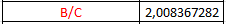
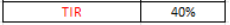

**UNIVERSIDAD PRIVADA DE TACNA**

**FACULTAD DE INGENIERÍA**

**Plataforma Avanzada para la Generación Automática de Diagramas UML empresa Tech Solutions**

Curso: Patrones de Software

Docente: Mg. Patrick Jose Cuadros Quiroga

Integrantes:

\- Alexis Jeanpierre Martínez Vargas			(2019063638)

\- Juan José David Pérez Vizcarra				(2019063636)

\- Jhon Thomas Ticona Chambi				(2018062232)

**Tacna-Perú**

**2025**

**Plataforma Avanzada para la Generación Automática de Diagramas UML empresa Tech Solutions**

**Propuesta Proyecto**

**Versión 1.0**

***Presentado Por:***

*Martínez Vargas, Alexis Jeanpierre*

*Documentador*

*2025*

|**Control de Versiones**||||||
| :-: | :- | :- | :- | :- | :- |
|**Versión**|**Hecha por**|**Revisada por**|**Aprobada por**|**Fecha**|**Motivo**|
|1\.0|AMV|AMV, JTC,JJPV|AMV, JTC,JJPV|26/05/2025|Versión Inicial|
# **Índex**
[RESUMEN EJECUTIVO	3](#_toc150164140)

[I. Propuesta narrativa	4](#_toc150164141)

[1.1. Planteamiento del Problema	4](#_toc150164142)

[1.2. Justificación del proyecto	5](#_toc150164143)

[1.3. Objetivo general	5](#_toc150164144)

[1.4. Beneficios	5](#_toc150164145)

[1.5. Alcance	5](#_toc150164146)

[1.6. Requerimientos del sistema	6](#_toc150164147)

[1.7. Restricciones	7](#_toc150164148)

[1.8. Supuestos	8](#_toc150164149)

[1.9. Resultados esperados	9](#_toc150164150)

[1.10. Metodología de implementación	10](#_toc150164151)

[1.11. Actores claves	10](#_toc150164152)

[1.12. Papel y responsabilidades del personal	10](#_toc150164153)

[1.13. Plan de monitoreo y evaluación	11](#_toc150164154)

[1.14. Cronograma del proyecto	12](#_toc150164155)

[1.15. Hitos de entregables	12](#_toc150164156)

[II. Presupuesto	13](#_toc150164157)

[2.1. Planteamiento de aplicación del presupuesto	13](#_toc150164158)

[2.2. Presupuesto	14](#_toc150164159)

[2.3. Análisis de Factibilidad	15](#_toc150164160)

[2.4. Evaluación Financiera	18](#_toc150164161)

# **RESUMEN EJECUTIVO**

|
**Nombre del Proyecto propuesto**: 

 

**Plataforma Avanzada para la Generación Automática de Diagramas UML empresa Tech Solutions** 
||
| - | :- |
|
El propósito de la *Plataforma Avanzada para la Generación Automática de Diagramas UML* es ofrecer una herramienta digital que automatice el modelado de sistemas a través de diagramas UML, a partir de entradas textuales o estructuradas. Este sistema está orientado a optimizar el proceso de documentación técnica en empresas tecnológicas como Tech Soluciones, facilitando la comunicación, comprensión y mantenimiento del software.

La plataforma busca:

- Automatizar la Creación de Diagramas UML: Generar diagramas de clases, casos de uso, secuencia, entre otros, de forma automática a partir de descripciones textuales, requisitos o código fuente.

- Mejorar la Productividad y Calidad Documental: Reducir el tiempo invertido en la elaboración manual de diagramas y garantizar la coherencia y estandarización en el modelado de sistemas.

- Facilitar el Trabajo Colaborativo: Incorporar funciones que permitan la edición compartida de diagramas en línea, con control de versiones y validación estructural.

- Integrar Inteligencia Artificial: Utilizar IA para interpretar descripciones funcionales y transformar automáticamente esas entradas en diagramas UML bien estructurados y personalizables.

- Apoyar la Formación Técnica: Servir como recurso educativo para estudiantes y profesionales, facilitando la comprensión visual de sistemas de software.

-----

Resultados Esperados:

- Generación Automática Precisa de Diagramas: Producción de diagramas UML correctos y estandarizados en cuestión de segundos, a partir de entradas simples o predefinidas.

- Reducción del Tiempo de Documentación: Disminución significativa en el tiempo dedicado a tareas de diagramación, permitiendo a los desarrolladores enfocarse en el diseño y desarrollo del sistema.

- Colaboración Eficiente en Tiempo Real: Trabajo sincrónico en línea entre equipos de desarrollo para modelar, revisar y validar diagramas desde cualquier ubicación.

- Mayor Coherencia en Proyectos de Software: Aseguramiento de una documentación consistente y bien estructurada que facilite la trazabilidad y el mantenimiento del software.

- Escalabilidad y Adaptabilidad del Sistema: Plataforma preparada para integrarse con entornos de desarrollo (IDE) o sistemas de control de versiones, y escalar para soportar múltiples proyectos simultáneamente.

||
|
**Población Objetivo:** 

*Dirigido al gerente de la Empresa Tech Solutions Entre otras municipalidades a nivel nacional o provincial*
||
|
**Monto de Inversión (En Soles):**

`	`***S/. 22,890.00***
|
**Duración del Proyecto (En Meses):**

`                           `***{3 MESES}***

 
|

# **I. Propuesta narrativa**	
## **1.1. Planteamiento del Problema**
En empresas tecnológicas como Tech Soluciones, el proceso de documentación y modelado de sistemas mediante diagramas UML suele ser manual, repetitivo y propenso a errores. Este proceso consume tiempo valioso y requiere conocimientos técnicos específicos que no todos los colaboradores poseen. Además, la falta de una herramienta centralizada y automatizada dificulta la colaboración entre equipos y retrasa la toma de decisiones técnicas informadas.

El proyecto surge ante la necesidad de una plataforma web inteligente que permita generar automáticamente diagramas UML (como clases, casos de uso o secuencia) a partir de entradas textuales estructuradas o no estructuradas, optimizando así el modelado de sistemas y mejorando la comunicación entre equipos de desarrollo, análisis y diseño.

## **1.2. Justificación del proyecto**
Este proyecto se justifica en función de los siguientes aspectos clave:

- **Optimización del Tiempo y Esfuerzo:** Automatizar la creación de diagramas UML reducirá significativamente el tiempo invertido en tareas manuales, permitiendo a los desarrolladores centrarse en el diseño lógico y funcional del sistema.
- **Reducción de Errores Humanos:** Al estandarizar la generación de diagramas, se evita la ambigüedad o inconsistencias que suelen surgir durante el modelado manual.
- **Fomento del Trabajo Colaborativo:** Una plataforma en línea facilitará la colaboración simultánea entre analistas, diseñadores y desarrolladores, mejorando la integración del equipo.
- **Aprovechamiento de la IA:** El uso de inteligencia artificial permitirá interpretar descripciones funcionales en lenguaje natural y traducirlas automáticamente a representaciones gráficas UML estructuradas.
## **1.3. Objetivo general**
Diseñar e implementar una plataforma web inteligente que permita la generación automática de diagramas UML mediante el uso de inteligencia artificial, mejorando la documentación técnica, la colaboración entre equipos y la eficiencia en el modelado de sistemas en Tech Soluciones.	
## **1.4. Beneficios**		
- Ahorro de Tiempo y Costos: Automatizar el modelado permite reducir los tiempos de documentación y evitar retrabajos, optimizando los recursos del equipo.
- Diagramas UML Estándar y Precisos: La generación automática garantiza consistencia en los diagramas y adherencia a los estándares UML.
- Acceso y Colaboración en Línea: La plataforma permitirá a múltiples usuarios visualizar, editar y compartir diagramas desde cualquier dispositivo conectado.
- Toma de Decisiones Informada: Al tener una representación clara y actualizada del sistema, los equipos podrán identificar errores de diseño o mejoras desde las primeras etapas.
- Escalabilidad y Personalización: El sistema podrá adaptarse a diversos proyectos, tecnologías y tipos de usuario según el perfil o necesidad.
## **1.5. Alcance**	
**Análisis de Requisitos:**

- Identificación de necesidades del usuario (desarrolladores, analistas, diseñadores).
- Definición de funcionalidades clave, como entrada textual, generación automática, edición colaborativa y exportación de diagramas.

**Diseño y Desarrollo del Sistema:**

- Arquitectura modular basada en microservicios o capas.
- Desarrollo de algoritmos de IA para interpretar entradas textuales y transformarlas en objetos UML.
- Interfaz gráfica intuitiva para visualización y edición de diagramas.

**Pruebas y Validación:**

- Pruebas unitarias y de integración para asegurar la precisión de los diagramas generados.
- Validación funcional con usuarios reales de Tech Soluciones.

**Documentación:**

- Manuales técnicos de desarrollo.
- Guías de usuario final con ejemplos de uso y buenas prácticas.

**Implementación y Despliegue:**

- Configuración en servidores internos o nube.
- Capacitación a usuarios sobre funcionalidades de entrada, edición y exportación.
- Mantenimiento continuo para corrección de errores y mejoras incrementales.
## **1.6. Requerimientos del sistema**	
*Tabla 1 – En esta tabla vemos todos los requerimientos funciones que se requiere en el sistema propuesto por la empresa Tech Solutions*

<table><tr><th><b>Nombre</b></th><th><b>Código</b></th><th><b>Descripción</b></th><th><b>Sistema</b></th><th><b>Prioridad</b></th></tr>
<tr><td>RF-01</td><td rowspan="2"><b>Selección de Opciones</b></td><td>Elegir el tipo de diagrama UML a generar: Clases, Secuencia, Casos de Uso, Componentes.</td><td>Plataforma Web</td><td>Alta</td></tr>
<tr><td>RF-02</td><td>Soporte para múltiples lenguajes de programación (C#, Java, Python, etc.).</td><td>Plataforma Web</td><td>Alta</td></tr>
<tr><td>RF-03</td><td><b>Generación de UML</b></td><td>Convertir automáticamente el código pegado en un diagrama UML con vista previa en tiempo real.</td><td>Plataforma Web</td><td>Alta</td></tr>
<tr><td>RF-04</td><td><b>Edición y Personalización</b></td><td>Permitir la edición manual del diagrama generado, añadiendo o eliminando nodos, relaciones o notas.</td><td>Plataforma Web</td><td>Alta</td></tr>
<tr><td>RF-05</td><td><b>Colaboración</b></td><td>Permitir compartir diagramas UML en tiempo real con otros usuarios para edición conjunta.</td><td>Plataforma Web</td><td>Media</td></tr>
<tr><td>RF-06</td><td><b>Exportación</b></td><td>Guardar diagramas en diferentes formatos: PNG, SVG, PDF o en código PlantUML/Mermaid.</td><td>Plataforma Web</td><td>Alta</td></tr>
<tr><td>RF-07</td><td><b>Historial y Versionado</b></td><td>Permitir la reversión a versiones anteriores del diagrama para recuperar cambios previos.</td><td>Plataforma Web</td><td>Media</td></tr>
<tr><td>RF-08</td><td><b>Comentarios y Notas</b></td><td>Posibilidad de añadir anotaciones o notas técnicas a los elementos del diagrama UML.</td><td>Plataforma Web</td><td>Baja</td></tr>
<tr><td>RF-09</td><td><b>Validaciones</b></td><td>Alertar si el código pegado tiene errores de sintaxis que impiden la generación del diagrama.</td><td>Plataforma Web</td><td>Alta</td></tr>
<tr><td>RF-10</td><td><b>Seguridad y Acceso</b></td><td>Implementar autenticación de usuarios con roles de acceso (Invitado, Usuario, Administrador).</td><td>Plataforma Web</td><td>Alta</td></tr>
</table>

*Fuente: Elaboración Propia*

## **1.7. Restricciones**	
- Alcance: La plataforma estará disponible como aplicación web accesible desde navegadores modernos (Chrome, Firefox, Edge, Safari), tanto en equipos de escritorio como en dispositivos móviles (Android y iOS). Se garantizará una experiencia de usuario adaptable y responsiva.
- Tiempo: El desarrollo e implementación del proyecto se llevará a cabo en un periodo estimado de 3 meses, que abarcará las fases de análisis de requisitos, diseño de la interfaz y la arquitectura, desarrollo del sistema, pruebas funcionales y despliegue final, así como capacitación a usuarios internos.
- Costo: La inversión total estimada del proyecto es de S/. 22,890.00, que cubre los costos de desarrollo, adquisición de recursos tecnológicos, pruebas, documentación y capacitación al personal de Tech Soluciones.
- Calidad: Se establecerán métricas de calidad en función de la usabilidad, precisión en la generación de diagramas UML, tiempos de respuesta del sistema y compatibilidad multiplataforma. El producto final deberá cumplir con los estándares técnicos y las expectativas funcionales del cliente.
- Recursos: Se utilizarán servidores cloud con alta disponibilidad, una base de datos relacional optimizada para estructuras jerárquicas, y tecnologías modernas como React para el frontend, Node.js o .NET para el backend, y bibliotecas de procesamiento de lenguaje natural para los motores de IA.
- Riesgos (Resumen):
- Cambios inesperados en los requisitos por parte del cliente.
- Subestimación del esfuerzo requerido para el entrenamiento del modelo de IA.
- Retrasos debido a pruebas o ajustes complejos en la interfaz de usuario.
- Posible resistencia al cambio por parte de algunos usuarios.
- Satisfacción del Cliente: El sistema estará orientado a cumplir fielmente con los requerimientos planteados por Tech Soluciones, proporcionando una solución robusta, intuitiva y alineada con las buenas prácticas del modelado de software, garantizando la aceptación y satisfacción de los usuarios finales.
## **1.8. Supuestos**
**SUPOSICIONES:**

- El equipo de Tech Soluciones proporcionará el acceso y el conocimiento necesario sobre los procesos actuales de documentación para entrenar y adaptar el sistema a sus necesidades.
- Se contará con personal disponible para pruebas funcionales y validación temprana del sistema durante el proceso de desarrollo.
- Los usuarios finales poseen conocimientos básicos en interpretación de diagramas UML o recibirán capacitación adecuada.

**DEPENDENCIAS:**

- La calidad del producto final dependerá en parte de la claridad y precisión de los textos funcionales que se utilicen como entrada para generar los diagramas.
- El proyecto no depende de la integración con sistemas existentes, pero requiere de conectividad estable y navegadores compatibles para un funcionamiento óptimo.
## **1.9. Resultados esperados**	
*Tabla 2: Tabla que Resume las Principales capacidades de nuestro Plataforma web respaldad por sus características*

|**Beneficio del Cliente**|**Características que lo Apoyan**|
| :-: | :-: |
|Mayor eficiencia en la documentación de software|Generación automática de diagramas UML a partir de descripciones funcionales, reduciendo tiempo y esfuerzo manual en el modelado.|
|Mejora de la experiencia de usuario|Interfaz web intuitiva, con diseño responsivo y asistentes interactivos que guían paso a paso la creación y descarga de diagramas.|
|Disponibilidad 24/7|Plataforma accesible desde cualquier dispositivo con navegador web, garantizando disponibilidad continua para equipos de desarrollo.|
|Acceso inmediato a modelos UML|Visualización y exportación en tiempo real de diagramas de casos de uso, clases, secuencia, entre otros, directamente desde los textos ingresados.|
|IA para interpretación de requerimientos|Motor de procesamiento de lenguaje natural que analiza descripciones textuales para identificar actores, funcionalidades y relaciones del sistema.|
|Documentación técnica automatizada|Generación automática de documentación base acompañando los diagramas, permitiendo mayor coherencia y facilitando auditorías o revisiones técnicas.|

*Fuente: Elaboración Propia*
## **1.10. Metodología de implementación**
Para llevar a cabo este proyecto, se ha optado por utilizar una metodología de desarrollo de software ampliamente reconocida en la industria. La elección recae en el Rational Unified Process (RUP) en su versión básica. Esto se debe a la necesidad de optimizar el tiempo disponible y aprovechar las ventajas que ofrece el RUP en términos de estructura y organización.

Además, para la gestión efectiva del proyecto, se emplearán herramientas como Rational Rose. Estas herramientas proporcionarán soporte adicional para la planificación, el seguimiento y el control del proyecto, lo que garantizará una ejecución eficiente y un cumplimiento exitoso de los objetivos establecidos.		
## **1.11. Actores claves**
Gerente de la Empresa Tech Solutions:

Principal autoridad interesada en la implementación del sistema. Su objetivo es ofrecer una herramienta innovadora que optimice la generación de documentos técnicos, mejorando la productividad y eficiencia de sus clientes. El gerente busca que este sistema agregue valor al portafolio de soluciones tecnológicas de la empresa, diferenciándola de la competencia y permitiéndole atraer nuevos clientes que requieren automatización en la documentación técnica.		
## **1.12. Papel y responsabilidades del personal**
*Tabla 3: Tabla de la Descripción Detalla del Perfil de los Interesados en el Proyecto*

|**Representante**|Gerente Ronald Ibarra Zapata|
| - | - |
|**Descripción**|Gerente de la Empresa Tech Solutions|
|**Tipo**|Administración de Empresas|
|**Responsabilidades**|Lleva a cabo un seguimiento del desarrollo del proyecto y aprobación de los requisitos, funcionalidades del sistema.|
|**Criterio de Éxito**|A definir por el cliente|
|**Grado de participación**|Seguimiento del Sistema Web.|
|**Comentarios**|Ninguno|

*Fuente: Elaboración Propia*

*Tabla 4. Descripción del Usuario*

|**Representante**|Profesional de Ingeniería de Sistemas encargado del área TI|
| - | - |
|**Descripción**|Personales responsables de los equipos tecnológicos|
|**Tipo**|Usuario|
|**Responsabilidades**|Participar en los servicios brindados por la consultoría.|
|**Criterio de Éxito**|A definir por el cliente|
|**Grado de participación**|A definir por el cliente|
|**Comentarios**|Ninguno|

*Fuente: Elaboración Propia*

*Tabla 5: Tabla de la Descripción del Perfil de los Usuarios del Sistema*

|**Representante**|Alumnos o estudiantes que hacen uso del Programa|
| - | - |
|**Descripción**|Persona que busca el servicio de Sistema|
|**Tipo**|Usuario|
|**Responsabilidades**|Participar en los servicios brindados por la consultoría.|
|**Criterio de Éxito**|A definir por el cliente|
|**Grado de participación**|A definir por el cliente|
|**Comentarios**|Ninguno|

*Fuente: Elaboración Propia*
## **1.13. Plan de monitoreo y evaluación**	
Metodología:	Una metodología de desarrollo de software altamente estructurada y orientada a la gestión de proyectos. RUP, o Rational Unified Process, se basa en principios sólidos de ingeniería de software y se caracteriza por su enfoque iterativo e incremental. Esta metodología se centra en la creación de productos de software de alta calidad y está diseñada para abordar los desafíos comunes en el desarrollo de proyectos complejos.

RUP promueve la colaboración entre equipos multidisciplinarios, la gestión efectiva de riesgos y la entrega de software funcional en ciclos cortos. Se compone de una serie de fases y disciplinas que guían el proceso de desarrollo, desde la concepción hasta la implementación y el mantenimiento.

Una de las ventajas clave de RUP es su flexibilidad, lo que permite adaptarla a las necesidades específicas de cada proyecto. Además, su enfoque en la documentación y la gestión de requisitos contribuye a la transparencia y al control de la calidad en todas las etapas del proyecto. En este contexto, RUP se utilizará como una metodología sólida para el desarrollo de software en el proyecto, garantizando una ejecución eficaz y un producto final de alta calidad.
## **1.14. Cronograma del proyecto** 	
Se han elaborado la estimación de los recursos en base a la experiencia de personal de cómputo, reuniones de trabajo con jefes de área y documentos que indican requerimientos.

El cronograma del trabajo mensual para el desarrollo de los sistemas de información se muestra en el siguiente cuadro:

Tabla 6: Cronograma del Proyecto “Plataforma Avanzada para la Generación Automática de Diagramas UML empresa Tech Solutions” desde el Mes de Abril al mes de Junio

|**ACTIVIDADES/MODULOS SISTEMAS**|**ABRIL**|**MAYO**|**JUNIO**||||||||||
| :-: | :-: | :-: | :-: | :- | :- | :- | :- | :- | :- | :- | :- | :- |
|**Fases de Identificación y Elaboración del Sistema**|**S1**|**S2**|**S3**|**S4**|**S1**|**S2**|**S3**|**S4**|**S1**|**S2**|**S3**|**S4**|
|Definición de Requerimientos|X|X| | | | | | | | | | |
|Análisis y Diseño del Sistema| |X|X|X| | | | | | | | |
|**Fase de Construcción**| | | | | | | | | | | | |
|Pre-Diseño| | | |X|X|X| | | | | | |
|Ingeniería| | | | | |X|X| | | | | |
|Abastecimiento| | | | | |X|X|X| | | | |
|Construcción| | | | | | |X|X|X|X|X| |
|**Fase de Transición**| | | | | | | | | | | | |
|Pruebas, Validación y Migración| | | | | | | | |X|X|X|X|
|Documentación y Capacitación| | | | | | | | | | |X|X|
|Despliegue y Puesta en Marcha| | | | | | | | | | |X|X|

*Fuente: Elaboración Propia*

## **1.15. Hitos de entregables**		

*Figura 1: Programación de las actividades de acuerdo al Cronograma del Proyecto “*Plataforma Avanzada para la Generación Automática de Diagramas UML empresa Tech Solutions

*Fuente: Elaboración Propia*

*Tabla 7: Tabla de las Tareas Programadas de acuerdo al Cronograma del Proyecto “*Plataforma Avanzada para la Generación Automática de Diagramas UML empresa Tech Solutions”

|Nombre de tarea|Duración|Comienzo|Fin|
| :- | :- | :- | :- |
|Sistema Web "SIETIA"|66 días?|lun 01/04/24|vie 28/06/25|
|Inicio|66 días?|lun 01/04/24|vie 28/06/25|
|Fases de Identificación y Elaboración del Sistema|23 días?|lun 01/04/24|mié 01/05/25|
|Definición de Requerimientos|11 días|lun 01/04/24|lun 15/04/25|
|Análisis y Diseño del Sistema|11 días|mar 16/04/25|mar 30/04/25|
|Fase de Construcción|44 días?|mié 01/05/25|dom 30/06/25|
|Pre-Diseño|5 días?|mié 01/05/25|mar 07/05/25|
|Ingeniería|5 días?|lun 13/05/25|dom 19/05/25|
|Abastecimiento|10 días|lun 13/05/25|dom 26/05/25|
|Construcción|10 días?|lun 27/05/25|dom 09/06/25|
|Fase de Transición|21 días?|lun 03/06/25|dom 30/06/25|
|Pruebas, Validación y Migración|20 días?|mar 04/06/25|sáb 29/06/25|
|Documentación y Capacitación|11 días|dom 16/06/25|sáb 29/06/25|
|Despliegue y Puesta en Marcha|11 días|dom 16/06/25|sáb 29/06/25|

*Fuente: Elaboración Propia*
# **II. Presupuesto**	
## **2.1. Planteamiento de aplicación del presupuesto**		
l presupuesto asignado para este proyecto será utilizado de forma estratégica para garantizar el desarrollo e implementación exitosa de la Plataforma Inteligente de Generación Automática de Diagramas UML. La distribución de los recursos se enfocará en cumplir con los objetivos técnicos, funcionales y operativos establecidos, asegurando una solución innovadora, eficiente y alineada con las necesidades del cliente.

**Desarrollo del Sistema Web Inteligente:** Una parte considerable del presupuesto se destinará al diseño y desarrollo del sistema web, con énfasis en la integración de componentes de inteligencia artificial capaces de interpretar requerimientos funcionales y generar diagramas UML precisos.

**Integración de IA y Procesamiento de Lenguaje Natural (PLN):** Se asignarán recursos a la implementación del motor de IA basado en PLN, que será el núcleo del sistema para transformar descripciones textuales en modelos visuales automatizados.

**Interfaz de Usuario y Experiencia UX/UI:** Se invertirá en el diseño de una interfaz intuitiva, responsiva y amigable que facilite la interacción del usuario con el sistema, garantizando accesibilidad desde diferentes dispositivos.

**Pruebas, Optimización y Validación Técnica:** Parte del presupuesto estará destinada a la realización de pruebas funcionales, técnicas y de usuario, así como a la optimización del rendimiento de la plataforma y la validación de resultados generados.

**Documentación y Capacitación:** Se contemplan recursos para la elaboración de documentación técnica y manuales de usuario, además de sesiones de capacitación al equipo de Tech Soluciones para asegurar el correcto uso y mantenimiento del sistema.

Esta distribución estratégica del presupuesto asegurará el cumplimiento de los objetivos del proyecto, brindando a Tech Soluciones una herramienta innovadora y eficaz para automatizar y agilizar la documentación de proyectos mediante diagramas UML.

## **2.2. Presupuesto** 	
*Tabla 8: Tabla de Materiales de Uso Diaria con el cálculo de los Gatos que se usará en el periodo de 3 meses del desarrollo del proyecto*

<table><tr><th colspan="1" rowspan="2"><b>Materiales de escritorio</b> </th><th colspan="3"><b>Tiempo/Coste</b> </th></tr>
<tr><td colspan="1"><b>Mes 1</b> </td><td colspan="1"><b>Mes 2</b> </td><td colspan="1"><b>Mes 3</b> </td></tr>
<tr><td colspan="1">Papel bond </td><td colspan="1">S/ 12.00 </td><td colspan="1">S/ 12.00 </td><td colspan="1">S/ 12.00 </td></tr>
<tr><td colspan="1">Lapiceros </td><td colspan="1">S/ 3.00 </td><td colspan="1">S/ 5.00 </td><td colspan="1">S/ 3.00 </td></tr>
<tr><td colspan="1">Tinta de impresora </td><td colspan="1">S/ 60.00 </td><td colspan="1">S/ 0.00 </td><td colspan="1">S/ 0.00 </td></tr>
<tr><td colspan="1"><b>Sub Total</b> </td><td colspan="1">S/ 74.00 </td><td colspan="1">S/ 16.00 </td><td colspan="1">S/ 14.00 </td></tr>
<tr><td colspan="3"><b>TOTAL</b></td><td colspan="1">S/ 105.00</td></tr>
</table>

*Fuente: Elaboración Propia*

*Tabla 9: Tabla de Costes de Servicio en el periodo de 3 meses de desarrollo del Proyecto*

<table><tr><th colspan="1" rowspan="2"><b>Costos Operativos</b> </th><th colspan="4"><b>Tiempo/Costo</b> </th></tr>
<tr><td colspan="1"><b>Mes 1</b> </td><td colspan="2"><b>Mes 2</b> </td><td colspan="1" valign="top"><b>Mes 3</b> </td></tr>
<tr><td colspan="1">Servicio de Internet </td><td colspan="1">S/ 80.00</td><td colspan="2">S/ 80.00</td><td colspan="1">S/ 80.00</td></tr>
<tr><td colspan="1">Oficina</td><td colspan="1">S/ 800.00</td><td colspan="2">S/ 800.00</td><td colspan="1">S/ 800.00</td></tr>
<tr><td colspan="1">Hosting </td><td colspan="1">S/ 50.00</td><td colspan="2">S/ 50.00</td><td colspan="1">S/ 50.00</td></tr>
<tr><td colspan="1"><b>Sub Total</b> </td><td colspan="2">S/ 930.00</td><td colspan="1">S/ 930.00 </td><td colspan="1">S/ 930.00</td></tr>
<tr><td colspan="4"><b>TOTAL</b></td><td colspan="1">S/2.790.00</td></tr>
</table>

*Fuente: Elaboración Propia*

*Tabla 10: Tabla de los Costes Operativos para el desarrollo del Proyecto en el plazo de 3 meses*

<table><tr><th colspan="1" rowspan="2"><b>Servicio</b> </th><th colspan="3"><b>Tiempo/Coste</b> </th></tr>
<tr><td colspan="1"><b>Mes 1</b> </td><td colspan="1"><b>Mes 2</b> </td><td colspan="1"><b>Mes 3</b> </td></tr>
<tr><td colspan="1">Servicio Eléctrico </td><td colspan="1">S/ 85.00</td><td colspan="1" valign="top">` `S/ 85.00 </td><td colspan="1" valign="top">` `S/ 85.00 </td></tr>
<tr><td colspan="1">Servicio de Agua </td><td colspan="1" valign="top">` `S/ 30.00 </td><td colspan="1" valign="top">` `S/ 30.00 </td><td colspan="1" valign="top">` `S/ 30.00 </td></tr>
<tr><td colspan="1"><b>Sub Total</b> </td><td colspan="1" valign="top">` `S/ 115.00 </td><td colspan="1" valign="top">` `S/ 115.00 </td><td colspan="1" valign="top">` `S/ 115.00 </td></tr>
<tr><td colspan="3"><b>TOTAL</b></td><td colspan="1" valign="top">S/ 345.00</td></tr>
</table>

*Fuente: Elaboración Propia*

*Tabla 11: Tabla de los Costes del Personal en el plazo de 3 meses de Desarrollo del Proyecto*

|**Rol**|**Horario (L a V)**|**Mes 1**|**Mes 2**|**Mes 3**|
| :-: | :-: | :-: | :-: | :-: |
|Jefe de proyecto|8:00 -16:00|S/ 2,500.00|S/ 2,500.00|S/ 2,500.00|
|Programador|8:00 -16:00|S/ 1,550.00|S/ 1,550.00|S/ 1,550.00|
|DBA|8:00 -16:00|S/ 1,300.00|S/ 1,300.00|S/ 1,300.00|
|Tester|8:00 -16:00|S/ 1,200.00|S/ 1,200.00|S/ 1,200.00|
|**Sub Total**|S/ 6,570.00|S/ 6,570.00|S/ 6,570.00||
|**TOTAL**|S/19.650.00||||
\*\

*Fuente: Elaboración Propia*

*Tabla 12: Tabla que Resume todos los Costes de las Tablas 3 ,4, 5 y 6 en un monto total final*

|Costo Total de Costo General |S/ 105.00|
| - | - |
|Costo Total del Ambiente |S/ 2,790.00|
|Costo Total del Personal |S/ 19,650.00|
|Costo Total de los Operativos |S/ 345.00|
|Costo Final |S/ 22,890.00|

*Fuente: Elaboración Propia*

## **2.3. Análisis de Factibilidad**	

`	`Factibilidad Técnica:

Los siguientes programas nos permitirán la creación y desarrollo del proyecto:

<table><tr><th colspan="3"><b>RECURSOS TECNICOS PARA EL DESARROLLO DEL PROYECTO</b></th></tr>
<tr><td colspan="1"><b>Tipo de Recurso</b></td><td colspan="1"><b>Nombre del recurso</b></td><td colspan="1"><b>Descripción</b></td></tr>
<tr><td colspan="1" rowspan="5">
Hardware

</td><td colspan="1" rowspan="4">
PC

(Personal Computer)

</td><td colspan="1">Escritorio o Portátil</td></tr>
<tr><td colspan="1">Intel Core i5 - 1.8GHz</td></tr>
<tr><td colspan="1">8 GB de RAM recomendados (2 GB mínimo).</td></tr>
<tr><td colspan="1">4 GB de espacio en disco duro (2 GB mínimo).</td></tr>
<tr><td colspan="1">Impresora</td><td colspan="1">Multifuncional</td></tr>
<tr><td colspan="1" rowspan="4">Software</td><td colspan="1">Windows 10 (64 bits)</td><td colspan="1">Sistema operativo</td></tr>
<tr><td colspan="1">` `Visual Studio 2022</td><td colspan="1">Herramienta para el desarrollo del sistema web</td></tr>
<tr><td colspan="1">Teams (Microsoft Office 365)</td><td colspan="1">Herramienta para el desarrollo de documentos</td></tr>
<tr><td colspan="1">SQL Azure</td><td colspan="1">Herramienta para el desarrollo de la BD en la nube</td></tr>
</table>

*Tabla 13 – Los recursos técnicos para el desarrollo del proyecto incluyen hardware como computadoras de escritorio o portátiles con procesador Intel Core i5, 8 GB de RAM recomendados, 4 GB de espacio en disco duro y una impresora multifuncional. En cuanto al software, se utilizará Windows 10 (64 bits) como sistema operativo, Visual Studio 2022 como herramienta de desarrollo del sistema web, Microsoft Teams para el desarrollo de documentos y SQL Azure para el desarrollo de la base de datos en la nube.*

`	`Factibilidad Ambiental:

El proyecto " Plataforma Avanzada para la Generación Automática de Diagramas UML empresa Tech Solutions" tiene un impacto ambiental mínimo, ya que su implementación y operación no implican procesos que generen emisiones contaminantes o consuman recursos naturales de manera significativa:

- **Ecoeficiencia en el Consumo de Energía:** Se prevé que el proyecto sea ecoeficiente, utilizando tecnologías y prácticas que minimicen el consumo de energía y reduzcan al mínimo la generación de residuos electrónicos. Esto incluye el uso de servidores energéticamente eficientes y la minimización del uso de papel a través de la digitalización de procesos.
- **Cumplimiento de Políticas Ambientales:** El desarrollo del proyecto se llevará a cabo en cumplimiento con las políticas y regulaciones ambientales locales y nacionales, asegurando que todas las actividades relacionadas con su implementación y operación se realicen de manera responsable y sostenible.
- **Promoción de la Conciencia Ambiental:** Aunque el impacto directo del proyecto en el medio ambiente es bajo, este puede servir como un ejemplo de cómo las tecnologías de la información pueden contribuir a la sostenibilidad. Al automatizar procesos y reducir el uso de recursos físicos, el sistema puede ayudar a promover una cultura organizacional más consciente del medio ambiente.

`	`Factibilidad Social:

El proyecto **"Plataforma Inteligente para la Generación Automática de Diagramas UML para la empresa Tech Soluciones"** presenta un alto potencial de impacto social positivo, tanto dentro de la organización como en su entorno profesional:

- **Fortalecimiento de Procesos de Documentación Técnica:** La automatización en la generación de diagramas UML permitirá una documentación más rápida, clara y precisa de los sistemas desarrollados, lo que beneficiará directamente a los equipos de desarrollo y a las áreas de análisis, planificación y soporte técnico.
- **Mejora en la Toma de Decisiones Técnicas:** Al contar con diagramas actualizados y generados automáticamente a partir de requerimientos, se agiliza la comprensión de los proyectos, facilitando decisiones más informadas y oportunas dentro de Tech Soluciones y en los equipos de trabajo de sus clientes.
- **Desarrollo de Competencias y Profesionalización:** La adopción de esta plataforma promoverá la capacitación del personal técnico en el uso de herramientas inteligentes basadas en inteligencia artificial, fortaleciendo sus competencias digitales y fomentando una cultura de innovación tecnológica.

Factibilidad Operativa:

La viabilidad operativa del proyecto se sustenta en factores clave que aseguran su implementación exitosa y su funcionamiento sostenible:

- **Disponibilidad de Recursos Humanos Especializados:** La empresa Tech Soluciones cuenta con profesionales capacitados en desarrollo web, inteligencia artificial, procesamiento de lenguaje natural y gestión de proyectos. Adicionalmente, se contempla la capacitación continua del personal para asegurar la correcta operación y evolución del sistema.
- **Infraestructura Tecnológica Adecuada:** El proyecto se apoyará en una infraestructura moderna y escalable, con servidores confiables, bases de datos eficientes y tecnologías web de última generación. Se garantizará también una conexión estable a Internet y un entorno de desarrollo seguro y colaborativo.
- **Cumplimiento Legal y Técnico:** El sistema será desarrollado en conformidad con las normativas vigentes relacionadas con la protección de datos, derechos de autor y seguridad informática. Se contemplará la adquisición de licencias necesarias y la adopción de buenas prácticas de la industria para garantizar la integridad, confiabilidad y sostenibilidad del sistema.
## **2.4. Evaluación Financiera**	
El plan financiero se ocupa del análisis de ingresos y gastos asociados a cada proyecto, desde el punto de vista del instante temporal en que se producen. Su misión fundamental es detectar situaciones financieramente inadecuadas.

Para demostrar que este proyecto es rentable, utilizamos una TEA (Tasa de interés) = 15% y el VAN, B/C y TIR.

**Justificación de la Inversión**

La justificación de la inversión en el proyecto "Plataforma Avanzada para la Generación Automática de Diagramas UML empresa Tech Solutions" se basa en una serie de beneficios que mejorarán significativamente la eficiencia operativa de la empresa y la calidad de los servicios ofrecidos por la empresa.

**Beneficios del Proyecto**	

**Beneficios Tangibles:**

- Reducción de Costos Operativos: La automatización de la gestión de inventarios y la elaboración de informes técnicos reducirá el tiempo y los recursos necesarios para estas tareas, resultando en una disminución significativa de los costos operativos.
- Optimización de Recursos: El sistema permitirá un control más eficiente y preciso del inventario, lo que se traducirá en un mejor uso de los recursos tecnológicos disponibles, minimizando pérdidas y aumentando la vida útil de los equipos.

**Beneficios Intangibles:**

- Mejora en la Toma de Decisiones: Al centralizar y automatizar la información sobre los equipos tecnológicos, el sistema facilitará la toma de decisiones informadas, permitiendo a la municipalidad actuar de manera proactiva ante posibles fallos o necesidades de mantenimiento.
- Eficiencia y Productividad: La implementación del sistema incrementará la eficiencia del equipo de EFTIC, permitiendo que se enfoquen en tareas estratégicas en lugar de procesos manuales repetitivos.
- Calidad en la Elaboración de Informes: La precisión y rapidez en la generación de informes técnicos mejorará la calidad de estos documentos, facilitando la supervisión y auditoría de los equipos tecnológicos.
- Fomento de la Transparencia: El sistema proporcionará una plataforma transparente y accesible para la gestión de inventarios, lo que contribuirá a una mayor confianza por parte de las autoridades y de la comunidad en general.

**Criterios de Inversión**

Nuestros criterios de inversión se basan en los tres criterios presentados en base a que se necesitara el B/C para saber si hay beneficios, El VAN para saber si es aceptable el valor del proyecto y el TIR si es que se puede obtener retornar los gastos, ya que necesitamos recuperar de los costos invertidos al desarrollarse en el trayecto del tiempo. En ello, podemos utilizar a esos criterios debido a que queremos que el proyecto cumpla con todos los requisitos y con los valores económicos para ser aceptado	

|**FLUJO DE CAJA**||||
| :-: | :- | :- | :- |
|**PERIODO ANUAL**|**INGRESOS**|**EGRESOS**|**EFECTIVO NETO ACTUAL**|
|0|-S/  22,890.00| |-S/  22,890.00|
|1|` `S/   50,534.00 |` `S/    41,753.00 |` `S/     8,781.00 |
|2|` `S/   52,863.00 |` `S/    42,751.00 |` `S/   10,112.00 |
|3|` `S/   57,453.00 |` `S/    44,646.00 |` `S/   12,807.00 |
|4|` `S/   59,588.00 |` `S/    45,050.00 |` `S/   14,538.00 |
|5|` `S/   62,090.00 |` `S/    45,856.00 |` `S/   16,234.00 |
|**Total**|**S/ 282,528.00**|**S/220,056.00**|**S/62.472.00**|

*Fuente : Elaboración propia de la tabla*

*Tabla 14 – La tabla presenta un **flujo de caja anual proyectado a cinco años**, en el que se detallan los ingresos, egresos y el efectivo neto resultante para cada periodo. En el primer año (periodo 0) se observa un ingreso inicial de S/ 22,890, sin egresos, resultando en un flujo de caja neto negativo de S/ 22,890. A partir del primer año, los ingresos aumentan progresivamente desde S/ 50,534 hasta S/ 62,090 en el quinto año, mientras que los egresos también crecen cada año, comenzando en S/ 41,753 y alcanzando S/ 45,856 al final del periodo. El efectivo neto actual, que representa la diferencia entre ingresos y egresos en cada año, evoluciona de manera positiva, pasando de un saldo inicial negativo en el periodo 0 a un saldo final positivo de S/ 16,234 en el quinto año. La proyección total acumulada indica que los ingresos suman S/ 282,528, los egresos S/ 220,056, y el efectivo neto actual final asciende a S/ 62,472. Esta tabla es una **elaboración propia** que proporciona una visión general de la rentabilidad y el desempeño financiero proyectado del flujo de caja a lo largo del periodo.* 

**Relación Beneficio/Costo (B/C)**	

*Fuente : Elaboración propia de la tabla*

*Tabla 15 – Tabla realizada en el Excel con los datos correspondiste del proyecto a realizar donde realizamos la formula de B/C y el Total de nuestro **B/C  = 2,008367282***

**Valor Actual Neto (VAN)***	

*Fuente: Elaboración propia de la tabla*

*Tabla 16 – Tabla realizada en el Excel con los datos correspondiste del proyecto a realizar donde realizamos la fórmula de VNA y el Total de nuestro **VNA = S/45.,971.53***

**Tasa Interna de Retorno (TIR)**	

*Fuente: Elaboración propia de la tabla*

*Tabla 17- Tabla realizada en el Excel con los datos correspondiste del proyecto a realizar donde realizamos la fórmula de TIR y el Total de nuestro **TIR = 40%, Lo que nos indica que el proyecto si es factible.***

2

