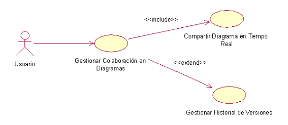
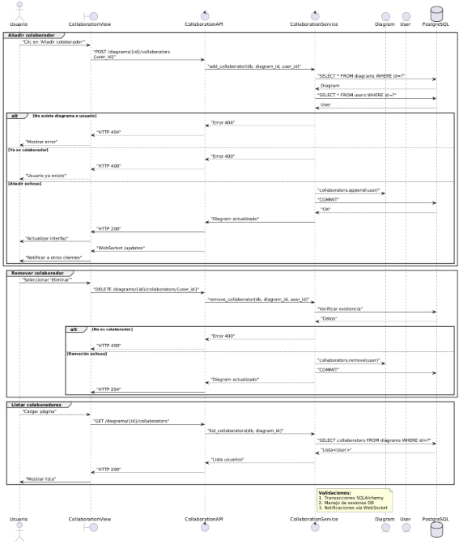
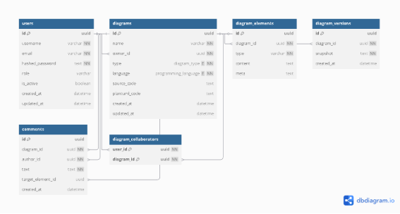
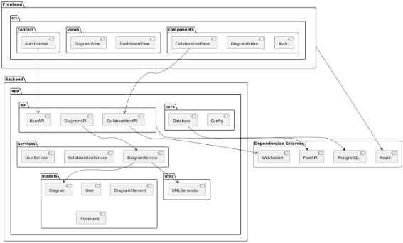
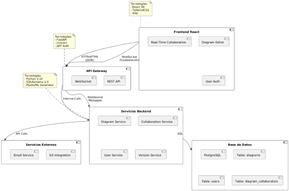

# Plataforma Avanzada para Generación Automática de Diagramas UML  
**Tech Solutions**  
*Patrones de Software - Mag. Patrick Cuadros*  

---

## Integrantes  
- Alexis Martínez Vargas (2019063638)  
- Juan Pérez Vizcarra (2019063636)  
- Jhon Ticona Chambi (2018062232)  

---

## 1. Introducción 

### Propósito  
Desarrollar una plataforma de generación y gestión de diagramas UML que ayude a los equipos de desarrollo colaboran en el diseño de software y  que garantice la mantenibilidad, extensibilidad y calidad del código.

### Automatización Inteligente:

Generar diagramas UML automáticamente desde múltiples fuentes (código fuente, bases de datos)

### Colaboración:

Facilitar la colaboración en tiempo real entre arquitectos de software, desarrolladores y stakeholders

### Gestión Avanzada de Versiones:

Mantener un historial completo de evolución de diagramas con capacidades de rollback.

---

### Alcance  
- **Incluye**:  
  - Backend con Clean Architecture (dominio, aplicación, infraestructura)
  - Frontend en React con arquitectura modular
  - Sistema de autenticación y gestión de permisos
  - API RESTful para integración con herramientas externas
- **Excluye**: 
  - Herramientas de modelado 3D
  - Generación de código a partir de diagramas

---

## 2. Arquitectura del Sistema  

### Arquitectura del Proyecto

*Figura: Arquitectura Clean implementada en el proyecto*

---

### Vista de Casos de Uso

**Diagramas clave**

- Generación de UML desde código  
- Colaboración en tiempo real  

  
*Figura: Módulo de Gestión de Diagramas UML*  

---

### Vista de Caso de uso

Diagrama de Caso de Uso del Módulo Iniciar Sesión incluyendo la acción de validar Usuario*

---

Diagrama de Caso de Uso del Modulo Gestionar Usuario

---

Diagrama de Caso de Uso del Módulo Gestionar Colaboración

---

Diagrama de Caso de Uso del Módulo Gestionar Diagramas UML

---

## Vista Lógica

### Diagrama de Subsistemas (paquetes)

---

### Diagrama de Secuencia 
#### Diagrama de secuencia de colaboración 

---

#### Diagrama de secuencia de generación  de UML

---

#### Diagrama de secuencia de autenticación 

---

#### Diagrama de secuencia de versiona miento 

---

#### Diagrama de secuencia de Comentarios

---

### Diagrama de Clases

---

### Diagrama de Base de datos

---

### Diagrama de arquitectura software

---

### Diagrama de arquitectura del sistema

---

### Diagrama de despliegue

